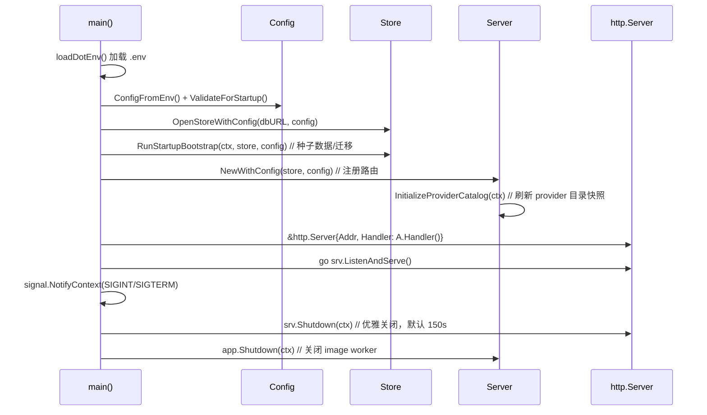
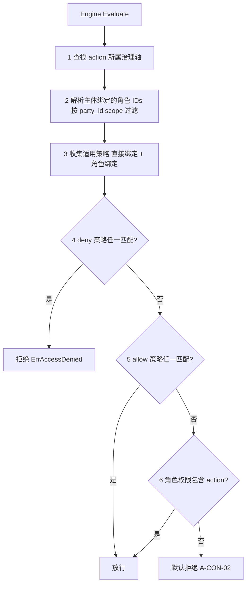
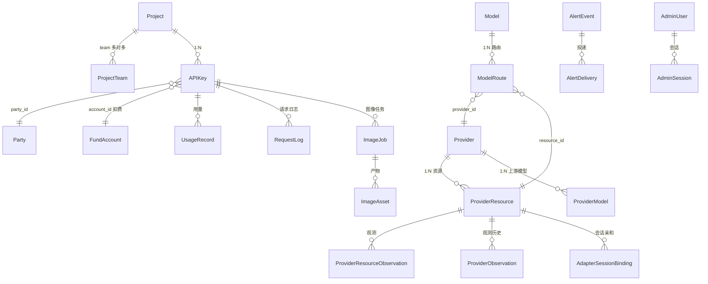
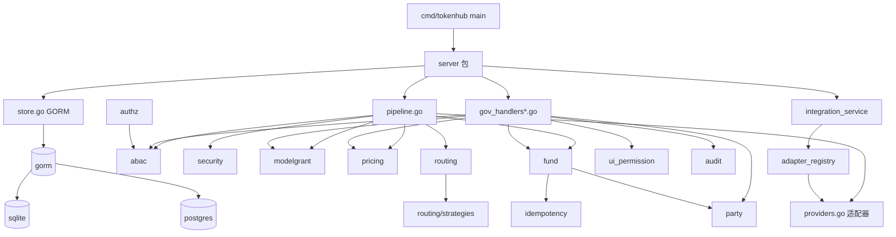

# AI-GOV Fusion Code Wiki | 版本：v3.2.0 | 日期：2026-07-31 | 状态：已发布

> 本 Wiki 基于 `d:\ai-work\grok\a-gov\ai-gov-fusion` 仓库实际代码梳理而成，覆盖项目整体架构、模块职责、关键类型与函数、依赖关系及运行方式。
> 上游基线：TokenHub v0.4.0 (Apache 2.0)；本仓库在其之上扩展 11 个治理包，形成「Token 治理底座」。

---

## 目录

- [1. 项目概览](#1-项目概览)
- [2. 顶层架构](#2-顶层架构)
- [3. 仓库目录结构](#3-仓库目录结构)
- [4. 后端架构（Go）](#4-后端架构go)
  - [4.1 启动流程](#41-启动流程)
  - [4.2 配置体系](#42-配置体系)
  - [4.3 HTTP 路由与 Server 核心](#43-http-路由与-server-核心)
  - [4.4 数据面 Pipeline（14 步管线）](#44-数据面-pipeline14-步管线)
  - [4.5 Provider 适配器层](#45-provider-适配器层)
  - [4.6 Store 存储抽象](#46-store-存储抽象)
  - [4.7 11 个治理包](#47-11-个治理包)
  - [4.8 治理 API（/gov/*）](#48-治理-apigov)
  - [4.9 控制台 API（/api/admin/*）](#49-控制台-apiapiadmin)
- [5. 前端架构（Next.js）](#5-前端架构nextjs)
  - [5.1 技术栈与配置](#51-技术栈与配置)
  - [5.2 目录结构](#52-目录结构)
  - [5.3 AdminConsole 状态机](#53-adminconsole-状态机)
  - [5.4 资源配置驱动 CRUD](#54-资源配置驱动-crud)
  - [5.5 i18n 多语言](#55-i18n-多语言)
- [6. 关键数据模型](#6-关键数据模型)
- [7. 依赖关系](#7-依赖关系)
- [8. 运行与部署](#8-运行与部署)
- [9. 测试体系](#9-测试体系)
- [10. 关键设计约定](#10-关键设计约定)

---

## 1. 项目概览

| 项目 | 说明 |
|---|---|
| 名称 | AI-GOV Fusion（后端二进制名 `tokenhub`） |
| 定位 | 企业级 AI 智能网关治理平台 / Token 治理底座 |
| 基线版本 | v3.2.0（上游 TokenHub v0.4.0） |
| 后端语言 | Go 1.26（`module tokenhub/backend`） |
| 前端框架 | Next.js 16.2.9 + React 19.2.7 + TypeScript 6.0.3 |
| 数据库 | SQLite（默认） / PostgreSQL（生产） |
| ORM | GORM v1.31.1（双驱动：`gorm.io/driver/sqlite` + `gorm.io/driver/postgres`） |
| 部署形态 | 源码运行 / Docker 单容器 / Docker Compose / systemd 原生 |
| 监听端口 | 后端 `:8080`，前端 `:3000` |
| License | Apache-2.0 |

**核心能力**：统一接入 OpenAI / Anthropic / Gemini / Azure / Codex / OpenAI-Compatible 等多家上游；在数据面实施 14 步治理管线（鉴权 → 安全钩子 → 模型授权 → 定价 → 预算 → 冻结 → 路由 → 上游调用 → 用量规范化 → 双轨结算 → 审计）；在控制面提供 ABAC 策略引擎、四轴正交授权、双轨计价、资金治理、对账等企业级能力。

---

## 2. 顶层架构

```mermaid
flowchart TB
  subgraph Client[客户端]
    A1[业务系统 / SDK]
    A2[管理控制台浏览器]
  end

  subgraph Frontend[前端 Next.js]
    F1[app/ 路由层]
    F2[features/admin 控制台]
    F3[lib/runtime-config]
  end

  subgraph Backend[后端 Go tokenhub]
    B1[net/http ServeMux]
    B2[数据面 /v1/* Pipeline]
    B3[控制面 /api/admin/*]
    B4[治理面 /gov/*]
    B5[Provider Adapters]
    B6[Store GORM]
    B7[11 治理包]
  end

  subgraph Upstream[上游 LLM Provider]
    U1[OpenAI / Azure]
    U2[Anthropic]
    U3[Gemini]
    U4[Codex Subscription]
    U5[OpenAI-Compatible]
  end

  subgraph DB[(数据库)]
    D1[(SQLite / PostgreSQL)]
  end

  A1 -->|Bearer API Key| B1
  A2 --> F1 --> F2 -->|admin token| B3
  F3 --> B1

  B1 --> B2
  B1 --> B3
  B1 --> B4
  B2 --> B5 --> U1 & U2 & U3 & U4 & U5
  B2 --> B7
  B4 --> B7
  B3 --> B6
  B4 --> B6
  B2 --> B6
  B6 --> D1
```

**三条 API 边界**：
- `/v1/*` — 数据面，OpenAI/Anthropic 兼容协议，业务系统通过 API Key 调用。
- `/api/admin/*` — 控制台 REST API，管理 Project / APIKey / Provider / Model / Route / 用量 / 审计 / 告警等。
- `/gov/*` — 治理 API（v3.2 新增），Party / Fund / Pricing / ModelGrant / Routing / ABAC / UI Permission / Audit / Dashboard 域，与控制台 API 完全隔离。

---

## 3. 仓库目录结构

```
ai-gov-fusion/
├── backend/                    # Go 后端
│   ├── cmd/tokenhub/main.go    # 程序入口
│   ├── internal/server/        # 全部业务代码（包名 server）
│   │   ├── *.go                # 存量代码（http/config/types/store/providers/pipeline...）
│   │   ├── abac/               # 治理包：ABAC 策略引擎
│   │   ├── audit/              # 治理包：不可篡改审计
│   │   ├── authz/              # 治理包：四轴正交授权 + grants + 中间件
│   │   ├── fund/               # 治理包：资金治理（账户/账本/冻结/清算）
│   │   │   └── sqlstore/pg.go
│   │   ├── idempotency/        # 治理包：幂等键去重
│   │   ├── modelgrant/          # 治理包：模型访问授权
│   │   ├── party/              # 治理包：组织/部门/团队/用户主体
│   │   ├── pricing/            # 治理包：双轨计价引擎
│   │   ├── reconciliation/     # 治理包：对账（P0 占位）
│   │   ├── routing/            # 治理包：12 策略路由引擎
│   │   │   └── strategies/     # 12 种策略实现
│   │   ├── security/           # 治理包：安全钩子 + 出网管控
│   │   └── ui_permission/      # 治理包：UI 权限投影
│   ├── Dockerfile              # 单容器构建（frontend + backend 一体）
│   ├── Dockerfile.native       # 原生安装包构建
│   ├── go.mod / go.sum
│   └── tokenhub.exe            # Windows 构建产物（已存在）
├── frontend/                   # Next.js 控制台
│   ├── app/                    # App Router（含 (console) 路由组）
│   │   ├── (console)/*/page.tsx
│   │   ├── gov/                # 治理子站（abac/audit/dashboard/fund/parties/pricing/routes/ui-permissions）
│   │   ├── layout.tsx / page.tsx / globals.css
│   │   └── styles/{legacy,redesign}/*.css
│   ├── features/admin/         # 控制台业务（core/domain/i18n/resources/shared/shell/views）
│   ├── lib/                    # runtime-config / error-codes
│   ├── public/                 # brand / model-icons
│   ├── next.config.ts / tsconfig.json / package.json
├── data/                       # 内置目录数据
│   ├── model-catalog.yaml
│   └── provider-catalog.json
├── deploy/                     # 部署配置
│   ├── docker-compose.yml           # 默认（SQLite + 单容器）
│   ├── docker-compose.postgres.yml  # PostgreSQL
│   ├── docker-compose.remote-postgres.yml
│   ├── docker-compose.e2e.yml
│   ├── docker-compose.model-catalog.yml
│   ├── nginx.multi-instance.conf
│   ├── .env.example
│   ├── install.sh / install_test.sh
│   ├── container/              # 容器入口脚本
│   ├── native/                 # systemd 服务文件
│   └── local/                  # 本地运行脚本
├── start.sh                    # 一键编译并启动前后端
├── .golangci.yml
├── README.md
└── LICENSE
```

---

## 4. 后端架构（Go）

### 4.1 启动流程

入口：[backend/cmd/tokenhub/main.go](file:///d:/ai-work/grok/a-gov/ai-gov-fusion/backend/cmd/tokenhub/main.go)



关键设计：
- `.env` 加载顺序：`.env` → `backend/.env` → `../.env`，使用 `godotenv.Load`（不覆盖已存在的系统环境变量）。
- `Config.ValidateForStartup()` 在非 dev 环境强制校验 `AdminToken` ≥32 字节、`SecretKey` ≥32 字节、`BootstrapAdminPassword` ≥12 字节，且禁止默认占位值。
- `OpenStoreWithConfig` 根据 `DatabaseURL` 选择 SQLite/PostgreSQL；`RunStartupBootstrap` 执行种子数据初始化与历史数据回填。
- 优雅关闭：先停 HTTP 监听，再停 image worker，超时由 `TOKENHUB_GRACEFUL_SHUTDOWN_SECONDS`（默认 150s）控制。

### 4.2 配置体系

文件：[backend/internal/server/config.go](file:///d:/ai-work/grok/a-gov/ai-gov-fusion/backend/internal/server/config.go)

`Config` 结构体聚合全部运行期参数，`ConfigFromEnv()` 从环境变量读取并应用默认值。核心字段：

| 字段 | 环境变量 | 默认值 | 说明 |
|---|---|---|---|
| Environment | `TOKENHUB_ENV` | `dev` | 启动校验严格度区分 |
| AdminToken | `TOKENHUB_ADMIN_TOKEN` | `dev_admin_token` | 控制台超级管理员令牌 |
| BootstrapAdminPassword | `TOKENHUB_BOOTSTRAP_ADMIN_PASSWORD` | `admin123456` | 首次启动 admin 用户密码 |
| SecretKey | `TOKENHUB_SECRET_KEY` | `dev_tokenhub_secret_key` | 凭据加密主密钥 |
| DatabaseURL | `TOKENHUB_DATABASE_URL` | SQLite | 数据库 URL/DSN |
| PublicBaseURL | `TOKENHUB_PUBLIC_BASE_URL` | `http://localhost:8080` | 网关对外基址 |
| CORSAllowedOrigins | `TOKENHUB_CORS_ALLOWED_ORIGINS` | `http://localhost:3000` | 跨域白名单 |
| TrustedProxyCIDRs | `TOKENHUB_TRUSTED_PROXY_CIDRS` | 空 | 客户端 IP 信任代理 |
| MetricsEnabled | `TOKENHUB_METRICS_ENABLED` | `false` | Prometheus `/metrics` |
| PipelineEnabled | `TOKENHUB_PIPELINE_ENABLED` | `true` | 14 步管线开关 |
| CacheAffinityEnabled | `TOKENHUB_CACHE_AFFINITY_ENABLED` | `false` | 缓存亲和路由 |
| ImageStorageDir | `TOKENHUB_IMAGE_STORAGE_DIR` | `backend/data/images` | 图像产物目录 |
| InFlightLeaseTTLSeconds | `TOKENHUB_IN_FLIGHT_LEASE_TTL_SECONDS` | `300` | 在途租约 TTL |
| ClusterLockTTLSeconds | `TOKENHUB_CLUSTER_LOCK_TTL_SECONDS` | `180` | 集群锁 TTL |
| GracefulShutdownSeconds | `TOKENHUB_GRACEFUL_SHUTDOWN_SECONDS` | `150` | 优雅关闭超时 |
| DBMaxOpenConns / DBMaxIdleConns / DBConnMaxLifetimeMinutes | `TOKENHUB_DB_*` | 25 / 5 / 30 | 连接池 |

数据库 URL 解析优先级（`resolveDatabaseURL`）：
1. `TOKENHUB_DATABASE_URL`（URL 或 keyword DSN）
2. `TOKENHUB_DB_HOST` 等字段组装的 PostgreSQL keyword DSN（密码特殊字符按 libpq 规则转义）
3. 默认 SQLite（`sqlite://backend/data/tokenhub.db` 或 `sqlite://data/tokenhub.db`）

### 4.3 HTTP 路由与 Server 核心

文件：[backend/internal/server/http.go](file:///d:/ai-work/grok/a-gov/ai-gov-fusion/backend/internal/server/http.go)（291KB，本节为路由层与 Server 结构）

#### Server 结构体

```go
type Server struct {
    store             Store
    adapters          map[string]ProviderAdapter
    adapterRegistry   *AdapterRegistry
    integrations      *IntegrationService
    codexSubscription *CodexSubscriptionAdapter
    providerCatalog   *providerCatalogService
    mux               *http.ServeMux
    config            Config
    metrics           *GatewayMetrics
    imageStorageDir   string
    imageRunner       func(context.Context, RouteSelection, ImageJob) ([]byte, string, Usage, error)
    imageContext      context.Context
    imageCancel       context.CancelFunc
    imageQueue        chan imageJobWork
    imageAccountMu    sync.Mutex
    imageAccountSlots map[string]chan struct{}
    versions          *versionService
    pipeline          *Pipeline       // 14 步数据面管线
    govDeps           GovDependencies // 治理层依赖
}
```

`NewWithConfig(store, config)` 在构造时完成：注册 Provider 适配器、注册 AdapterRegistry 能力声明、初始化 ImageJob 队列、回填 ProviderModels、按 `MetricsEnabled` 挂载 `GatewayMetrics`、调用 `s.routes()` 注册全部 HTTP 路由。

#### 路由注册（`s.routes()`）

| 路径前缀 | 用途 | 关键端点 |
|---|---|---|
| `/livez` `/readyz` `/healthz` `/metrics` | 探针与监控 | k8s/容器健康检查 |
| `/v1/models` `/v1/models/` | OpenAI 兼容模型目录 | 网关侧模型发布 |
| `/v1/chat/completions` | 数据面 — Chat | `gatewayInFlight(s.pipelineChatHandler)` |
| `/v1/messages` `/v1/messages/count_tokens` | Anthropic 兼容 | `/v1/messages` 走 in-flight |
| `/v1/responses` `/v1/responses/compact` | OpenAI Responses API | 兼容 Codex 协议 |
| `/v1/embeddings` | 向量嵌入 | in-flight |
| `/v1/images/generations` `/v1/images/edits` `/v1/image-jobs/` `/v1/image-assets/` | 异步图像生成 | 含工作队列 |
| `/api/admin/auth/*` | 控制台鉴权 | login / logout / me / reset-password / OAuth |
| `/api/admin/{projects,users,api-keys,providers,provider-resources,provider-models,models,routing-rules,resources,sqlite/backups,billing,export,usage,audit,alerts,approvals,system}/*` | 控制台资源 CRUD | 全部管理面操作 |
| `/gov/*` | 治理 API（v3.2 新增） | 见 [4.8](#48-治理-apigov) |

`Handler()` 返回 `s.cors(s.mux)`，CORS 由 `TOKENHUB_CORS_ALLOWED_ORIGINS` 控制。`gatewayInFlight` 中间件包裹所有真正路由到上游的端点，保证在途请求计数与 `requests_total` 可比。

#### Pipeline 集成入口

- `SetPipelineGovDeps(deps GovDependencies)`：注入治理依赖并懒构造 `Pipeline`。
  - 若 `deps.Pipeline != nil`，直接使用全量注入实例。
  - 否则调用 `buildPipeline()` 从 Server 已有能力渐进构造。
- `buildPipeline()` 为 14 步各注入一个函数：`Auth`、`SecurityHook`、`ModelGrant`、`Pricing`、`BudgetCheck`、`Freeze`、`Router`、`Adapter`、`Normalizer`，`Settlement`/`Audit` 在未注入时为 nil（管线自动跳过）。

### 4.4 数据面 Pipeline（14 步管线）

文件：[backend/internal/server/pipeline.go](file:///d:/ai-work/grok/a-gov/ai-gov-fusion/backend/internal/server/pipeline.go)

```mermaid
flowchart LR
  A[1 协议解析<br/>HTTP handler] --> B[2 密钥鉴权<br/>Auth]
  B --> C[3 安全钩子<br/>SecurityHook]
  C --> D[4 模型授权<br/>ModelGrant]
  D --> E[5 价格预估<br/>Pricing]
  E --> F[6 价格过滤 δ<br/>Router 内部]
  F --> G[7 预算帽检查<br/>BudgetCheck]
  G --> H[8 冻结<br/>Freeze]
  H --> I[9 策略路由<br/>Router]
  I --> J[10 上游调用<br/>Adapter]
  J --> K[11 流式续期<br/>HTTP handler 周期调用]
  K --> L[12 用量规范化<br/>Normalizer]
  L --> M[13 双轨结算<br/>Settlement]
  M --> N[14 审计持久化<br/>Audit]
```



#### 步骤函数类型

| 类型 | 步骤 | 职责 |
|---|---|---|
| `AuthFunc` | [2] | 校验 API Key，返回 `AuthResult`（PartyID/UserID/AccountID/ClientIP/NetworkClass） |
| `SecurityHookFunc` | [3] | 串联多个安全钩子，首个失败即阻断 |
| `ModelGrantCheckFunc` | [4] | DENY 优先于 ALLOW 的模型访问判定 |
| `PricingFunc` | [5] | 估算 `EstimatedCost`（cost_amount / sell_amount） |
| 内联函数 | [6] | 价格过滤 δ：剔除超过锚定价 × (1+δ) 的候选 |
| `BudgetCheck` | [7] | 账户级预算帽检查 |
| `Freeze` | [8] | 资金冻结，返回 `freezeID` |
| `RouteSelectFunc` | [9] | 从候选集执行 12 策略矩阵选最优渠道 |
| `UpstreamCallFunc` | [10] | 调用 Provider Adapter |
| `StreamRenewal` | [11] | 流式响应周期性延长冻结到期 |
| `UsageNormalizeFunc` | [12] | 将 Provider 原始用量映射为内部 itemCode |
| `Settlement` | [13] | 按实际用量计算 cost/sell 并解冻、记账 |
| `AuditRecordFunc` | [14] | 将管线决策写入审计表 |

#### 核心数据类型

- `AuthResult`：调用方身份快照，含 `RequestID/PartyID/UserID/AccountID/KeyID/ClientIP/NetworkClass/Metadata`。
- `EstimatedCost`：`CostAmount` / `SellAmount` / `Currency`（默认 CNY）。
- `NormalizedUsage`：`Items map[itemCode]float64` + `Incomplete bool`（未映射标记进对账差异）。
- `UpstreamResponse`：上游 HTTP 状态、Body、原始 `Usage`、延迟、上游 RequestID。
- `PipelineAuditEvent`：步骤编号、步骤名、success/failure、Detail、LatencyMS、Timestamp。
- `PipelineResult`：全链路聚合结果，含 `TotalLatencyMS`。
- `SettlementDetail`：最终 cost/sell 与 `SettlementID`。

#### Pipeline.Execute 行为

- 严格按顺序执行，任一步骤失败立即中止并返回 error。
- 每步通过 `auditStep` 记录 `PipelineAuditEvent`；`Audit` 未注入则静默跳过。
- 步骤 [3] 之后注入 `network_class` 到 `ctx`，供下游 S-COMPLIANCE 策略消费；同时执行出网管控校验（`security.CheckEgress`），`INTERNAL_ONLY` 用户请求 external 模型直接阻断（D-CON-02）。
- 步骤 [6] 与 [11] 不在 `Execute` 内独立执行：[6] 由 `Router` 内部处理，[11] 由 HTTP handler 在流式写入循环中周期调用。
- `resolveNetworkClass` 解析优先级：`AuthResult.NetworkClass` → `Metadata["egress_policy"]` → 默认 `HYBRID_ALLOWED`。

### 4.5 Provider 适配器层

文件：[backend/internal/server/providers.go](file:///d:/ai-work/grok/a-gov/ai-gov-fusion/backend/internal/server/providers.go)、[adapter_registry.go](file:///d:/ai-work/grok/a-gov/ai-gov-fusion/backend/internal/server/adapter_registry.go)

#### ProviderAdapter 接口

```go
type ProviderAdapter interface {
    Chat(ctx, provider, providerModel, req ChatCompletionRequest) (any, Usage, error)
    ChatStream(ctx, provider, providerModel, req, w io.Writer) (Usage, error)
    Responses(ctx, provider, providerModel, req ResponsesRequest) (any, Usage, error)
    Embeddings(ctx, provider, providerModel, req EmbeddingsRequest) (any, Usage, error)
}
```

扩展接口（按需实现）：`ResponsesEnvelopeAdapter`、`ResponsesInvoker`、`ResponsesStreamOpener`、`ProviderResourceProber`、`ResponsesCompactAdapter`。

#### AdapterRegistry

- 通过 `Register(adapterType, adapter any, capabilities ...AdapterCapability)` 注册适配器及其能力声明。
- 能力枚举（12 种）：`chat`、`chat_stream`、`responses`、`responses_stream`、`embeddings`、`models`、`probe`、`quota`、`oauth`、`session_affinity`、`responses_compact`、`responses_websocket`、`image_generation`。
- `Resolve(adapterType)` 返回适配器实例；`Describe(adapterType)` 返回能力描述符；`List()` 返回全部描述符（用于 `/api/admin/provider-adapters`）。

#### 内置适配器

| Type | 适配器 | 能力 |
|---|---|---|
| `mock` | `MockAdapter` | chat / chat_stream / responses / embeddings |
| `openai` `openai_compatible` `deepseek` `qwen` `local` | `OpenAICompatibleAdapter` | chat / chat_stream / responses / responses_stream / embeddings / probe |
| `azure_openai` | `AzureOpenAIAdapter` | chat / chat_stream / embeddings / probe |
| `anthropic` | `AnthropicAdapter` | chat / chat_stream / probe |
| `gemini` | `GeminiAdapter` | chat / chat_stream / embeddings / probe |
| `openai_codex` | `CodexSubscriptionAdapter` | responses / responses_stream / models / probe / quota / oauth / session_affinity / responses_compact / image_generation |

#### IntegrationService

文件：[integration_service.go](file:///d:/ai-work/grok/a-gov/ai-gov-fusion/backend/internal/server/integration_service.go)

- `TestProvider` / `TestProviderResource`：对 Provider 或单个 Resource 发起主动探测，成功后清除熔断器。
- `finishProbe`：根据探测结果调用 `FinishProviderResourceAttempt` 与 `RecordProviderObservation`，写入观测表。

### 4.6 Store 存储抽象

文件：[backend/internal/server/store.go](file:///d:/ai-work/grok/a-gov/ai-gov-fusion/backend/internal/server/store.go)（184KB，包含 GORM 实现）

#### Store 接口

`Store` 接口聚合 100+ 方法，覆盖：
- Project / APIKey / QuotaBucket
- Provider / ProviderModel / ProviderCatalogSnapshot / ProviderResource / ProviderObservation
- Model / ModelRoute / ModelRoutePolicy
- Call 生命周期：`StartCall` / `FinishCall` / `RecordRouteAttempts` / `RecordRejectedRequest` / `RecordRequestPayload`
- ImageJob / ImageAsset
- Usage / Billing / RequestLog
- Alert / Audit / AdminResource / AdminUser / AdminSession / AdminPasswordResetToken
- SQLiteBackup
- ProviderResource 容量与恢复：`CheckProviderResourceCapacity` / `RecoverProviderResource` / `RefreshProviderResourceCredentials`
- AdapterSessionBinding（会话亲和）
- InFlightLease / ClusterLease / ClusterTaskState（集群协调）

#### 关键内嵌模型

文件 [types.go](file:///d:/ai-work/grok/a-gov/ai-gov-fusion/backend/internal/server/types.go) 定义全部 GORM 实体，重要者：

| 实体 | 表语义 |
|---|---|
| `Project` / `ProjectTeam` | 项目与团队多对多 |
| `APIKey` | API 密钥（KeyHash 唯一索引，绑定 AccountID/PartyID） |
| `QuotaLimits` / `QuotaCounter` / `QuotaBucket` | 限额与计数（按 KeyID+Scope+Bucket） |
| `Model` | 网关发布的对外模型 |
| `ProviderModel` | Provider 上游模型库存（不直接对外） |
| `Provider` / `ProviderResource` | Provider 及其资源（API Key / OAuth / 区域） |
| `ModelRoute` | 模型 → Provider/Resource 路由绑定（含 Strategy/ProjectScope） |
| `Usage` / `UsageRecord` / `RequestLog` / `RequestPayloadLog` | 用量与请求日志 |
| `ImageJob` / `ImageAsset` | 异步图像任务与产物 |
| `AlertEvent` / `AlertDelivery` | 告警事件与投递记录 |
| `AuditEvent` | 控制台审计事件 |
| `AdminUser` / `AdminSession` / `AdminPasswordResetToken` | 控制台账户与会话 |
| `SQLiteBackupRecord` | SQLite 备份元数据 |
| `InFlightLease` / `ClusterLease` / `ClusterTaskState` | 集群协调（多实例一致） |
| `AdapterSessionBinding` | 适配器会话亲和绑定 |
| `ProviderResourceObservation` / `ProviderObservation` | 上游观测（限流头、配额、延迟、错误） |

#### 协调与一致性

- `InFlightLease`：跨实例的并发占用可见性，崩溃后自动过期，避免容量永久卡死。
- `ClusterLease`：数据库背书的过期互斥锁，全集群单写者。
- `ClusterTaskState`：单调 revision 防止旧版本覆盖新版本已完成任务。
- `CheckProviderResourceCapacity` / `ReleaseProviderResourceCapacity`：基于租约的容量准入。
- `FinishProviderResourceAttempt(outcome, usage)`：根据结果触发熔断器三态转换。

### 4.7 11 个治理包

> 命名空间：`tokenhub/backend/internal/server/<pkg>`；全部通过 `doc.go` 声明职责与 PRD 章节对应。

| 包 | 路径 | 职责 | 关键导出 |
|---|---|---|---|
| `abac` | [abac/](file:///d:/ai-work/grok/a-gov/ai-gov-fusion/backend/internal/server/abac) | ABAC 策略引擎（统一授权底座，RBAC 是其子集） | `Engine.Evaluate` / `Engine.GetPermissions` / `SeedBuiltinPolicies` |
| `audit` | [audit/](file:///d:/ai-work/grok/a-gov/ai-gov-fusion/backend/internal/server/audit) | 不可篡改审计（仅 INSERT，定期哈希链锚定） | `AuditEvent` / `ChainAnchor` / `Store` |
| `authz` | [authz/](file:///d:/ai-work/grok/a-gov/ai-gov-fusion/backend/internal/server/authz) | 四轴正交授权（data/fund/iam/routing）+ grants 直授 + HTTP 中间件 | `Grant` / `Middleware` / 评估顺序：ABAC deny > ABAC allow > grant deny > grant allow |
| `fund` | [fund/](file:///d:/ai-work/grok/a-gov/ai-gov-fusion/backend/internal/server/fund) | 资金治理（账户/账本/冻结/划拨/清算），所有变更追加不可变且幂等 | `Service.Allocate` / `Service.Freeze` / `Service.Settle` / `Service.Release` |
| `idempotency` | [idempotency/](file:///d:/ai-work/grok/a-gov/ai-gov-fusion/backend/internal/server/idempotency) | 幂等键去重，保证至多一次语义 | `Claim` / `Store` / `Retrieve` + HTTP 中间件 |
| `modelgrant` | [modelgrant/](file:///d:/ai-work/grok/a-gov/ai-gov-fusion/backend/internal/server/modelgrant) | 模型访问授权（DENY 优先于 ALLOW，级联 Key > Person > Party > 全局） | `Checker.CheckAccess` / `CheckQuotaLimit` / `ConsumeQuota` |
| `party` | [party/](file:///d:/ai-work/grok/a-gov/ai-gov-fusion/backend/internal/server/party) | 组织/部门/团队/用户主体管理，支撑治理作用域 | `Service` + party/members/edges CRUD |
| `pricing` | [pricing/](file:///d:/ai-work/grok/a-gov/ai-gov-fusion/backend/internal/server/pricing) | 双轨计价（cost / sell），5 种计价模式 + 10 项费用编码（itemCode） | `Calculator` / `Normalizer` |
| `reconciliation` | [reconciliation/](file:///d:/ai-work/grok/a-gov/ai-gov-fusion/backend/internal/server/reconciliation) | 对账（P0：数据模型 + 接口契约 + 占位端点） | `ReconciliationRun` / `ReconciliationService` |
| `routing` | [routing/](file:///d:/ai-work/grok/a-gov/ai-gov-fusion/backend/internal/server/routing) | 12 策略智能路由引擎 | `Strategy` 接口 / `Candidate` / `RouteProfile` / `Registry` |
| `security` | [security/](file:///d:/ai-work/grok/a-gov/ai-gov-fusion/backend/internal/server/security) | 数据面安全扩展（钩子链 + 出网管控骨架） | `CheckEgress` / `HookChain` / 策略常量 `INTERNAL_ONLY/HYBRID_ALLOWED/OPEN_ALL` |
| `ui_permission` | [ui_permission/](file:///d:/ai-work/grok/a-gov/ai-gov-fusion/backend/internal/server/ui_permission) | UI 权限投影（菜单/路由/按钮可见性 = ABAC 前端映射） | `Projector` / `Store` |

#### ABAC 评估顺序（PRD §7.2.3）

文件：[abac/engine.go](file:///d:/ai-work/grok/a-gov/ai-gov-fusion/backend/internal/server/abac/engine.go)



数据模型（6 表）：`sys_action_catalogs` / `sys_roles` / `sys_role_permissions` / `sys_subject_role_bindings` / `sys_access_policies` / `sys_access_policy_bindings`。

#### Routing 12 策略

文件：[routing/strategy.go](file:///d:/ai-work/grok/a-gov/ai-gov-fusion/backend/internal/server/routing/strategy.go) + [routing/strategies/register.go](file:///d:/ai-work/grok/a-gov/ai-gov-fusion/backend/internal/server/routing/strategies/register.go)

| 代码 | 名称 | 类型 |
|---|---|---|
| `S-COMPLIANCE` | 合规网络 | 硬过滤，不可关闭 |
| `S-HEALTH` | 健康与熔断 | 三态熔断（up/degraded/down） |
| `S-PRI` | 优先级分组 | 主备硬分组 |
| `S-WEIGHT` | 权重与负载 | 按配置权重分配 |
| `S-COST` | 成本感知 | 低价优先 |
| `S-LATENCY` | 延迟感知 | EWMA 越低越好 |
| `S-ERROR` | 错误率感知 | 近期成功率惩罚 |
| `S-RATE` | 限流感知 | 降低 429 概率 |
| `S-AFFINITY` | 会话亲和 | 同会话优先同渠道 |
| `S-TAG` | 业务标签 | 按标签定向路由 |
| `S-CACHE` | 缓存兜底 | 最后手段降级 |
| `S-CLASSIFY` | 智能分类 | 任务复杂度预判 |

`Strategy` 接口：`ID() string` + `Filter(ctx, candidates) []Candidate` + `Score(ctx, candidates) []Candidate`。策略通过 `init()` 自动注册到 `routing.Registry`，`RouteProfile` 通过 `Strategies []StrategyBinding` 组合策略并配置 `DeltaCap`（δ 价格帽，硬上限 20%）与 `Shadow`（影子模式仅记录不执行）。

#### Fund 资金治理

文件：[fund/service.go](file:///d:/ai-work/grok/a-gov/ai-gov-fusion/backend/internal/server/fund/service.go)

- `Service` 持有 `Store` + `IdempotencyChecker` + `PartyService`。
- 所有货币值使用 `shopspring/decimal.Decimal`（禁用 `float64`）。
- `Allocate`：在单事务内 `src_delta + dst_delta = 0`（F-CON-02 守恒），账户按 ID 升序锁定防死锁；通道校验：`parent` / `sponsors` / `allocates` / `whitelist`。
- 幂等键必填（RED-2 安全修复）；默认冻结 TTL 15 分钟，累计最大 2 小时（PRD S8.3）。
- 结构化日志：每次资金变更记录 `request_id` / `account_id` / `freeze_id` / `amount` / `balance_after`。

### 4.8 治理 API（/gov/*）

文件：[backend/internal/server/gov_handlers.go](file:///d:/ai-work/grok/a-gov/ai-gov-fusion/backend/internal/server/gov_handlers.go)（+ `gov_handlers_fund.go` / `gov_handlers_abac.go`）

`RegisterGovHandlers(mux, deps GovDependencies)` 在现有 mux 上注册全部 `/gov/*` 路由，与 `/api/admin/*` 完全隔离。

#### GovDependencies 依赖聚合

```go
type GovDependencies struct {
    FundService       *fund.Service
    PartyService      *party.Service
    PricingDB         *gorm.DB
    ABACEngine        *abac.Engine
    ModelGrantChecker *modelgrant.Checker
    UIPermProjector   *ui_permission.Projector
    AuditRecorder     func(ctx *GovRequestContext, event *audit.AuditEvent) error
    RouteProfileDB    *gorm.DB
    DB                *gorm.DB
    Pipeline          *Pipeline              // 14 步管线
    Integrator        StartCallIntegrator    // StartCall 事务插桩
}
```

未注入的服务对应端点返回 501。

#### 路由清单（按域）

| 域 | 端点 |
|---|---|
| §2 Party | `/gov/parties` `/gov/party-edges` `/gov/party-members`（含 `/` 子项） |
| §3 Fund | `/gov/accounts` `/gov/allocations` |
| §4 Key | `/gov/keys` |
| §5 Pricing | `/gov/model-prices` |
| §6 ModelGrant | `/gov/model-grants` |
| §7 Routing | `/gov/route-profiles` `/gov/route-strategies` `/gov/model-routes` |
| §8 ABAC | `/gov/action-catalogs` `/gov/roles` `/gov/policies` `/gov/subject-role-bindings` `/gov/grants` |
| §9 UI Permission | `/gov/ui-menus` `/gov/ui-routes` `/gov/ui-action-bindings` `/gov/ui-permissions/snapshot` |
| §10 Audit | `/gov/audit-events` `/gov/request-logs` `/gov/audit-chain-anchors` `/gov/reconciliation-runs` |
| §11 Dashboard | `/gov/dashboard` `/gov/security-reports` `/gov/trace` |

所有 handler 通过 `wrapGovHandler` 统一设置 `Content-Type: application/json`；通过 `requireGovAuth` / `requireGovItemAuth` 完成 ABAC 鉴权后调用对应 Service 层。

### 4.9 控制台 API（/api/admin/*）

文件：[http.go](file:///d:/ai-work/grok/a-gov/ai-gov-fusion/backend/internal/server/http.go) `s.routes()` 段。

涵盖：登录/登出/Me/重置密码/OAuth（含 OpenAI 账户 OAuth 回调）、Overview、Playground、Projects（含 nested）、Users（含 import）、Provider Catalog、Provider Adapters、API Keys、Providers（含 monitoring/resources/models）、Models（含 restore-defaults）、Model Routing Policies、Routing Rules、AdminResources、SQLite Backups、Billing、Export、Usage（summary/breakdown/timeseries）、Audit（requests/image-jobs/events）、Alerts、Approvals、System（db-status/version/update/rollback/restart/rollback-versions）。

---

## 5. 前端架构（Next.js）

### 5.1 技术栈与配置

文件：[frontend/package.json](file:///d:/ai-work/grok/a-gov/ai-gov-fusion/frontend/package.json) + [next.config.ts](file:///d:/ai-work/grok/a-gov/ai-gov-fusion/frontend/next.config.ts)

| 项 | 版本 / 配置 |
|---|---|
| next | 16.2.9 |
| react / react-dom | 19.2.7 |
| lucide-react | 1.17.0（图标） |
| typescript | 6.0.3 |
| 输出模式 | `output: "standalone"`（用于 Docker 单容器） |
| 严格模式 | `reactStrictMode: true` |
| 允许开发来源 | `127.0.0.1` / `localhost` |
| 脚本 | `dev` / `build` / `start` / `check:lines` / `typecheck` |

入口：[app/layout.tsx](file:///d:/ai-work/grok/a-gov/ai-gov-fusion/frontend/app/layout.tsx) 设 `lang="zh-CN"`，[app/page.tsx](file:///d:/ai-work/grok/a-gov/ai-gov-fusion/frontend/app/page.tsx) 渲染 `<AdminConsole defaultBaseURL={runtimeAPIBaseURL()} />` 并 `export const dynamic = "force-dynamic"`。

运行时配置：[lib/runtime-config.ts](file:///d:/ai-work/grok/a-gov/ai-gov-fusion/frontend/lib/runtime-config.ts)
- 优先级：`TOKENHUB_API_BASE_URL` > `NEXT_PUBLIC_API_BASE_URL` > `http://localhost:8080`。
- 使用 `server-only` 标记，仅在服务端读取。

### 5.2 目录结构

```
frontend/
├── app/                          # App Router
│   ├── (console)/                # 控制台路由组（每个域一个 page.tsx）
│   │   ├── overview/ alert-deliveries/ alert-events/ alerts/ announcements/
│   │   ├── api-keys/ approval-flows/ approvals/ audit/ billing/ budgets/
│   │   ├── chargebacks/ cost-centers/ database-status/ gateway/ identity-providers/
│   │   ├── invoices/ models/ monitors/ notification-channels/ playground/
│   │   ├── project-members/ projects/ providers/ proxies/ quota-policies/
│   │   ├── reports/ routes/ security-policies/ settings/ sqlite-backups/
│   │   ├── teams/ usage/ users/
│   │   └── layout.tsx
│   ├── gov/                      # 治理子站（v3.2 新增）
│   │   ├── _components/          # CodeBlock / ConfirmDialog / DataTable / ErrorAlert / StatCard
│   │   ├── abac/ audit/ dashboard/ fund/ parties/ pricing/ routes/ ui-permissions/
│   │   └── layout.tsx
│   ├── styles/
│   │   ├── legacy/               # 旧版样式（17 个 CSS）
│   │   └── redesign/             # 新版样式（10 个 CSS）
│   ├── globals.css
│   ├── layout.tsx
│   └── page.tsx
├── features/admin/               # 控制台业务
│   ├── core/                     # data-loading / navigation / session / types
│   ├── domain/                   # catalog / entities / formatting / labels / model-directory
│   ├── i18n/                     # en / ja / routing / runtime / translations
│   ├── resources/                # 配置驱动 CRUD 的资源定义
│   │   ├── generic-config.tsx
│   │   ├── governance-config.tsx
│   │   ├── payloads.tsx
│   │   ├── project-key-config.tsx
│   │   ├── provider-model-config.tsx
│   │   └── settings-config.tsx
│   ├── shared/                   # modals / ui
│   ├── shell/                    # 控制台壳层
│   │   ├── admin-console.tsx     # 主状态机
│   │   ├── auth.tsx              # 登录 / 重置密码
│   │   ├── navigation-ui.tsx     # 顶栏 / 侧栏
│   │   └── version-status.tsx
│   └── views/                    # 各域视图组件（25+）
├── lib/                          # error-codes / runtime-config
└── public/                       # brand / model-icons（19 个 SVG）
```

### 5.3 AdminConsole 状态机

文件：[features/admin/shell/admin-console.tsx](file:///d:/ai-work/grok/a-gov/ai-gov-fusion/frontend/features/admin/shell/admin-console.tsx)

`AdminConsole` 是控制台根组件，单文件管理全部 UI 状态：

| 状态 | 用途 |
|---|---|
| `language` / `theme` | i18n 与主题 |
| `baseURL` / `adminToken` / `currentUser` | 会话与 API 凭据 |
| `oauthReturnURL` / `loginIdentityProviders` | OAuth 登录流程 |
| `bootstrapped` | 启动 bootstrap 完成 |
| `sidebarCollapsed` / `openNavGroups` / `activeView` | 导航 UI |
| `data: AppData` | 全量业务数据缓存 |
| `error` / `notice` / `loading` | 反馈 |
| `query` / `modelCategoryFilter` / `settingsTab` | 列表过滤 |
| `modal` / `projectWorkspace` / `providerCreateOpen` / `providerEditItem` / `apiKeyWizardOpen` / `userImportOpen` | 弹窗状态 |
| `confirmDelete` / `confirmRestoreModels` / `issuedKey` | 二次确认与结果展示 |
| `reportHistory` | 报表导出历史 |

`selectView(view)` 切换视图并通过 `router.push/replace` 同步 URL；`viewFromPath(pathname)` 反向解析；`resourceConfigFor(activeView)` 返回当前视图的资源配置（驱动 CRUD 表格 / 工具栏 / 弹窗）。

#### 视图清单（features/admin/views/）

`overview` / `audit` / `crud-projects` / `database-model-pricing` / `gateway-view` / `model-directory` / `model-catalog` / `model-routing-policy` / `playground` / `project-workspace` / `provider-editor` / `provider-account-ui` / `provider-api-quick-connect` / `quick-access` / `settings-table` / `usage-billing` + 多语种网关文档（en/ja/zh）。

### 5.4 资源配置驱动 CRUD

文件：[features/admin/resources/](file:///d:/ai-work/grok/a-gov/ai-gov-fusion/frontend/features/admin/resources)

`generic-config.tsx` / `governance-config.tsx` / `project-key-config.tsx` / `provider-model-config.tsx` / `settings-config.tsx` 通过声明式配置生成 CRUD 表格、表单、工具栏动作；`payloads.tsx` 封装 `adminFetch` / `adminMutate` / `importUsersFromCSVContent` 等数据访问辅助；`governance-config.tsx` 还提供 `downloadReport` 报表导出。

### 5.5 i18n 多语言

文件：[features/admin/i18n/](file:///d:/ai-work/grok/a-gov/ai-gov-fusion/frontend/features/admin/i18n)

支持 `en` / `ja`（运行时 `tx()` 翻译函数 + `setActiveLanguage` 持久化到 localStorage）。`routing.tsx` 处理多语言路由；`runtime.tsx` 提供运行时切换；`translations.tsx` 集中翻译表。前端 HTML `lang="zh-CN"`，UI 文案以中文为主，业务术语保留英文。

---

## 6. 关键数据模型

> 全部 GORM 实体定义于 [backend/internal/server/types.go](file:///d:/ai-work/grok/a-gov/ai-gov-fusion/backend/internal/server/types.go)；治理包内的模型在各包 `model.go`。



### 6.1 核心枚举常量

- `StatusActive` / `StatusDisabled` / `StatusRevoked`
- 路由策略：`balanced` / `adaptive` / `cost` / `quality` / `priority_weighted` / `priority_only`
- 项目作用域：`all` / `include` / `exclude`
- Provider 类型：`mock` / `openai` / `openai_codex` / `openai_compatible` / `azure_openai` / `anthropic` / `gemini`
- Provider 资源类型：`api_key` / `openai_subscription`
- API Key 默认前缀 `sk_`，随机长度 48（范围 24–128，前缀最大 24）

### 6.2 关键工具函数

文件：[types.go](file:///d:/ai-work/grok/a-gov/ai-gov-fusion/backend/internal/server/types.go) 末段。

| 函数 | 用途 |
|---|---|
| `NewID(prefix)` | 12 字节随机 + base64 URL 编码生成 ID |
| `GenerateAPIKey` / `GenerateAPIKeyWithOptions` | 生成 API Key（前缀规范化 + 长度规范化） |
| `GenerateAdminSessionToken` | 控制台会话令牌 `tha_session_...` |
| `HashSecret` / `PrefixSuffix` | SHA-256 哈希 / 前后缀展示 |
| `AllowedModelSet` | 模型列表转 set |
| `EstimateTextTokens` | 文本 token 估算（max(words, chars/4)） |
| `ChatPromptText` / `ResponsesInputText` / `EmbeddingInputText` | 提取请求文本用于估算 |
| `contentToText` | 递归解析 string / []any / map[string]any |

### 6.3 协议保留设计

`ChatMessage` / `ChatCompletionRequest` / `ResponsesRequest` 自定义 `UnmarshalJSON`/`MarshalJSON`：在解码到 typed 字段的同时保留 `raw map[string]json.RawMessage`，编码时合并 typed 字段与 raw 字段，确保上游协议扩展字段（如 DeepSeek 思考链、Anthropic signature blob）透明转发。

---

## 7. 依赖关系

### 7.1 后端 Go 依赖

文件：[backend/go.mod](file:///d:/ai-work/grok/a-gov/ai-gov-fusion/backend/go.mod)

| 依赖 | 版本 | 用途 |
|---|---|---|
| `github.com/joho/godotenv` | v1.5.1 | `.env` 加载 |
| `github.com/mattn/go-sqlite3` | v1.14.22 | SQLite 驱动（CGO） |
| `github.com/prometheus/client_golang` | v1.24.1 | Prometheus 指标 |
| `golang.org/x/crypto` | v0.54.0 | 密码哈希（bcrypt 等） |
| `gopkg.in/yaml.v3` | v3.0.1 | model-catalog.yaml 解析 |
| `gorm.io/driver/postgres` | v1.5.9 | PostgreSQL GORM 驱动 |
| `gorm.io/driver/sqlite` | v1.6.0 | SQLite GORM 驱动 |
| `gorm.io/gorm` | v1.31.1 | ORM |
| `github.com/shopspring/decimal`（间接） | v1.4.0 | 资金 Decimal 运算 |
| `github.com/jackc/pgx/v5`（间接） | v5.5.5 | PostgreSQL 底层协议 |

构建约束：`go 1.26`；Dockerfile 使用 `golang:1.26-alpine` + `CGO_ENABLED=1` + `netgo osusergo` + 静态链接。

### 7.2 后端内部依赖图



### 7.3 前端依赖

文件：[frontend/package.json](file:///d:/ai-work/grok/a-gov/ai-gov-fusion/frontend/package.json)

仅 4 个运行时依赖：`next` / `react` / `react-dom` / `lucide-react`。无 UI 框架（自研 CSS，位于 `app/styles/`），无状态管理库（React `useState` + 自定义 hooks），无数据请求库（`fetch` 封装于 `resources/payloads.tsx`）。构建产物 `output: "standalone"`，由后端 Dockerfile 集成为单容器。

### 7.4 前后端契约

- 数据面：客户端以 `Authorization: Bearer <APIKey>` 调用 `/v1/*`，遵循 OpenAI / Anthropic / Responses 协议。
- 控制台：前端通过 `adminToken` 调用 `/api/admin/*`，返回 JSON；CORS 由 `TOKENHUB_CORS_ALLOWED_ORIGINS` 控制。
- 治理：`/gov/*` 与 `/api/admin/*` 完全隔离，使用同一 `adminToken` 但独立的 ABAC 鉴权流。

---

## 8. 运行与部署

### 8.1 一键启动（开发模式）

文件：[start.sh](file:///d:/ai-work/grok/a-gov/ai-gov-fusion/start.sh)

```bash
./start.sh
```

行为：
1. 自动检测 Go（优先 `GO_BIN`，回退 `/tmp/tokenhub-go126/go/bin/go`）。
2. 若 `frontend/node_modules` 不存在则 `npm install`。
3. 编译后端到 `.tmp/tokenhub-backend`：`go build -o .tmp/tokenhub-backend ./cmd/tokenhub`。
4. 后台启动后端，注入全部 `TOKENHUB_*` 环境变量（`TOKENHUB_DATABASE_URL` 仅在非空时传递，否则让后端 godotenv 读 `backend/.env`）。
5. 后台启动前端：`next dev --hostname 0.0.0.0 --port 3000`。
6. 捕获 SIGINT/SIGTERM，调用 `kill_tree` 优雅停止两个进程。

Windows 环境下若 `start.sh` 受 GOROOT 配置或 WSL 路径转换影响，可直接用 PowerShell：
```powershell
cd backend; $env:GOTOOLCHAIN="auto"; go build -o ../.tmp/tokenhub-backend.exe ./cmd/tokenhub
# 启动后端
../.tmp/tokenhub-backend.exe
# 另开终端启动前端
cd frontend; npm install; npm run dev
```

### 8.2 Docker 单容器（推荐生产）

文件：[deploy/docker-compose.yml](file:///d:/ai-work/grok/a-gov/ai-gov-fusion/deploy/docker-compose.yml) + [backend/Dockerfile](file:///d:/ai-work/grok/a-gov/ai-gov-fusion/backend/Dockerfile)

```bash
cd deploy
cp .env.example .env  # 修改密钥与端口
docker compose up -d
```

Dockerfile 多阶段构建：
1. `frontend-deps`（node:22.23.1-bookworm-slim）：`npm ci`
2. `frontend-builder`：`npm run build` → 提取 `standalone` 产物到 `/out/frontend`
3. `backend-builder`（golang:1.26-alpine）：`CGO_ENABLED=1 go build` 静态链接
4. 运行时（debian:bookworm-slim）：内嵌 Node 二进制 + 后端二进制 + 前端 standalone + catalog 文件，`ENTRYPOINT` 为 `tokenhub-entrypoint`，`EXPOSE 8080 3000`，`HEALTHCHECK` 同时检查后端 `/healthz` 与前端 `/`。

Compose 关键配置：
- 镜像：`ghcr.io/astaxie/tokenhub-backend:${TOKENHUB_IMAGE_TAG:-latest}`
- 卷：`tokenhub-data`（`/app/data`）+ `tokenhub-releases`（`/opt/tokenhub`）
- 健康检查：`node -e "Promise.all([fetch('http://127.0.0.1:8080/healthz'),fetch('http://127.0.0.1:3000')])..."`
- `stop_grace_period` 默认 180s（匹配优雅关闭）
- 网络：`tokenhub`

### 8.3 PostgreSQL 部署

```bash
cd deploy
docker compose -f docker-compose.postgres.yml up -d
```

自动配置 `TOKENHUB_DATABASE_URL=postgresql://tokenhub:$POSTGRES_PASSWORD@db:5432/$POSTGRES_DB?sslmode=disable`。多实例远程 PostgreSQL 使用 `docker-compose.remote-postgres.yml`，通过 `TOKENHUB_BACKEND_REPLICAS` / `TOKENHUB_FRONTEND_REPLICAS` 横向扩展，配合 `nginx.multi-instance.conf`。

### 8.4 systemd 原生部署

文件：[deploy/native/](file:///d:/ai-work/grok/a-gov/ai-gov-fusion/deploy/native)
- `install.sh`：安装到 `TOKENHUB_INSTALL_ROOT`（必须非根绝对路径）。
- `tokenhub.service`：systemd 单元文件。
- `tokenhub-run`：启动包装脚本。

### 8.5 关键环境变量速查

文件：[deploy/.env.example](file:///d:/ai-work/grok/a-gov/ai-gov-fusion/deploy/.env.example)

| 变量 | 默认 | 必改 |
|---|---|---|
| `TOKENHUB_ENV` | prod | 否 |
| `TOKENHUB_ADMIN_TOKEN` | change-me-... | **是**（≥32 字节） |
| `TOKENHUB_BOOTSTRAP_ADMIN_PASSWORD` | change-me-... | **是**（≥12 字节） |
| `TOKENHUB_SECRET_KEY` | change-me-... | **是**（≥32 字节） |
| `TOKENHUB_PUBLIC_BASE_URL` | http://localhost:8080 | 视域名 |
| `TOKENHUB_CORS_ALLOWED_ORIGINS` | http://localhost:3000 | 视前端域 |
| `POSTGRES_PASSWORD` | change-me-... | **是**（用 PG 时） |
| `TOKENHUB_METRICS_ENABLED` | false | 启用监控时 true |
| `TOKENHUB_METRICS_TOKEN` | 空（接受 admin token） | 推荐独立 |
| `TOKENHUB_PIPELINE_ENABLED` | true | 否 |
| `TOKENHUB_CACHE_AFFINITY_ENABLED` | false | 灰度开启 |

---

## 9. 测试体系

后端测试覆盖广泛（每个治理包与核心模块均含 `*_test.go`），关键测试：
- `abac/engine_test.go` `abac/policy_role_test.go`：策略评估与角色权限。
- `audit/event_test.go`：审计事件。
- `authz/grant_test.go`：四轴授权。
- `fund/service_test.go`：资金划拨/冻结/结算。
- `idempotency/claim_test.go`：幂等键。
- `modelgrant/checker_test.go`：模型授权。
- `party/service_test.go` `party/service_validation_test.go`：主体管理。
- `pricing/calculator_test.go` `pricing/normalizer_test.go`：双轨计价。
- `routing/profile_test.go`：路由档案。
- `security/egress_test.go`：出网管控。
- `ui_permission/projector_test.go` `ui_permission/store_test.go`：UI 权限投影。
- `http_test.go` `multi_instance_e2e_test.go` `store_coordination_test.go` `stream_failover_test.go`：端到端与多实例。
- `provider_*_test.go`：各家适配器协议转换。
- `deploy/install_test.sh` `deploy/container/tokenhub-entrypoint_test.sh` `deploy/native/install_test.sh`：部署脚本测试。

前端：`npm run typecheck`（含 `check:lines` 源代码行数检查 + `tsc --noEmit`）。

---

## 10. 关键设计约定

### 10.1 数据面与控制面隔离

- 数据面 `/v1/*` 走 API Key 鉴权与 Pipeline 14 步治理。
- 控制面 `/api/admin/*` 走 admin token + 会话。
- 治理面 `/gov/*` 走 admin token + ABAC 引擎统一鉴权。
- 三类路由注册于同一 `http.ServeMux`，但鉴权链与依赖完全独立。

### 10.2 渐进式治理注入

`Pipeline` 各步骤函数为 nil 时自动跳过（`Pipeline.Execute` 中 `if p.X != nil`）。`buildPipeline()` 从 Server 已有能力动态构造，未实现的步骤（如 `Settlement`、`Audit`）留空而不报错。这使得 v3.2 可在不破坏 v0.4 数据面的前提下灰度上线治理能力。

### 10.3 协议透明转发

`ChatMessage` / `ChatCompletionRequest` / `ResponsesRequest` 保留 `raw` 字段，使上游协议扩展（DeepSeek 思考链、Anthropic signature、未来字段）无需 TokenHub 升级即可端到端转发。`PromptCacheKey` / `User` 显式声明为 `any` 而非 `string`，避免比上游更严格。

### 10.4 资金安全

- 所有资金变更追加不可变、幂等（`IdempotencyKey` 必填）。
- 货币值必须 `decimal.Decimal`，禁用 `float64`。
- 划拨事务内 `src_delta + dst_delta = 0`，账户按 ID 升序锁定防死锁。
- 通道校验（parent/sponsors/allocates/whitelist）防止绕过 party_edges 的非法划拨（RED-2）。
- 结构化日志记录每次资金变更的 `balance_after`。

### 10.5 集群协调

`InFlightLease` / `ClusterLease` / `ClusterTaskState` 全部基于数据库 + TTL，无需额外中间件：
- 在途租约让并发占用跨实例可见，崩溃后自动过期。
- 集群锁保证全集群单写者。
- 任务状态 revision 单调，防止旧版本覆盖新版本已完成任务。

### 10.6 配置安全

- 非 dev 环境启动校验强制最小密钥长度与禁用占位值。
- `MetricsToken` 推荐独立，避免 admin 凭据进入 Prometheus scrape config。
- `MetricsEnabled` 默认 false：`/metrics` 暴露内部拓扑与花费，需显式开启。
- `CacheAffinityAllowUserScope` 默认 false：避免单用户流量热点。
- `InstallRoot` 在 managed updates 模式下必须非根绝对路径。

### 10.7 优雅关闭

`TOKENHUB_GRACEFUL_SHUTDOWN_SECONDS`（默认 150s）+ Docker `stop_grace_period`（默认 180s）配合：先停 HTTP 监听（拒绝新请求），再等待在途请求与 image worker 完成，最后关闭 store。`srv.Shutdown` 失败时 fallback 到 `srv.Close()`。

---

> 文档生成依据：仓库实际源码（截至 2026-07-31）。后续若治理包实现深化或新增端点，应同步更新本 Wiki 的 §4.7 / §4.8 与 §6 章节。
