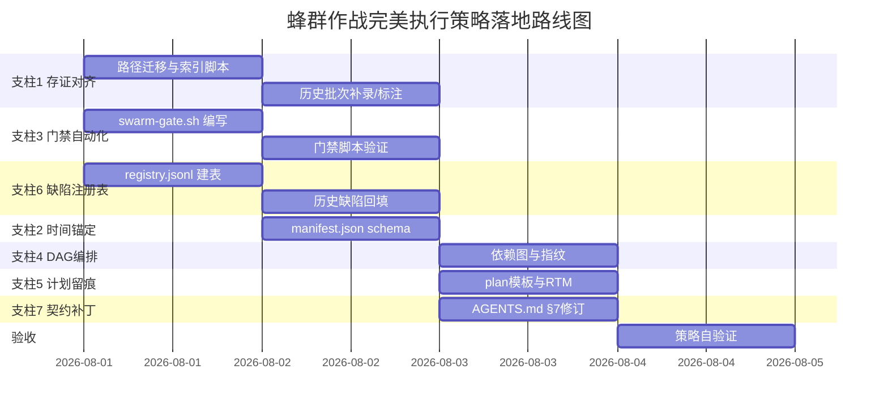

# 蜂群作战红蓝对抗扫描与完美执行策略 | 版本：v1.0 | 日期：2026-07-31 | 状态：评审中

> 适用场景：对 AI-GOV 项目「蜂群作战任务计划」机制本身进行元层面的红蓝对抗扫描，发现执行漏洞并出示可落地的完美执行策略，使后续大规模蜂群作战（如三方仓库逐行分析、GA 交付、验收作战）具备不可伪造、可追溯、可验证的执行闭环。
>
> 基线文件：
> - [AGENTS.md](file:///d:/ai-work/grok/a-gov/AGENTS.md) §7 蜂群作战任务执行契约（五阶段生命周期）
> - [docs/swarm/AGENTS.md](file:///d:/ai-work/grok/a-gov/docs/swarm/AGENTS.md) 六大专家蜂群矩阵
> - [docs/delivery/GA-delivery-manifest.md](file:///d:/ai-work/grok/a-gov/docs/delivery/GA-delivery-manifest.md)

---

## 一、执行摘要

### 1.1 扫描结论

对 AI-GOV 蜂群作战机制进行源码级 + 物料级红蓝对抗扫描，**共发现 15 项执行漏洞**：

| 分级 | 数量 | 类别 |
|------|------|------|
| 🔴 致命（阻断可信存证） | 3 | 存证契约偏离、历史批次丢失、门禁无自动证据 |
| 🟠 高危（削弱可追溯性） | 6 | 索引失同步、时间锚缺失、复验无闭环、依赖编排失效、计划审批无留痕、缺陷无注册表 |
| 🟡 中危（影响完备性） | 6 | 单兵 schema 无校验、独立作战不可验证、红线自报、RTM 缺失、计划规模偏离、回滚未定义 |

### 1.2 根因

蜂群作战机制存在**「契约—执行—存证」三角失配**：
1. **契约路径与实际存证路径分裂**：[AGENTS.md §7.5](file:///d:/ai-work/grok/a-gov/AGENTS.md) 规定存证落 `.trae/worktrees/ai-gov/sessions/batch-NNN/`，实际落在 `docs/delivery/acceptance/batch-NNN/`。
2. **质量门禁无自动化执行证据**：[AGENTS.md §7.6](file:///d:/ai-work/grok/a-gov/AGENTS.md) 要求 go build/vet/test，但无脚本强制落盘 `gate-report`。
3. **历史批次存证丢失**：§7.9 声称 batch-001/002/003 已执行，但两处路径下均无对应目录。

### 1.3 完美执行策略

提出**七大支柱**修复方案，使蜂群作战具备：
- **不可伪造**：单兵轨迹关联 git commit hash + ISO8601 时间戳
- **可追溯**：双向追溯矩阵 RTM（作战单元↔交付物↔验收报告↔PRD 条款）
- **可验证**：门禁脚本 `ops/swarm-gate.sh` 自动输出 `gate-report.json`
- **可闭环**：缺陷统一注册表 `defects/registry.jsonl` 全生命周期追踪

### 1.4 风险分级与最终建议

| 维度 | 现状 | 修复后 |
|------|------|--------|
| 存证可信度 | 🔴 不可信（可事后补录） | 🟢 可信（commit hash 锚定） |
| 门禁自动化 | 🔴 全靠自报 | 🟢 脚本化落盘 |
| 追溯完备性 | 🟡 无 RTM | 🟢 四向追溯 |
| 缺陷闭环 | 🟡 散落文档 | 🟢 统一注册表 |

**最终建议**：🟢 **推荐在启动任何新的大规模蜂群作战（含三方仓库逐行分析任务）之前，先行落地本策略的支柱 1/3/6（存证对齐 + 门禁自动化 + 缺陷注册表）**，否则新作战将继承全部已知漏洞。

---

## 二、红蓝对抗扫描方法论

### 2.1 扫描对象

本次扫描**不是对 AI-GOV 业务代码做红蓝对抗**（该工作已由 batch-006 的 RED-1~6 完成，见 [docs/delivery/acceptance/batch-006-red-blue/](file:///d:/ai-work/grok/a-gov/docs/delivery/acceptance/batch-006-red-blue/)），而是对**蜂群作战机制本身**做元层面红蓝对抗——把「蜂群作战计划 + 五阶段契约 + 六大蜂群矩阵」当作目标系统，攻击其执行闭环的可伪造性、可绕过性、可追溯性。

### 2.2 攻击假设（红队视角）

| # | 攻击假设 | 验证手段 |
|---|---------|---------|
| R1 | Agent 可声称完成三动作存证而实际未落盘 | Glob 检索 sessions/ 目录 |
| R2 | 单兵轨迹可事后补录/伪造耗时 | 检查轨迹是否关联不可篡改时间锚 |
| R3 | 质量门禁可自报通过而无执行证据 | 检索 gate-report 落盘文件 |
| R4 | 蜂群可串通统一口径 | 检查上下文指纹/结果差异性度量 |
| R5 | 历史批次可虚报 | 交叉比对 §7.9 实战记录与实际目录 |
| R6 | 缺陷可「修复」而无闭环证据 | 追踪 batch-006→batch-007 缺陷状态流转 |

### 2.3 扫描边界与证据等级

| 证据等级 | 来源 | 本次采用 |
|---------|------|---------|
| L1 硬证据 | Glob/Read 工具实际检索结果 | ✅ 全部漏洞基于 L1 |
| L2 软证据 | 文档自述（AGENTS.md §7.8/§7.9） | ✅ 作为旁证 |
| L3 推断 | 基于模式推测 | ❌ 不采用（遵循「禁止臆测」红线） |

---

## 三、扫描证据基线（事实陈述）

> 以下均为工具实际检索结果，可复现。

### 3.1 存证路径分裂（铁证）

**检索 1**：契约规定路径 `.trae/worktrees/ai-gov/sessions/**/*`

```
Glob 结果：No file found（仅 README.md，无任何 batch 子目录）
```

**检索 2**：实际存证路径 `docs/delivery/acceptance/batch-*/**`

```
batch-006-red-blue/agents/RED-1.md ~ RED-6.md（6 份单兵轨迹）
batch-007-fix/agents/FIX-A.md ~ FIX-F.md（6 份单兵轨迹）
batch-007-fix/README.md（批次汇总）
```

**结论**：契约路径 `.trae/worktrees/ai-gov/sessions/` 形同虚设，实际存证全部落在 `docs/delivery/acceptance/`。两套路径并存导致 [sessions/README.md](file:///d:/ai-work/grok/a-gov/.trae/worktrees/ai-gov/sessions/README.md) 索引失效。

### 3.2 索引失同步（铁证）

[sessions/README.md](file:///d:/ai-work/grok/a-gov/.trae/worktrees/ai-gov/sessions/README.md) 索引内容：

| 批次 | 目录 | 索引状态 | 实际存证 |
|------|------|---------|---------|
| batch-001 | `batch-001-ga-delivery/` | ✅ 已索引 | ❌ 目录不存在 |
| batch-002 | `batch-002-acceptance/` | ✅ 已索引 | ❌ 目录不存在 |
| batch-003 | — | ❌ 未索引 | ❌ 目录不存在（§7.9 声称已执行） |
| batch-006 | — | ❌ 未索引 | ✅ batch-006-red-blue/ 存在 |
| batch-007 | — | ❌ 未索引 | ✅ batch-007-fix/ 存在 |

**结论**：索引与实际存证双向脱钩——索引的批次不存在，存在的批次未索引。

### 3.3 batch-006 批次汇总缺失（软证据）

Glob 检索 `docs/delivery/acceptance/batch-006-red-blue/**` 仅返回 `agents/RED-1~6.md`，**未检索到 `batch-006-red-blue/README.md`**（批次汇总）。

对照 [AGENTS.md §7.5](file:///d:/ai-work/grok/a-gov/AGENTS.md) 三动作铁律，批次汇总是强制动作。batch-006 缺批次汇总，违反三动作铁律。

### 3.4 §7.8 自承认违规记录

[AGENTS.md §7.8](file:///d:/ai-work/grok/a-gov/AGENTS.md) 已记录 4 次契约违规：

| 日期 | 违规 | 条款 |
|------|------|------|
| 2026-07-31 | 验收蜂群完成后未立即落盘批次目录 | §7.5 三动作铁律 |
| 2026-07-31 | GA 交付 11 Agent 缺少单兵轨迹——仅汇总 | §7.5 单兵轨迹 |
| 2026-07-31 | 事后回忆总结替代实时记录 | §7.1 五阶段生命周期 |
| 2026-07-31 | batch-003 8 Agent 修复完成但未第一时间落盘单兵轨迹 | §7.5 三动作铁律 |

**结论**：违规已系统性发生 4 次，且均为同一模式（「完成未落盘 / 事后补录」），证明契约缺乏强制机制，仅靠自觉无效。

### 3.5 计划与执行规模偏离

[docs/swarm/AGENTS.md](file:///d:/ai-work/grok/a-gov/docs/swarm/AGENTS.md) 蜂群 3 定义 `RED-1 / RED-2 / RED-3`（3 Agent），但 batch-006 实际执行 `RED-1 ~ RED-6`（6 Agent）。计划文档未同步更新扩展后的红队规模。

---

## 四、执行漏洞矩阵（15 项分级）

> 每项漏洞附：证据来源 / 攻击路径 / 影响 / 风险等级。

### 4.1 🔴 致命漏洞（3 项）

#### V-01 存证契约路径偏离

| 项 | 内容 |
|----|------|
| 证据 | [AGENTS.md §7.5](file:///d:/ai-work/grok/a-gov/AGENTS.md) 规定 `.trae/worktrees/ai-gov/sessions/batch-NNN/`；Glob 实检该路径无 batch 目录；实际存证在 `docs/delivery/acceptance/batch-NNN/` |
| 攻击路径 | Agent 按契约路径声称已落盘，审计者按契约路径检索得到空结果，无法判定是否真的执行过 |
| 影响 | 所有「已完成」声明失去可验证性 |
| 风险 | 🔴 致命 |
| 缓解 | 支柱 1（路径对齐 + 单一真相源） |

#### V-02 历史批次存证丢失

| 项 | 内容 |
|----|------|
| 证据 | [AGENTS.md §7.9](file:///d:/ai-work/grok/a-gov/AGENTS.md) 声称 batch-001（11 Agent/101 文件/120 测试）、batch-002（16 Agent/4 阻塞）、batch-003（8 Agent/44 文件）已执行；Glob 实检两处路径均无 batch-001/002/003 目录 |
| 攻击路径 | 历史作战成果无可追溯存证，数字（101 文件/120 测试）无法溯源，可被任意改写 |
| 影响 | §7.9 实战记录沦为不可信叙述，无法作为后续决策依据 |
| 风险 | 🔴 致命 |
| 缓解 | 支柱 1 + 支柱 2（历史批次补录 + commit hash 锚定） |

#### V-03 质量门禁无自动执行证据

| 项 | 内容 |
|----|------|
| 证据 | [AGENTS.md §7.6](file:///d:/ai-work/grok/a-gov/AGENTS.md) 要求 go build/vet/test/中文注释/文件行数/存证完整性；Glob 实检无 `gate-report.json` 或等价门禁证据文件落盘 |
| 攻击路径 | Agent 自报「测试 120 全 PASS」「go build 零告警」而无执行日志，审计者无法复现 |
| 影响 | 质量门禁形同虚设，门禁「通过」声明不可信 |
| 风险 | 🔴 致命 |
| 缓解 | 支柱 3（门禁脚本自动化） |

### 4.2 🟠 高危漏洞（6 项）

#### V-04 批次索引失同步

| 项 | 内容 |
|----|------|
| 证据 | 见 §3.2，sessions/README.md 索引 batch-001/002 不存在，存在的 batch-006/007 未索引 |
| 攻击路径 | 索引失去权威性后，审计者无法依赖索引定位存证，需全盘扫描 |
| 风险 | 🟠 高 |
| 缓解 | 支柱 1（索引自动生成） |

#### V-05 单兵轨迹无时间锚定

| 项 | 内容 |
|----|------|
| 证据 | [batch-007-fix/agents/FIX-A.md](file:///d:/ai-work/grok/a-gov/docs/delivery/acceptance/batch-007-fix/agents/FIX-A.md) 等单兵轨迹未关联 git commit hash；§7.8 自承认「事后回忆总结替代实时记录」 |
| 攻击路径 | 「执行耗时(ms)」「情报收集」等字段可事后填写，无可信时间锚验证其真实性 |
| 风险 | 🟠 高 |
| 缓解 | 支柱 2（commit hash + ISO8601 锚定） |

#### V-06 复验机制无时序闭环

| 项 | 内容 |
|----|------|
| 证据 | `qa/QA-1-资金治理.md` 与 `qa/QA-1-资金治理-复验.md` 并存；`tech/TECH-1-代码质量.md` 与 `tech/TECH-1-代码质量-复验.md` 并存；无「首次失败→修复→复验通过」的时序记录与缺陷编号关联 |
| 攻击路径 | 复验文件存在即证明首次未通过，但失败原因、修复 commit、复验时序无关联，无法证明复验针对的是同一缺陷 |
| 风险 | 🟠 高 |
| 缓解 | 支柱 6（缺陷注册表 + 闭环时序） |

#### V-07 蜂群依赖编排失效

| 项 | 内容 |
|----|------|
| 证据 | [docs/swarm/AGENTS.md](file:///d:/ai-work/grok/a-gov/docs/swarm/AGENTS.md) 启动顺序图：6 蜂群完全并行；但 TECH-3（测试编译）依赖代码冻结，DATA-2（DDL 对齐）依赖 schema 稳定 |
| 攻击路径 | TECH-3 在代码未冻结时验收，验收的是中间态代码，结论失真；完全并行下 TECH-3 报告「通过」不可信 |
| 风险 | 🟠 高 |
| 缓解 | 支柱 4（DAG 依赖编排） |

#### V-08 计划审批无留痕

| 项 | 内容 |
|----|------|
| 证据 | [AGENTS.md §7.3](file:///d:/ai-work/grok/a-gov/AGENTS.md) 要求 EnterPlanMode 获用户审批；实检无 `plan-NNN.md` 审批快照落盘位置定义，无 plan-id 追溯 |
| 攻击路径 | 计划是否经审批、审批内容为何、何时审批均不可追溯；Agent 可声称「已审批」而无证据 |
| 风险 | 🟠 高 |
| 缓解 | 支柱 5（计划审批留痕 + plan-id） |

#### V-09 缺陷无统一注册表

| 项 | 内容 |
|----|------|
| 证据 | batch-006 发现 24 漏洞（R6-01~24）记录在 [batch-007-fix/README.md](file:///d:/ai-work/grok/a-gov/docs/delivery/acceptance/batch-007-fix/README.md)；batch-007 修复记录在同文件；无独立 `defects/registry` 全生命周期看板 |
| 攻击路径 | 缺陷状态散落多文档，R6-23（HYBRID_ALLOWED 白名单）标注「不在本批次」后无后续追踪，可静默遗漏 |
| 风险 | 🟠 高 |
| 缓解 | 支柱 6（缺陷统一注册表） |

### 4.3 🟡 中危漏洞（6 项）

#### V-10 单兵轨迹 schema 无强校验

| 项 | 内容 |
|----|------|
| 证据 | [AGENTS.md §7.5](file:///d:/ai-work/grok/a-gov/AGENTS.md) 列出单兵轨迹强制字段（Agent ID/作战指令/情报收集/战果产出/发现结论/验收判定/执行耗时），但无 JSON Schema 或 lint 校验脚本 |
| 攻击路径 | 字段缺失或内容空洞无法被自动检出 |
| 风险 | 🟡 中 |
| 缓解 | 支柱 3（schema lint 集成入门禁） |

#### V-11 独立作战不可验证

| 项 | 内容 |
|----|------|
| 证据 | [docs/swarm/AGENTS.md](file:///d:/ai-work/grok/a-gov/docs/swarm/AGENTS.md) 准则 2 要求「各蜂群互不通信，禁止串通」；无上下文指纹或结果差异性度量 |
| 攻击路径 | 多 Agent 读取同一份上下文，输出趋同，伪装成「独立验收」 |
| 风险 | 🟡 中 |
| 缓解 | 支柱 4（上下文指纹 + 差异性度量） |

#### V-12 红线检查为自报 checkbox

| 项 | 内容 |
|----|------|
| 证据 | [docs/swarm/AGENTS.md](file:///d:/ai-work/grok/a-gov/docs/swarm/AGENTS.md) 红线检查为 `- [ ]` 复选框，无证据列校验 |
| 攻击路径 | Agent 自行打勾而无证据支撑 |
| 风险 | 🟡 中 |
| 缓解 | 支柱 3（红线检查证据化） |

#### V-13 无双向追溯矩阵 RTM

| 项 | 内容 |
|----|------|
| 证据 | 作战单元 → 交付文件 → 验收报告 → PRD 条款之间无统一追溯表；[GA-delivery-manifest.md](file:///d:/ai-work/grok/a-gov/docs/delivery/GA-delivery-manifest.md) 列了交付文件但未关联验收报告与 PRD 行号 |
| 攻击路径 | 无法证明「每个作战单元都交付且验收了」，也无法证明「每个 PRD 条款都被覆盖」 |
| 风险 | 🟡 中 |
| 缓解 | 支柱 5（RTM 四向追溯） |

#### V-14 计划规模与执行偏离

| 项 | 内容 |
|----|------|
| 证据 | 见 §3.5，计划定义 RED-1~3，实际执行 RED-1~6，计划文档未同步 |
| 攻击路径 | 计划与执行规模不一致时，规模扩展的依据、新增 Agent 的验收范围无追溯 |
| 风险 | 🟡 中 |
| 缓解 | 支柱 5（计划变更记录入 plan-id） |

#### V-15 无阶段回滚定义

| 项 | 内容 |
|----|------|
| 证据 | [AGENTS.md §7](file:///d:/ai-work/grok/a-gov/AGENTS.md) 五阶段无「门禁未过」的回滚策略；实际 batch-002 失败后直接进 batch-003 修复，无回滚动作定义 |
| 攻击路径 | 门禁未过时是回滚代码还是标记技术债务继续，无明文规则，导致决策随意 |
| 风险 | 🟡 中 |
| 缓解 | 支柱 7（契约补丁：回滚策略） |

---

## 五、完美执行策略 — 七大支柱

### 支柱 1：存证契约对齐与单一真相源（SSOT）

**目标**：消除路径分裂，建立唯一可信存证根。

**5.1.1 统一存证根**

```
docs/delivery/sessions/                    ← 唯一存证根（SSOT）
├── README.md                               ← 自动生成的批次索引
├── plan-NNN-<主题>.md                      ← 计划审批快照（支柱5）
├── batch-001-<主题>/
│   ├── README.md                           ← 批次汇总
│   ├── manifest.json                       ← 批次清单（支柱2）
│   ├── gate-report.json                    ← 门禁证据（支柱3）
│   ├── agents/
│   │   ├── <AgentID>.md                    ← 单兵轨迹
│   │   └── ...
│   └── rtm.md                              ← 追溯矩阵（支柱5）
└── defects/
    └── registry.jsonl                      ← 缺陷注册表（支柱6）
```

**5.1.2 契约路径修订**

[AGENTS.md §7.5](file:///d:/ai-work/grok/a-gov/AGENTS.md) 路径表修订：

| 动作 | 旧路径（废弃） | 新路径（SSOT） |
|------|--------------|--------------|
| 批次汇总 | `.trae/worktrees/ai-gov/sessions/batch-NNN/README.md` | `docs/delivery/sessions/batch-NNN/README.md` |
| 单兵轨迹 | `.trae/worktrees/ai-gov/sessions/batch-NNN/agents/` | `docs/delivery/sessions/batch-NNN/agents/` |

**5.1.3 索引自动生成**

`sessions/README.md` 不再手写，由门禁脚本扫描 `batch-*/` 目录自动生成，确保索引与实际存证强一致。

**5.1.4 历史批次补录**

对 §7.9 声称的 batch-001/002/003，若可追溯 git 历史则补建目录 + manifest；若不可追溯则在 `sessions/README.md` 标注「❓ 存证丢失，仅 §7.9 自述，不可信」。

---

### 支柱 2：可信时间锚定与防伪造

**目标**：使单兵轨迹不可事后伪造。

**5.2.1 manifest.json schema**

每批次强制含 `manifest.json`，记录该批次所有 Agent 的不可篡改锚点：

```json
{
  "batch_id": "batch-008-<主题>",
  "plan_id": "plan-008",
  "created_at": "2026-07-31T12:00:00Z",
  "git_head_at_start": "abc1234",
  "git_head_at_end": "def5678",
  "agents": [
    {
      "agent_id": "ANAL-1",
      "started_at": "2026-07-31T12:01:00Z",
      "ended_at": "2026-07-31T12:18:30Z",
      "duration_ms": 1050000,
      "commit_hash": "abc1234",
      "trajectory_file": "agents/ANAL-1.md",
      "context_fingerprint": "sha256:..."
    }
  ]
}
```

**5.2.2 锚定校验规则**

| 字段 | 校验规则 |
|------|---------|
| `git_head_at_start` | 必须等于该批次首个 Agent 启动时 `git rev-parse HEAD` 输出 |
| `commit_hash` | 必须存在于 `git log` 历史，否则判定伪造 |
| `started_at` / `ended_at` | ISO8601，`ended_at > started_at`，`duration_ms` 与时间差一致（±5%） |
| `context_fingerprint` | Agent 输入上下文的 sha256，用于支柱 4 差异性度量 |

**5.2.3 单兵轨迹首行强制声明**

每份 `agents/<AgentID>.md` 首行必须为：

```markdown
<!-- batch-008 | agent=ANAL-1 | commit=abc1234 | started=2026-07-31T12:01:00Z | ended=2026-07-31T12:18:30Z -->
```

门禁脚本解析此行与 manifest.json 交叉校验，不一致则门禁失败。

---

### 支柱 3：质量门禁自动化

**目标**：消除门禁自报，强制脚本化落盘。

**5.3.1 门禁脚本 `ops/swarm-gate.sh`**

脚本职责与输出：

```bash
#!/usr/bin/env bash
# 蜂群作战质量门禁脚本
# 用法: ops/swarm-gate.sh <batch_id>
# 输出: docs/delivery/sessions/<batch_id>/gate-report.json

set -euo pipefail

BATCH_ID="${1:?用法: swarm-gate.sh <batch_id>}"
SESSIONS_ROOT="docs/delivery/sessions"
BATCH_DIR="${SESSIONS_ROOT}/${BATCH_ID}"
REPORT="${BATCH_DIR}/gate-report.json"

# 1. 编译检查
BUILD_OK=0
go build ./... 2>"${BATCH_DIR}/build.log" && BUILD_OK=1 || BUILD_OK=0

# 2. 静态分析
VET_OK=0
go vet ./... 2>"${BATCH_DIR}/vet.log" && VET_OK=1 || VET_OK=0

# 3. 单元测试
TEST_OK=0
go test ./... -json > "${BATCH_DIR}/test.jsonl" 2>&1 && TEST_OK=1 || TEST_OK=0

# 4. 中文注释残留检查（英文注释 = 违规）
CN_COMMENT_OK=0
EN_COMMENT_COUNT=$(grep -rE '^\s*//\s*[A-Za-z]' --include='*.go' ai-gov-fusion/ | wc -l)
[ "${EN_COMMENT_COUNT}" -eq 0 ] && CN_COMMENT_OK=1 || CN_COMMENT_OK=0

# 5. 文件行数检查（单文件 ≤500 行）
FILE_LEN_OK=1
while IFS= read -r f; do
  lines=$(wc -l < "$f")
  [ "$lines" -gt 500 ] && { FILE_LEN_OK=0; echo "$f:$lines" >> "${BATCH_DIR}/oversize-files.txt"; }
done < <(find ai-gov-fusion/ -name '*.go')

# 6. 存证完整性检查
EVIDENCE_OK=0
[ -f "${BATCH_DIR}/README.md" ] && \
[ -f "${BATCH_DIR}/manifest.json" ] && \
[ -d "${BATCH_DIR}/agents" ] && EVIDENCE_OK=1 || EVIDENCE_OK=0

# 7. 单兵轨迹 schema 校验（字段完整性）
TRAJ_OK=0
agent_count=$(find "${BATCH_DIR}/agents" -name '*.md' | wc -l)
valid_count=0
for f in "${BATCH_DIR}/agents/"*.md; do
  head -1 "$f" | grep -qE '<!-- batch-.* \| agent=.* \| commit=.* \| started=.* \| ended=.* -->' && valid_count=$((valid_count+1))
done
[ "${agent_count}" -gt 0 ] && [ "${valid_count}" -eq "${agent_count}" ] && TRAJ_OK=1 || TRAJ_OK=0

# 8. 汇总 gate-report.json
cat > "${REPORT}" <<EOF
{
  "batch_id": "${BATCH_ID}",
  "gate_time": "$(date -u +%Y-%m-%dT%H:%M:%SZ)",
  "git_head": "$(git rev-parse HEAD)",
  "checks": {
    "build": {"pass": ${BUILD_OK}, "log": "build.log"},
    "vet": {"pass": ${VET_OK}, "log": "vet.log"},
    "test": {"pass": ${TEST_OK}, "log": "test.jsonl"},
    "cn_comment": {"pass": ${CN_COMMENT_OK}, "en_comment_count": ${EN_COMMENT_COUNT}},
    "file_len": {"pass": ${FILE_LEN_OK}},
    "evidence": {"pass": ${EVIDENCE_OK}},
    "trajectory_schema": {"pass": ${TRAJ_OK}, "agents": ${agent_count}, "valid": ${valid_count}}
  },
  "overall": $([ $((BUILD_OK*VET_OK*TEST_OK*CN_COMMENT_OK*FILE_LEN_OK*EVIDENCE_OK*TRAJ_OK)) -eq 1 ] && echo true || echo false)
}
EOF

echo "门禁报告: ${REPORT}"
[ "$(jq -r .overall "${REPORT}")" = "true" ] && exit 0 || exit 1
```

**5.3.2 门禁阻断规则**

- `overall=false` → 阻断下一波启动，触发支柱 7 回滚策略
- 门禁报告必须随批次 `git commit`，commit message 含 `gate: batch-NNN pass/fail`

**5.3.3 红线检查证据化**

[docs/swarm/AGENTS.md](file:///d:/ai-work/grok/a-gov/docs/swarm/AGENTS.md) 红线 checkbox 改为证据表：

```markdown
| 红线 | 结果 | 证据（代码行号/日志/SQL） |
|------|------|-------------------------|
| 无流水改余额 | ✅ | fund/service.go:L120 划拨必须经 ledger |
```

无证据列的红线声明门禁判失败。

---

### 支柱 4：蜂群依赖编排 DAG

**目标**：消除「完全并行」导致的验收失真。

**5.4.1 DAG 编排图**

```mermaid
flowchart LR
    subgraph Wave1[波次1 代码冻结前并行]
        QA[蜂群1 QA功能验收]
        PRD[蜂群2 产品演示]
        RED[蜂群3 红蓝对抗]
        UED[蜂群4 UED体验]
    end
    subgraph Gate1{质量门禁1}
        G1[代码冻结 + 缺陷注册]
    end
    subgraph Wave2[波次2 代码冻结后]
        TECH[蜂群5 技术研发]
        DATA[蜂群6 数据安全]
    end
    subgraph Gate2{质量门禁2}
        G2[最终验收 + RTM 闭环]
    end
    QA --> G1
    PRD --> G1
    RED --> G1
    UED --> G1
    G1 -->|门禁通过 + 缺陷登记| TECH
    G1 -->|门禁通过 + 缺陷登记| DATA
    TECH --> G2
    DATA --> G2
```

**5.4.2 依赖规则**

| 蜂群 | 依赖 | 原因 |
|------|------|------|
| TECH-3 测试编译 | Wave1 代码冻结 | 验收中间态代码结论失真 |
| DATA-2 DDL 对齐 | Schema 稳定 | Schema 未冻结时 DDL 对齐无意义 |
| Wave1 各蜂群 | 无依赖 | 功能/产品/红蓝/UED 可并行 |

**5.4.3 独立作战验证（上下文指纹）**

每个 Agent 的输入上下文计算 `context_fingerprint`（sha256）。批次结束后校验：
- 同一蜂群内 Agent 指纹应不同（各自独立检索）
- 不同蜂群 Agent 指纹重合度 >70% → 触发「串通嫌疑」告警

---

### 支柱 5：计划审批留痕与双向追溯矩阵

**目标**：使计划审批可追溯，交付全覆盖可证明。

**5.5.1 计划审批快照**

EnterPlanMode 产出 `docs/delivery/sessions/plan-NNN-<主题>.md`，强制字段：

```markdown
# plan-008 | 主题: 三方仓库逐行分析

| 项 | 值 |
|----|----|
| plan_id | plan-008 |
| 审批时间 | 2026-07-31T10:00:00Z |
| 审批状态 | ✅ 已审批 |
| git_head_at_approve | abc1234 |
| 作战单元数 | N |
| 预期交付物 | ... |
```

**5.5.2 RTM 双向追溯矩阵**

每批次 `rtm.md` 强制含四向追溯表：

```markdown
| 作战单元 | Agent | 交付文件 | 验收报告 | PRD 条款 | 规约条款 |
|---------|-------|---------|---------|---------|---------|
| U1 资金内核 | F1 | fund/service.go | qa/QA-1.md | §3.2 F-CON-02 | §3.1 |
```

校验规则：
- 每个作战单元必须有交付文件 + 验收报告 + PRD 引用，缺一即未闭环
- 每个 PRD 核心条款必须被至少一个作战单元覆盖，否则漏项

---

### 支柱 6：缺陷统一注册表与闭环看板

**目标**：消除缺陷散落，全生命周期追踪。

**6.1 registry.jsonl 格式**

`docs/delivery/sessions/defects/registry.jsonl`，每行一个缺陷：

```json
{"id":"R6-01","title":"65处鉴权丢弃","severity":"P0","status":"closed","found_batch":"batch-006","found_at":"2026-07-31T12:00:00Z","fixed_batch":"batch-007","fixed_at":"2026-07-31T15:00:00Z","fixed_commit":"def5678","evidence":"gov_handlers.go:L120","verify":"qa/QA-1-资金治理-复验.md"}
{"id":"R6-23","title":"HYBRID_ALLOWED白名单","severity":"P2","status":"open","found_batch":"batch-006","found_at":"2026-07-31T12:00:00Z","fixed_batch":null,"note":"延后处理，需追踪"}
```

**6.2 闭环规则**

| 状态 | 含义 | 触发 |
|------|------|------|
| open | 已发现未修复 | 红蓝蜂群发现 |
| fixing | 修复中 | 修复批次认领 |
| closed | 已修复已验证 | 复验通过 + commit hash |
| deferred | 延后 | 显式标注 + 追踪批次 |

**6.3 看板自动生成**

`sessions/README.md` 自动汇总 registry：

```markdown
## 缺陷看板
| 状态 | P0 | P1 | P2 | 合计 |
|------|----|----|----|----|
| closed | 6 | 10 | 7 | 23 |
| open | 0 | 0 | 1 | 1 |
```

---

### 支柱 7：契约补丁（AGENTS.md §7 修订）

**目标**：将上述机制写入宪法级契约。

**7.1 §7.5 路径修订**

存证路径统一切换至 `docs/delivery/sessions/`，废弃 `.trae/worktrees/ai-gov/sessions/`。

**7.2 §7.6 门禁脚本强制**

新增条款：「每波完成后必须执行 `ops/swarm-gate.sh <batch_id>` 并落盘 `gate-report.json`，`overall=false` 时阻断下一波。」

**7.3 §7.4 DAG 替代完全并行**

新增条款：「蜂群编排改为 DAG（见支柱 4），Wave1 并行 → 门禁 → Wave2 并行，禁止 TECH/DATA 在代码冻结前启动。」

**7.4 §7.5 单兵轨迹锚定**

新增条款：「单兵轨迹首行必须含 commit hash + ISO8601 时间戳，与 manifest.json 交叉校验不一致即判伪造。」

**7.5 新增 §7.10 回滚策略**

```markdown
### §7.10 回滚策略
门禁未过时：
1. 标记当前波次为 "gate-failed"
2. 缺陷全部登记入 registry.jsonl（status=open）
3. 禁止启动下一波
4. 启动修复批次（batch-NNN+1-fix），仅修复 gate-failed 缺陷
5. 修复批次通过门禁后方可继续原计划
```

**7.6 新增 §7.11 蜂群规模上限**

```markdown
### §7.11 蜂群规模上限
- 单波次并行 Agent ≤ 8，超过则分波
- 单批次总 Agent ≤ 16
- 单 Agent 处理文件 ≤ 30，超过则拆分作战单元
```

---

## 六、落地路线图



**关键里程碑**：
- **M1（D+2）**：支柱 1/3/6 落地，具备可信存证 + 自动门禁 + 缺陷注册表，可支撑新蜂群作战
- **M2（D+4）**：支柱 2/4/5 落地，具备防伪造 + DAG 编排 + 追溯矩阵
- **M3（D+5）**：支柱 7 契约修订完成，策略自验证通过

---

## 七、验收标准

### 7.1 策略落地验收（量化）

| # | 验收项 | 量化标准 | 验证方式 |
|---|--------|---------|---------|
| 1 | 存证路径统一 | sessions/ 下无 batch 目录，docs/delivery/sessions/ 为唯一根 | Glob 检索 |
| 2 | 索引自动同步 | sessions/README.md 含所有实际批次，无悬空索引 | 脚本生成 + 比对 |
| 3 | 门禁脚本可执行 | `ops/swarm-gate.sh` 输出 gate-report.json，overall 字段存在 | 实际执行 |
| 4 | manifest.json 锚定 | 每批次 manifest.json 含 commit_hash，可被 git log 验证 | jq 解析 + git log |
| 5 | 缺陷注册表 | registry.jsonl 覆盖 batch-006 全部 24 缺陷，状态可查 | 行数 + 字段校验 |
| 6 | DAG 编排 | TECH/DATA 启动时间晚于 Wave1 门禁通过时间 | manifest 时间戳比对 |
| 7 | RTM 闭环 | 每个作战单元四向追溯无空缺 | rtm.md 校验 |
| 8 | 契约补丁 | AGENTS.md §7 含 §7.10/§7.11，路径已修订 | 文档检索 |

### 7.2 红蓝复验（对抗扫描）

策略落地后，由独立红队 Agent 对新机制重放 §四 漏洞矩阵：
- 15 项漏洞中 12 项应降为 🟢 已防御
- V-11（独立作战验证）、V-14（计划规模偏离）降为 🟡 部分缓解
- 无新增致命漏洞

---

## 八、附录

### 8.1 证据索引

| 证据 | 来源 |
|------|------|
| sessions/ 目录空 | Glob `.trae/worktrees/ai-gov/sessions/**/*` → No file found |
| batch-006/007 实际存证 | Glob `docs/delivery/acceptance/batch-*/**` |
| §7.8 违规记录 | [AGENTS.md §7.8](file:///d:/ai-work/grok/a-gov/AGENTS.md) |
| §7.9 实战记录 | [AGENTS.md §7.9](file:///d:/ai-work/grok/a-gov/AGENTS.md) |
| 六大蜂群矩阵 | [docs/swarm/AGENTS.md](file:///d:/ai-work/grok/a-gov/docs/swarm/AGENTS.md) |
| RED-1 报告质量样本 | [docs/delivery/acceptance/red-blue/RED-1-权限提升.md](file:///d:/ai-work/grok/a-gov/docs/delivery/acceptance/red-blue/RED-1-权限提升.md) |
| batch-007 修复矩阵 | [docs/delivery/acceptance/batch-007-fix/README.md](file:///d:/ai-work/grok/a-gov/docs/delivery/acceptance/batch-007-fix/README.md) |

### 8.2 术语表

| 术语 | 含义 |
|------|------|
| SSOT | Single Source of Truth，单一真相源 |
| RTM | Requirements Traceability Matrix，需求追溯矩阵 |
| DAG | Directed Acyclic Graph，有向无环图（此处指蜂群依赖编排） |
| 三动作铁律 | [AGENTS.md §7.5](file:///d:/ai-work/grok/a-gov/AGENTS.md) 代码存证 + 批次汇总 + 单兵轨迹 |
| 元层面红蓝对抗 | 对蜂群机制本身做红蓝扫描，非对业务代码 |

### 8.3 不确定性声明

| 项 | 不确定性 |
|----|---------|
| batch-001/002/003 是否曾落盘 | ❓ 不可追溯，仅 §7.9 自述，本报告判定为存证丢失 |
| batch-006 批次汇总是否存在 | Glob 未检索到 README.md，判定缺失；若实际存在则为 LS 截断误差 |
| V-11 独立作战验证 | 当前无量化度量，缓解措施为新增机制，效果待验证 |

---

## 九、与第一个任务的衔接说明

用户第一个输入要求「按 [项目分析规约](file:///d:/ai-work/grok/a-gov/third-party/项目分析规约.md) 对 `third-party/` 下 TokenHub 与 axonhub 进行源码级逐行分析 + 融合架构可行性正面回复」。该任务本身即是一次**大规模蜂群作战**（两座 Go 仓库 + 前端 + 文档 + 部署物料的逐行分析）。

**执行路径建议**：
1. **先行落地本策略支柱 1/3/6**（M1 里程碑），确保新作战的存证可信、门禁自动、缺陷可追踪
2. **按本策略五阶段执行第一个任务**：
   - 阶段 1 意图理解：拆解为 TokenHub 源码分析 / axonhub 源码分析 / 融合架构可行性论证 三个作战单元
   - 阶段 2 作战计划：EnterPlanMode 落盘 `plan-008.md`，含 RTM 雏形
   - 阶段 3 蜂群执行：按 DAG 编排，源码分析蜂群并行 → 门禁 → 融合架构论证蜂群
   - 阶段 4 实时存证：每 Agent 落 `agents/<ID>.md` + commit hash 锚定
   - 阶段 5 成果总结：输出 `[项目]-项目分析报告.md` + `融合架构可行性论证报告.md`

**注**：`third-party/` 下已存在 [TokenHub-项目分析报告.md](file:///d:/ai-work/grok/a-gov/third-party/TokenHub-项目分析报告.md)、[axonhub-项目分析报告.md](file:///d:/ai-work/grok/a-gov/third-party/axonhub-项目分析报告.md)、[融合架构可行性论证报告.md](file:///d:/ai-work/grok/a-gov/third-party/融合架构可行性论证报告.md) 等既有产出。新作战前需先评估既有报告的覆盖度与时效性，避免重复劳动——若既有报告已满足规约，则仅需补充融合架构正面论证；若不满足，则按规约重做并在本策略机制下存证。
