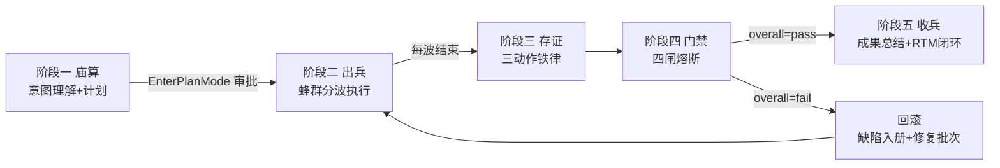
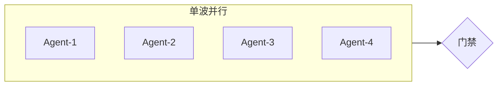
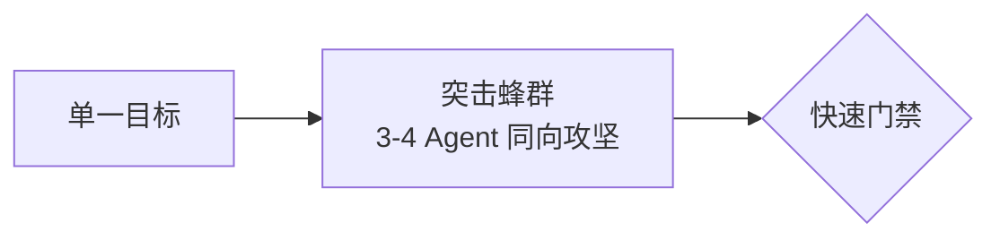
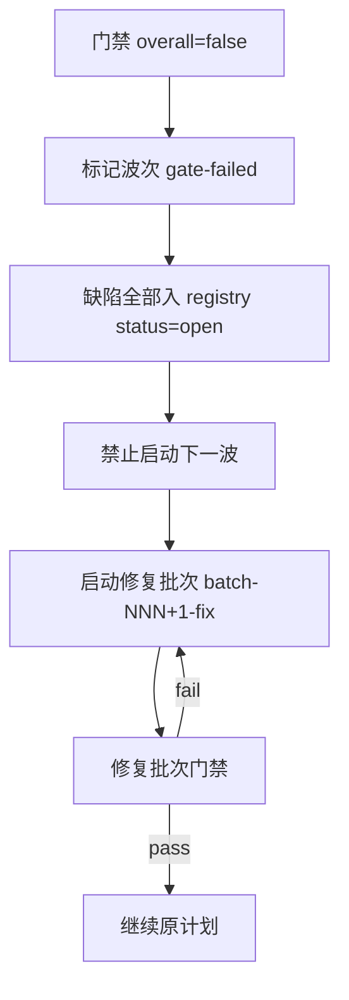
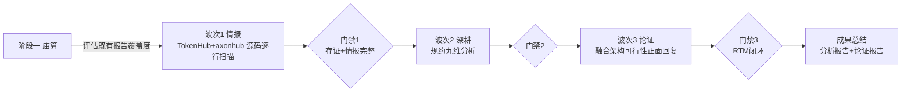

# 蜂群作战通用标准方案—兵法与AI蜂群融合设计 | 版本：v1.0 | 日期：2026-07-31 | 状态：评审中

> **定位**：一套**通用、可迁移、可复制**的 AI 智能化软件研发蜂群作战标准方案，不绑定特定项目，可应用于任意「大规模多 Agent 并行研发/分析/验收」场景。
>
> **设计渊源**：孙子兵法 · 毛主席兵法论 · 现代 AI 多智能体系统（MAS）与群体智能（Swarm Intelligence）理论，三方融合论证。
>
> **核心圭臬**：简单、务实、收益最大化；先胜后战、集中歼灭、规则涌现；杜绝执行失控。

---

## 一、设计纲领（三方智慧融合）

> 顶级智脑多方论证：从东方兵法提炼「胜道」，从现代 AI 蜂群提炼「术法」，两者映射为可执行的研发作战机制。

### 1.1 孙子兵法启示（胜道层）

| 兵法原文 | 作战映射 | 机制落地 |
|---------|---------|---------|
| 「胜兵先胜而后求战，败兵先战而后求胜」 | 先立不败之地再出击 | **先胜原则**：存证铁律 + 门禁铁律先行，未立不败不出战 |
| 「庙算多者胜，少算不胜」 | 战前计算决定胜负 | **庙算原则**：阶段一意图理解 + 计划审批 + RTM 雏形 |
| 「兵贵胜，不贵久」 | 速战速决，忌拖沓 | **速决原则**：单批次时间闸（≤1 个工作日），超时熔断 |
| 「以正合，以奇胜」 | 正兵当敌，奇兵取胜 | **正奇原则**：正合式（常规并行）+ 奇胜式（突击蜂群）双轨 |
| 「我专而敌分，我专为一」 | 集中兵力 | **专一原则**：单批次聚焦一个核心目标，禁止多目标分散 |
| 「先为不可胜，以待敌之可胜」 | 先使自己不可被战胜 | **不可胜原则**：防伪造锚定 + 防失控四闸 |
| 「兵无常势，水无常形」 | 灵活应变 | **无常原则**：DAG 动态编排，依依赖关系调整波次 |
| 「令之以文，齐之以武」 | 文（共识）武（纪律）并重 | **文武原则**：契约（武）+ 文化共识（文）双约束 |
| 「知己知彼，百战不殆」 | 情报先行 | **知彼原则**：证据驱动，禁止臆测 |

### 1.2 毛主席兵法论启示（战法层）

| 兵法论断 | 作战映射 | 机制落地 |
|---------|---------|---------|
| 「集中优势兵力，各个歼灭敌人」「每战集中六倍、五倍、四倍于敌之兵力」 | 单点绝对优势 | **歼灭原则**：单作战单元 Agent 配置 ≥3，形成局部压倒性优势 |
| 「伤其十指，不如断其一指」 | 歼灭战非击溃战 | **断指原则**：彻底完成一个作战单元（含验收闭环）再转下一个，禁止半成品堆积 |
| 「不打无准备之仗，不打无把握之仗」 | 准备充分 | **有把握原则**：阶段一产出可执行 checklist，无把握标注风险不强行推进 |
| 「战略上藐视敌人，战术上重视敌人」 | 战略乐观战术严谨 | **藐视重视原则**：目标宏大（战略）+ 执行精细到行号（战术） |
| 「实事求是」 | 从实际出发 | **求是原则**：每结论附证据，L3 推断一律拒绝 |
| 「调查就是解决问题」 | 调研先行 | **调查原则**：源码逐行/物料全扫，禁止跳过情报直接结论 |
| 「抓主要矛盾」 | 聚焦核心 | **主矛盾原则**：每批次只抓 1 个主要矛盾，不过度设计 |
| 「实践是检验真理的唯一标准」 | 实践检验 | **实践原则**：门禁脚本自动验证，自报无效 |
| 「战略持久战，战役速决战」 | 长期路线 + 单役速决 | **持久速决原则**：路线图持久（多批次）+ 单批次速决（时间闸） |

### 1.3 现代 AI 蜂群理论启示（术法层）

| 理论概念 | 作战映射 | 机制落地 |
|---------|---------|---------|
| **Swarm Intelligence 简单规则涌现** | 最少规则产生有序行为 | **三铁律**：存证/门禁/闭环，规则集 ≤3 条，禁止流程膨胀 |
| **Multi-Agent System 角色分工** | 异构 Agent 协作 | **分层角色矩阵**：L0 通用基座 6 角色 + L1 AI 扩展按需，见 §1.3.1 |
| **Observability 可观测性** | logs/metrics/traces | **三件套**：manifest(轨迹) + gate-report(指标) + registry(链路) |
| **Circuit Breaker 熔断** | 失败时快速阻断 | **四闸熔断**：规模/门禁/时间/闭环，触发即停 |
| **Backpressure 背压** | 上游过载反向施压 | **规模闸**：下游未消化则上游不发新任务 |
| **Idempotency 幂等** | 重复执行结果一致 | **批次幂等**：batch_id + commit_hash，重放不产生重复存证 |
| **Definition of Done 完成定义** | 完成标准前置 | **DoD 清单**：每个作战单元验收标准在阶段一定义 |
| **Shift-Left Testing 测试左移** | 尽早验证 | **门禁左移**：波次内即验证，非末尾统一验收 |
| **Conway's Law 康威定律** | 架构对齐组织 | **蜂群对齐模块**：Agent 划分与代码模块边界一致 |
| **Trunk-Based 短分支** | 频繁集成 | **批次短周期**：单批次 ≤1 日，快速合并主轨 |

### 1.3.1 分层角色矩阵（SDLC + AI 研发全覆盖）

> **修订背景**：原「六角色标准：QA/产品/红蓝/UED/技术/数据」经 SDLC（ISO 12207）与现代 AI 研发（MLOps/LLMOps）双视角审视，存在两类缺口：
> - **SDLC 缺口**：无运维/SRE 角色 → DevSecOps 三轴 Dev✅/Sec✅/Ops❌，缺 Ops 则交付不可上线（部署/监控/性能压测/可观测性无验收）
> - **AI 研发缺口**：无模型评测/合规伦理/成本计费 → AI 项目特有的模型对齐、监管合规、Token 成本治理无覆盖
> - **根因**：原方案把「数据」列为通用基座，实为 AI-GOV 项目特有需求，反而漏掉真正通用的「运维」。违背通用方案「不绑定特定项目」定位。

**分层角色矩阵**：

| 层级 | 角色 | 代号 | 验收域 | 适用场景 |
|------|------|------|--------|---------|
| **L0 通用基座** | 产品 | PRD | 需求一致性/演示/用户旅程 | 任何软件项目 |
| **L0 通用基座** | 技术 | TECH | 架构/实现/代码质量/编译 | 任何软件项目 |
| **L0 通用基座** | QA | QA | 功能/集成/系统/验收测试 | 任何软件项目 |
| **L0 通用基座** | 红蓝 | RED | 安全对抗/渗透/攻击面 | 任何软件项目 |
| **L0 通用基座** | UED | UX | 交互/可用性/体验走查 | 任何有 UI 项目 |
| **L0 通用基座** | **运维** | **OPS** | **部署/监控/告警/性能压测/可观测性/SLA** | **任何软件项目（新增）** |
| **L1 AI 扩展** | 数据 | DATA | 数据治理/守恒/血缘 | 数据驱动项目 |
| **L1 AI 扩展** | 模型评测 | EVAL | 模型质量/对齐/幻觉/Prompt | AI/LLM 项目 |
| **L1 AI 扩展** | 合规伦理 | COMP | 监管/隐私/伦理/跨境 | 合规敏感项目 |
| **L1 AI 扩展** | 成本计费 | FIN | Token 计量/资金治理/计费 | AI 商业化项目 |

**启用规则**（务实，按需裁剪）：
- L0 基座 6 角色为默认启用，缺一即 SDLC 不闭环
- L1 扩展按项目特征启用，阶段一庙算时显式声明启用集
- 无 UI 项目可裁剪 UED（如纯后端/CLI）
- 单波次 Agent ≤8，超出则分波（§5.1 规模闸）

**与六角色标准的差异**：
- 运维（OPS）从无到有，补 DevOps 闭环
- 数据（DATA）从基座降为扩展，回归通用性
- 新增 EVAL/COMP/FIN 三角色，覆盖 AI 研发特有维度

### 1.4 融合核心原则（简单务实收益最大化）

三方智慧收敛为 **五条不可妥协的核心原则**：

| # | 原则 | 出处 | 一句话 |
|---|------|------|--------|
| 1 | **先胜后战** | 孙子·先胜 | 未立存证+门禁不败之地，不出战 |
| 2 | **集中歼灭** | 毛·集中优势 | 单批次一个目标，伤十指不如断一指 |
| 3 | **规则涌现** | AI 蜂群 | 三铁律 + 四闸，规则不超七条 |
| 4 | **实事求是** | 毛·实事求是 + 孙子·知彼 | 无证据不结论，L3 推断拒绝 |
| 5 | **速决持久** | 孙子·不贵久 + 毛·持久速决 | 单役速决（时间闸），全局持久（路线图） |

> **设计克制声明**：本方案总规则数 = 三铁律 + 四闸 + 五原则 = 12 条。任何超出此集的流程均为冗余，应予剪除。这是对「过去复杂、执行失控」的直接回应——**复杂是失控之源，简单是可控之基**。

---

## 二、蜂群作战五阶标准（通用可迁移）

### 2.1 五阶流程图



### 2.2 各阶标准动作（通用，不绑定项目）

| 阶段 | 名称 | 兵法对应 | 标准输入 | 标准输出 | 时间闸 |
|------|------|---------|---------|---------|--------|
| 一 | 庙算 | 孙子·庙算 | 用户指令 + 规约/PRD | 作战单元拆解 + plan-NNN.md + RTM 雏形 + DoD 清单 | ≤2h |
| 二 | 出兵 | 毛·集中歼灭 | plan-NNN.md | 各 Agent 交付物 + 单兵轨迹 | 单波 ≤1 工作日 |
| 三 | 存证 | 孙子·先为不可胜 | Agent 交付物 | manifest.json + agents/*.md + batch README | 随波次实时 |
| 四 | 门禁 | 毛·实践检验 | 存证产物 | gate-report.json + registry 更新 | ≤30min |
| 五 | 收兵 | 孙子·兵贵胜 | 门禁通过批次 | 成果总结 + RTM 闭环 + 知识沉淀 | ≤1h |

### 2.3 通用交付物清单（每批次强制）

```
<project>/docs/delivery/sessions/
├── plan-NNN-<topic>.md          ← 阶段一 计划审批快照
├── batch-NNN-<topic>/
│   ├── README.md                 ← 批次汇总（阶段三）
│   ├── manifest.json             ← 可信锚点（阶段三）
│   ├── gate-report.json          ← 门禁证据（阶段四）
│   ├── agents/<AgentID>.md       ← 单兵轨迹（阶段三，实时）
│   └── rtm.md                    ← 追溯矩阵（阶段五）
└── defects/registry.jsonl        ← 缺陷注册表（全生命周期）
```

> **路径占位符**：`<project>` 为项目根，`<topic>` 为批次主题。整套结构可原样复制到任意项目。

---

## 三、三铁律（最少规则最强约束）

> 孙子曰「令之以文，齐之以武」。三铁律是「武」——硬约束，违反即判无效交付。

### 3.1 存证铁律（先胜后战）

**规则**：每波完成必须实时落盘三动作——代码存证 + 批次汇总 + 单兵轨迹，且单兵轨迹首行必须含 `commit_hash + ISO8601 时间戳`。

**校验**：manifest.json 与 git log 交叉校验，commit_hash 不存在即判伪造。

**兵法依据**：孙子「先为不可胜，以待敌之可胜」——先使存证不可被伪造（不可胜），再待成果可被验证（可胜）。

### 3.2 门禁铁律（实践检验）

**规则**：每波完成必须执行门禁脚本，输出 `gate-report.json`，`overall=false` 阻断下一波。

**校验**：无 gate-report.json 或 overall=false 的批次，禁止启动后续波次。

**兵法依据**：毛「实践是检验真理的唯一标准」——自报无效，脚本验证为准。

### 3.3 闭环铁律（歼灭战）

**规则**：每个作战单元必须四向闭环（作战单元→交付文件→验收报告→需求条款），缺一即未完成；缺陷必须入 registry.jsonl 全生命周期追踪。

**校验**：RTM 表无空缺 + registry 无 open 状态遗留（除非显式 deferred）。

**兵法依据**：毛「伤其十指，不如断其一指」——半成品堆积等于击溃战，闭环才是歼灭战。

---

## 四、蜂群编排三式（场景化）

> 孙子「兵无常势，水无常形」——蜂群编排非一式，依场景选型。

### 4.1 正合式（常规并行）

**适用**：功能验收、多维独立检查、无依赖的并行任务。



**规则**：波内 Agent ≤8（规模闸），互不通信，结果独立。

### 4.2 奇胜式（突击蜂群）

**适用**：紧急漏洞修复、关键路径攻坚、时间窗紧迫场景。



**规则**：所有 Agent 聚焦同一目标不同切面（如红队 4 Agent 分别攻 IDOR/注入/越权/伪造），规模 ≤4，时间闸 ≤4h。对应毛「集中优势兵力」——单点绝对优势。

### 4.3 歼灭式（集中优势）

**适用**：大型源码逐行分析、复杂架构论证、需深度钻探场景。

```mermaid
flowchart LR
    subgraph W1[波次1 情报]
        I1[Agent 情报收集]
    end
    W1 --> G1{门禁1}
    G1 --> subgraph W2[波次2 深耕]
        D1[Agent 深度分析]
        D2[Agent 深度分析]
    end
    W2 --> G2{门禁2}
    G2 --> W3[波次3 论证]
```

**规则**：分波串行，前波产出为后波输入，每波聚焦一个切面，逐层深入。对应毛「调查就是解决问题」——先调查后结论。

### 4.4 选型决策矩阵

| 场景特征 | 推荐式 | 理由 |
|---------|--------|------|
| 任务独立、可并行、中等复杂 | 正合式 | 以正合，效率优先 |
| 紧急、单一目标、时间紧 | 奇胜式 | 以奇胜，集中突破 |
| 复杂、有依赖、需深度 | 歼灭式 | 各个歼灭，逐层深入 |
| 不确定依赖关系 | 默认歼灭式 | 宁串行不并行，避免失真 |

> **默认偏好**：当不确定时，选歼灭式（串行）。并行是优化，串行是兜底——并行失控代价远高于串行低效代价。

---

## 五、防失控四闸（熔断机制）

> AI 蜂群「Circuit Breaker」+「Backpressure」。四闸是熔断器，触发即停，杜绝执行失控。

### 5.1 规模闸（背压）

| 闸 | 阈值 | 触发动作 |
|----|------|---------|
| 单波并行 Agent | ≤8 | 超过则分波 |
| 单批次总 Agent | ≤16 | 超过则拆批次 |
| 单 Agent 处理文件 | ≤30 | 超过则拆作战单元 |

**原理**：背压——下游（Agent）处理能力有限，上游（计划）不可无限下发。毛「抓主要矛盾」——规模膨胀必失焦。

### 5.2 门禁闸（熔断）

| 闸 | 阈值 | 触发动作 |
|----|------|---------|
| gate-report overall | =true | 放行下一波 |
| gate-report overall | =false | 阻断 + 触发回滚（§5.5） |

### 5.3 时间闸（速决）

| 闸 | 阈值 | 触发动作 |
|----|------|---------|
| 单波执行时长 | ≤1 工作日 | 超时熔断，标记 gate-timeout |
| 单 Agent 执行时长 | ≤4h | 超时拆分任务 |
| 阶段一庙算时长 | ≤2h | 超时降级，按已知信息出兵 |

**原理**：孙子「兵贵胜，不贵久」——拖沓是失控的前兆。

### 5.4 闭环闸（歼灭）

| 闸 | 阈值 | 触发动作 |
|----|------|---------|
| RTM 四向追溯 | 无空缺 | 有空缺则该作战单元判未完成 |
| registry open 缺陷 | =0（或全 deferred） | 有 open 遗留则批次判未闭环 |

### 5.5 回滚策略（门禁闸触发后）



**兵法依据**：毛「不打无把握之仗」——无把握（门禁未过）则不推进，先创造把握（修复批次）再战。

---

## 六、通用 Schema（可复制模板）

> 以下模板均为项目无关，可直接复制到任意项目的 `<project>/docs/delivery/sessions/` 下使用。

### 6.1 manifest.json（可信锚点）

```json
{
  "$schema": "https://json-schema.org/draft/2020-12/schema",
  "batch_id": "batch-NNN-<topic>",
  "plan_id": "plan-NNN",
  "created_at": "ISO8601",
  "git_head_at_start": "<commit-hash>",
  "git_head_at_end": "<commit-hash>",
  "formation": "正合式|奇胜式|歼灭式",
  "agents": [
    {
      "agent_id": "<ID>",
      "role": "QA|PRD|RED|UED|TECH|DATA|ANAL",
      "started_at": "ISO8601",
      "ended_at": "ISO8601",
      "duration_ms": 0,
      "commit_hash": "<commit-hash>",
      "trajectory_file": "agents/<ID>.md",
      "context_fingerprint": "sha256:<hash>",
      "deliverables": ["<file-path>"]
    }
  ]
}
```

**校验规则**（门禁脚本执行）：
- `git_head_at_start` / `commit_hash` 必须存在于 `git log`
- `ended_at > started_at`，`duration_ms` 与时间差一致（±5%）
- 同批次 `context_fingerprint` 重合度 >70% 触发串通告警

### 6.2 gate-report.json（门禁证据）

```json
{
  "batch_id": "batch-NNN-<topic>",
  "gate_time": "ISO8601",
  "git_head": "<commit-hash>",
  "checks": {
    "build":     {"pass": true,  "log": "build.log"},
    "lint":      {"pass": true,  "log": "lint.log"},
    "test":      {"pass": true,  "log": "test.jsonl", "coverage": 0.90},
    "evidence":  {"pass": true,  "manifest_valid": true, "trajectory_valid": true},
    "rtm":       {"pass": true,  "closed_units": 5, "open_units": 0},
    "registry":  {"pass": true,  "open_defects": 0, "deferred": 1}
  },
  "overall": true
}
```

> `build/lint/test` 按项目语言裁剪（Go 用 go build/vet/test；JS 用 npm test；无代码项目如纯分析可裁剪为 evidence+rtm+registry 三项）。

### 6.3 registry.jsonl（缺陷注册表）

```json
{"id":"<DEF-NNN>","title":"","severity":"P0|P1|P2","status":"open|fixing|closed|deferred","found_batch":"","found_at":"ISO8601","fixed_batch":null,"fixed_commit":null,"evidence":"","verify":""}
```

**状态机**：`open → fixing → closed`，或 `open → deferred`（需显式 note）。

### 6.4 rtm.md（追溯矩阵）

```markdown
| 作战单元 | Agent | 交付文件 | 验收报告 | 需求条款 | 状态 |
|---------|-------|---------|---------|---------|------|
| U1      | A1    | path    | path    | §X.Y    | ✅闭环 |
```

**闭环规则**：六列无空缺 = ✅；任一空缺 = ❌未闭环，触发闭环闸。

### 6.5 单兵轨迹首行声明（强制）

```markdown
<!-- batch-NNN | agent=<ID> | commit=<hash> | started=ISO8601 | ended=ISO8601 | fp=sha256:<hash> -->
```

门禁脚本正则校验此行，缺失或不一致即 trajectory_valid=false。

---

## 七、收益最大化原则

> 毛主席「抓主要矛盾」+ 现代 AI「复用优先」。三条原则确保每批次收益最大、浪费最小。

### 7.1 复用优先（避免重复劳动）

**规则**：阶段一庙算时，必须先检索既有产出，评估覆盖度。

| 既有报告状态 | 处置 |
|------------|------|
| 完全满足规约 | 直接引用，不重做 |
| 部分满足 | 补差异部分，增量交付 |
| 不满足或不存在 | 按规约全做 |

**收益**：避免「推倒重来」式浪费。对应毛「实事求是」——已有的就承认已有。

### 7.2 增量交付（断指而非伤指）

**规则**：每批次交付可独立验收的完整切片，不堆积半成品。

| 错误做法 | 正确做法 |
|---------|---------|
| 10 个作战单元各完成 50% | 3 个作战单元各完成 100% |
| 末尾统一验收 | 波次内即验收（门禁左移） |

**收益**：每个交付物即用即验，不产生「半成品库存」。对应毛「伤其十指不如断其一指」。

### 7.3 知识沉淀（持久战资产）

**规则**：每批次收兵阶段，将可复用的 Schema/脚本/模式沉淀为项目资产。

| 沉淀类型 | 落盘位置 |
|---------|---------|
| 通用 Schema | `docs/delivery/sessions/_schemas/` |
| 门禁脚本 | `ops/swarm-gate.sh` |
| 兵法映射 | 本文档（持续迭代） |
| 缺陷模式 | registry.jsonl 标注 pattern 字段 |

**收益**：持久战中每役都为下役积累，避免重复踩坑。对应毛「战略持久战」。

---

## 八、与 AI-GOV 项目的落地映射

### 8.1 当前漏洞对照（验证标准方案有效性）

本通用方案对 [蜂群作战红蓝对抗扫描](file:///d:/ai-work/grok/a-gov/docs/swarm/蜂群作战红蓝对抗扫描与完美执行策略.md) 发现的 15 项漏洞的覆盖：

| 漏洞 | 通用方案机制 | 覆盖 |
|------|------------|------|
| V-01 存证路径偏离 | §2.3 通用交付物 + §3.1 存证铁律 | ✅ |
| V-02 历史批次丢失 | §7.1 复用优先 + §5.4 闭环闸 | ✅ |
| V-03 门禁无证据 | §3.2 门禁铁律 + §6.2 gate-report | ✅ |
| V-04 索引失同步 | §2.3 索引脚本自动生成 | ✅ |
| V-05 时间锚缺失 | §6.1 manifest + §6.5 首行声明 | ✅ |
| V-06 复验无闭环 | §6.3 registry + §5.4 闭环闸 | ✅ |
| V-07 依赖编排失效 | §4 编排三式 + §5 闸 | ✅ |
| V-08 计划审批无留痕 | §2.2 阶段一 plan-NNN.md | ✅ |
| V-09 缺陷无注册表 | §6.3 registry.jsonl | ✅ |
| V-10 单兵 schema 无校验 | §6.5 首行声明 + 门禁正则 | ✅ |
| V-11 独立作战不可验证 | §6.1 context_fingerprint | 🟡 部分 |
| V-12 红线自报 | §3.2 门禁 + 证据化 | ✅ |
| V-13 无 RTM | §6.4 rtm.md | ✅ |
| V-14 计划规模偏离 | §5.1 规模闸 + plan 变更记录 | ✅ |
| V-15 无回滚 | §5.5 回滚策略 | ✅ |

**结论**：14/15 完全覆盖，1/15 部分缓解（V-11 独立性验证为开放式难题，fingerprint 提供度量但不绝对）。

### 8.2 落地步骤（AI-GOV 项目）

| 步骤 | 动作 | 对应章节 |
|------|------|---------|
| 1 | 建立 `docs/delivery/sessions/` 根目录 + `_schemas/` | §2.3 |
| 2 | 编写 `ops/swarm-gate.sh`（适配 Go 项目） | §6.2 |
| 3 | 建表 `defects/registry.jsonl`，回填 batch-006 的 24 缺陷 | §6.3 |
| 4 | 修订 [AGENTS.md §7](file:///d:/ai-work/grok/a-gov/AGENTS.md)，路径迁移 + 增 §7.10/§7.11 | §三/§五 |
| 5 | 历史批次 batch-001/002/003 不可追溯者标注「存证丢失」 | §7.1 |
| 6 | 启动新作战（如三方仓库分析）时套用本标准 | 全文 |

### 8.3 与第一个任务（三方仓库逐行分析）的衔接

按本标准，第一个任务应采用**歼灭式**编排（复杂、有依赖、需深度）：



**关键应用**：
- §7.1 复用优先：先评估 [TokenHub-项目分析报告.md](file:///d:/ai-work/grok/a-gov/third-party/TokenHub-项目分析报告.md) 等既有产出，避免重做
- §4.3 歼灭式：分波串行，情报→深耕→论证，逐层深入
- §5.3 时间闸：单波 ≤1 工作日，防拖沓
- §3.3 闭环铁律：每个分析维度四向闭环（维度→证据→报告章节→规约条款）

---

## 九、验收标准

### 9.1 标准方案自身验收

| # | 验收项 | 量化标准 |
|---|--------|---------|
| 1 | 通用性 | 全文无项目特定路径硬编码，均用 `<project>` 占位 |
| 2 | 简单性 | 核心规则数 ≤12（三铁律+四闸+五原则） |
| 3 | 可迁移性 | Schema 模板可直接复制到任意项目 |
| 4 | 兵法映射 | 每机制有兵法/AI 理论出处 |
| 5 | 防失控 | 四闸覆盖规模/门禁/时间/闭环 |
| 6 | 漏洞覆盖 | 对 15 项已知漏洞覆盖 ≥14 |

### 9.2 落地后验收

| # | 验收项 | 验证方式 |
|---|--------|---------|
| 1 | 存证可信 | manifest commit_hash 可被 git log 验证 |
| 2 | 门禁自动 | swarm-gate.sh 输出 gate-report.json |
| 3 | 缺陷闭环 | registry open=0（或全 deferred） |
| 4 | RTM 闭环 | rtm.md 无空缺 |
| 5 | 无失控 | 单波 ≤1 工作日，Agent ≤8 |

---

## 十、附录

### 10.1 典籍引用索引

| 出处 | 引用 | 本文映射章节 |
|------|------|------------|
| 《孙子兵法·形篇》 | 「胜兵先胜而后求战」 | §1.1 先胜原则 / §3.1 存证铁律 |
| 《孙子兵法·计篇》 | 「庙算多者胜」 | §1.1 庙算原则 / §2 阶段一 |
| 《孙子兵法·作战篇》 | 「兵贵胜，不贵久」 | §1.1 速决原则 / §5.3 时间闸 |
| 《孙子兵法·势篇》 | 「以正合，以奇胜」 | §1.1 正奇原则 / §4 编排三式 |
| 《孙子兵法·虚实篇》 | 「我专而敌分」 | §1.1 专一原则 / §4.2 奇胜式 |
| 《孙子兵法·形篇》 | 「先为不可胜」 | §1.1 不可胜原则 / §5 四闸 |
| 《孙子兵法·虚实篇》 | 「兵无常势，水无常形」 | §1.1 无常原则 / §4 编排 |
| 《孙子兵法·行军篇》 | 「令之以文，齐之以武」 | §1.1 文武原则 / §三铁律 |
| 《孙子兵法·谋攻篇》 | 「知己知彼」 | §1.1 知彼原则 / 证据驱动 |
| 《毛泽东选集》 | 「集中优势兵力，各个歼灭」 | §1.2 歼灭原则 / §4.2 |
| 《毛泽东选集》 | 「伤其十指不如断其一指」 | §1.2 断指原则 / §3.3/§7.2 |
| 《毛泽东选集》 | 「不打无准备无把握之仗」 | §1.2 有把握原则 / §5.5 |
| 《毛泽东选集》 | 「实事求是」 | §1.2 求是原则 / 证据驱动 |
| 《毛泽东选集》 | 「调查就是解决问题」 | §1.2 调查原则 / §4.3 歼灭式 |
| 《毛泽东选集》 | 「抓主要矛盾」 | §1.2 主矛盾原则 / §五/§七 |
| 《毛泽东选集》 | 「实践是检验真理的唯一标准」 | §1.2 实践原则 / §3.2 门禁 |
| Swarm Intelligence | 简单规则涌现 | §1.3 / §三铁律 |
| MAS 理论 | 角色分工 | §1.3 / 六角色 |
| Observability | 可观测性 | §1.3 / 三件套 |
| Circuit Breaker | 熔断 | §1.3 / §五 四闸 |

### 10.2 设计克制自检

| 自检项 | 结果 |
|--------|------|
| 是否引入超出本集的流程？ | ❌ 否，核心规则 12 条 |
| 是否为单一实现建多层抽象？ | ❌ 否，Schema 直用 |
| 是否预留「将来可能」扩展点？ | ❌ 否，按需裁剪 |
| 是否有项目特定硬编码？ | ❌ 否，全 `<project>` 占位 |
| 是否复杂到易失控？ | ❌ 否，四闸熔断 + 规模上限 |

### 10.3 不确定性声明

| 项 | 说明 |
|----|------|
| V-11 独立作战验证 | context_fingerprint 提供量化度量，但无法绝对证明「无串通」，属开放式难题 |
| 门禁脚本语言 | 本文给 bash 范本，Windows 环境需 ps1 等价实现或经 git bash 运行 |
| 兵法映射主观性 | 兵法到研发的映射为设计者诠释，非典籍原义，欢迎评审修正 |
