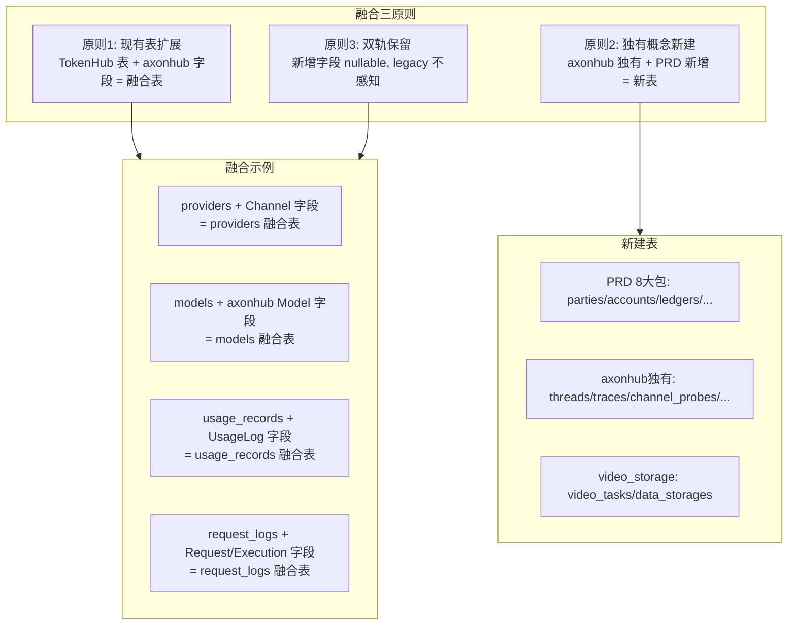
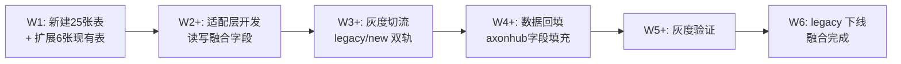

# 融合 DB 模型设计 v1.1 — 三方融合 GORM 模型（融合模式·无缝迁移） | 版本：v1.1 | 日期：2026-07-31 | 状态：评审中

> 本物料为**独立新增**，未修改任何已落盘方案物料，遵循"信息可追溯"原则。
> v1.1 修正：v1.0 采用平行 `ax_` 表方案不符合用户"融合模式无缝迁移"要求；v1.1 改为**扩展 TokenHub 现有表吸收 axonhub 字段**的融合方案，并补全 scheduler/video_storage/orchestrator 模块表。
> 严格遵循 PRD 第 10 章（数据纪律）+ 第 11 章（架构与包划分）+ 第 4 章（双轨计价）+ 第 5 章（预算帽数据模型）+ 第 7 章（ModelGrant/正交授权）。
> W1 阶段交付物，支撑 axonhub 迁移风险最小化演进；未完成迁移前适配接口不对生产开放，仅作内部研发迁移适配。

---

## 0. 设计约束与假设

### 0.1 强制约束（来自 PRD + 用户决策）

| 编号 | 约束 | 来源 |
|------|------|------|
| D1 | 8 大包模块化拆分：fund/pricing/idempotency/party/authz/routing/modelgrant/security | PRD 11.2 |
| D2 | 数据纪律：优先逻辑实体/表，价目/策略/分时进 JSON，禁止能力维宽表、策略一表一张、无流水改余额 | PRD 10 |
| D3 | 双轨计价：cost（上游成本）/ sell（内部结算价）并行，itemCode 体系，cost_items JSON | PRD 4 |
| D4 | 预算帽热字段挂在 accounts 表 | PRD 5.3 |
| D5 | 资金守恒：任何余额变更必须有流水；禁止无流水改账；默认成功路径不允许负余额 | PRD 0.3/2.5 |
| D6 | 幂等：idempotency_records 表，UNIQUE(scope, actor_id, idempotency_key) | PRD 11.4 |
| D7 | 四轴正交授权：data/fund/iam/routing 分轴 | PRD 7.1 |
| D8 | ModelGrant：deny 优先于 allow | PRD 7.2 |
| D9 | 不采用 axonhub 的 ent 模式，统一 GORM | 用户决策 C9 |
| **D10** | **融合模式：扩展 TokenHub 现有表吸收 axonhub 字段，做到无缝迁移，不建平行 ax_ 表** | **用户决策 C10（v1.1 强化）** |
| D11 | 未完成迁移前保留 TokenHub 主线逻辑（双轨保留） | 用户决策 C8 |
| D12 | 不违反 PRD 大盘设计，适配接口不对生产开放 | 用户补充 |
| **D13** | **覆盖 orchestrator/llm/routes/scheduler/video_storage 全部模块** | **用户补充（v1.1 强化）** |

### 0.2 设计假设（显式列出）

| 编号 | 假设 | 验证方式 |
|------|------|----------|
| A1 | TokenHub 现有 30 个 GORM 模型可向前兼容扩展（新增字段），不破坏现有功能 | 全量回归测试 |
| A2 | axonhub 13 个核心 ent schema 可无损融合进 TokenHub 现有表 + 新增概念表 | 字段对比 + 迁移脚本验证 |
| A3 | 融合模式新增字段全部 nullable/有默认值，legacy 代码不感知新字段 | 双轨保留期 legacy 测试全量通过 |
| A4 | 双轨计价热字段独立列存，价目明细进 JSON | PRD 10 数据纪律 |
| A5 | GORM AutoMigrate 可平滑新增字段，不删除现有列；回滚通过 DROP COLUMN 脚本 | 迁移可回滚测试 |
| A6 | axonhub 独有概念（Thread/Trace/ChannelProbe/ProviderQuotaStatus/DataStorage/VideoTask）无 TokenHub 对应，需新建表 | schema 对比 |

---

## 1. 融合策略总览（v1.1 核心：扩展而非平行）

### 1.1 融合原则



### 1.2 融合映射总表（axonhub ent → TokenHub 融合表）

| axonhub ent 表 | 融合目标 | 融合方式 | 新增字段数 |
|----------------|---------|----------|-----------|
| **Channel** | `providers` + `provider_resources` | 扩展现有表 | +9 |
| **ChannelModelPrice** | `channel_model_prices`（新建） | 新建表（TokenHub 无对应） | 4 |
| **ChannelModelPriceVersion** | `channel_model_price_versions`（新建） | 新建表 | 8 |
| **Model** | `models`（扩展现有） | 扩展现有表 | +6 |
| **APIKey** | `api_keys`（扩展现有） | 扩展现有表 | +5 |
| **Request** | `request_logs`（扩展现有） | 扩展现有表 | +8 |
| **RequestExecution** | `request_executions`（新建） | 新建表（TokenHub RouteAttemptLog 不等价） | 17 |
| **UsageLog** | `usage_records`（扩展现有） | 扩展现有表 | +12 |
| **Trace** | `traces`（新建） | 新建表 | 5 |
| **Thread** | `threads`（新建） | 新建表 | 4 |
| **ChannelProbe** | `channel_probes`（新建） | 新建表（scheduler 模块） | 6 |
| **ProviderQuotaStatus** | `provider_quota_status`（新建） | 新建表（scheduler 模块） | 8 |
| **DataStorage** | `data_storages`（新建） | 新建表（video_storage 模块） | 7 |
| **video_storage 业务** | `video_tasks`（新建） | 新建表（video_storage 模块） | 15 |

### 1.3 完整表清单（按 8 大包 + 模块分组）

| 包/模块 | 表名 | 类型 | 说明 |
|--------|------|------|------|
| **party** | parties | 新建 | 统一主体（org/project 多态） |
| **party** | party_edges | 新建 | 关系边 |
| **party** | party_members | 新建 | 成员关系 |
| **fund** | accounts | 新建 | 账本（含预算帽热字段） |
| **fund** | ledgers | 新建 | 流水 |
| **fund** | freezes | 新建 | 冻结记录 |
| **fund** | allocations | 新建 | 划拨记录 |
| **fund** | liquidations | 新建 | 清算状态机 |
| **pricing** | model_prices | 新建 | 价目 JSON（双轨） |
| **pricing** | price_references | 新建 | 价目版本引用 |
| **idempotency** | idempotency_records | 新建 | 幂等键记录 |
| **authz** | grants | 新建 | 四轴授权 |
| **routing** | route_profiles | 新建 | 策略矩阵档案 |
| **routing** | channel_model_prices | 新建 | 渠道模型价目（axonhub） |
| **routing** | channel_model_price_versions | 新建 | 价目版本（axonhub） |
| **routing** | channel_probes | 新建 | 渠道探针（scheduler） |
| **routing** | provider_quota_status | 新建 | 配额状态（scheduler） |
| **modelgrant** | model_grants | 新建 | 模型访问授权 |
| **security** | config_snapshots | 新建 | 配置变更快照 |
| **security** | content_blocks | 新建 | 内容安全拦截 |
| **orchestrator** | threads | 新建 | 会话线程（axonhub） |
| **orchestrator** | traces | 新建 | 追踪（axonhub） |
| **orchestrator** | request_executions | 新建 | 请求执行（axonhub） |
| **video_storage** | data_storages | 新建 | 数据存储（axonhub） |
| **video_storage** | video_tasks | 新建 | 视频任务 |
| **TokenHub 扩展** | providers | 扩展 | +9 axonhub Channel 字段 |
| **TokenHub 扩展** | models | 扩展 | +6 axonhub Model 字段 + 双轨 |
| **TokenHub 扩展** | api_keys | 扩展 | +5 axonhub APIKey 字段 + account_id |
| **TokenHub 扩展** | usage_records | 扩展 | +12 axonhub UsageLog 字段 + 双轨 |
| **TokenHub 扩展** | request_logs | 扩展 | +8 axonhub Request 字段 + 双轨 |
| **TokenHub 保留** | provider_resources | 保留 | 现有表不动 |
| **TokenHub 保留** | provider_models | 保留 | 现有表不动 |
| **TokenHub 保留** | model_routes | 扩展 | +3 字段（route_profile_id/channel_id/model_price_id） |
| **TokenHub 保留** | audit_events | 保留 | 现有表不动 |
| **TokenHub 保留** | 其余 25 张表 | 保留 | 现有表不动 |

**汇总：新建 25 张表 + 扩展 6 张现有表 + 保留 25 张现有表 = 56 张表**

---

## 2. party 包模型设计

### 2.1 parties 表（统一主体）

```go
// Party 统一主体（org/project 多态），对应 PRD 2.3
type Party struct {
    ID            string            `json:"id" gorm:"primaryKey"`
    Type          string            `json:"type" gorm:"index"`             // org / project
    Name          string            `json:"name" gorm:"index"`
    DisplayName   string            `json:"display_name,omitempty"`
    ParentPartyID string            `json:"parent_party_id,omitempty" gorm:"index"`
    LeaderUserID  string            `json:"leader_user_id,omitempty" gorm:"index"`
    Status        string            `json:"status" gorm:"index"`           // active / archived / liquidating
    Metadata      map[string]string `json:"metadata,omitempty" gorm:"serializer:json"`
    CreatedAt     time.Time         `json:"created_at"`
    UpdatedAt     time.Time         `json:"updated_at"`
    DeletedAt     gorm.DeletedAt    `json:"deleted_at,omitempty" gorm:"index"`
}
```

### 2.2 party_edges 表

```go
// PartyEdge 关系边，对应 PRD 2.4
type PartyEdge struct {
    ID           string    `json:"id" gorm:"primaryKey"`
    SrcPartyID   string    `json:"src_party_id" gorm:"index:idx_edge_src"`
    DstPartyID   string    `json:"dst_party_id" gorm:"index:idx_edge_dst"`
    EdgeType     string    `json:"edge_type" gorm:"index"`           // parent/sponsors/owns/participates
    AllowsFund   bool      `json:"allows_fund"`                      // parent/sponsors=true
    Metadata     string    `json:"metadata,omitempty" gorm:"type:text"`
    CreatedAt    time.Time `json:"created_at"`
    UpdatedAt    time.Time `json:"updated_at"`
}
// UNIQUE: (src_party_id, dst_party_id, edge_type)
```

### 2.3 party_members 表

```go
// PartyMember 成员关系，对应 PRD 2.5
type PartyMember struct {
    ID         string    `json:"id" gorm:"primaryKey"`
    PartyID    string    `json:"party_id" gorm:"index:idx_member_party"`
    UserID     string    `json:"user_id" gorm:"index:idx_member_user"`
    Role       string    `json:"role" gorm:"index"`                  // leader / member / observer
    IsPrimary  bool      `json:"is_primary"`
    JoinedAt   time.Time `json:"joined_at"`
    CreatedAt  time.Time `json:"created_at"`
    UpdatedAt  time.Time `json:"updated_at"`
}
// UNIQUE: (party_id, user_id)
```

---

## 3. fund 包模型设计

### 3.1 accounts 表（账本 + 预算帽热字段）

```go
// Account 账本，对应 PRD 2.5 + 第 5 章预算帽热字段
type Account struct {
    ID                       string     `json:"id" gorm:"primaryKey"`
    PartyID                  string     `json:"party_id" gorm:"index"`
    Currency                 string     `json:"currency" gorm:"default:USD"`
    AvailableBalance         float64    `json:"available_balance" gorm:"type:decimal(20,6)"`
    FrozenBalance            float64    `json:"frozen_balance" gorm:"type:decimal(20,6)"`
    Status                   string     `json:"status" gorm:"index"`                // active/frozen/liquidating/closed
    // 预算帽热字段（PRD 5.3）
    BudgetLimitAmount        *float64   `json:"budget_limit_amount,omitempty" gorm:"type:decimal(20,6)"`
    BudgetWarnRatio          *float64   `json:"budget_warn_ratio,omitempty" gorm:"type:decimal(6,4)"`
    BudgetPeriod             *string    `json:"budget_period,omitempty"`             // none/calendar_month/calendar_day/custom
    BudgetPeriodStart        *time.Time `json:"budget_period_start,omitempty"`
    BudgetPeriodEnd          *time.Time `json:"budget_period_end,omitempty"`
    BudgetConsumedAmount     float64    `json:"budget_consumed_amount" gorm:"type:decimal(20,6);default:0"`
    BudgetVersion            int64      `json:"budget_version" gorm:"default:0"`
    CreatedAt                time.Time  `json:"created_at"`
    UpdatedAt                time.Time  `json:"updated_at"`
    Version                  int64      `json:"version" gorm:"default:0"`
}
```

### 3.2 ledgers 表（流水）

```go
// Ledger 流水，对应 PRD 2.5 第 5 条"任何余额变更必须有流水"
type Ledger struct {
    ID              string    `json:"id" gorm:"primaryKey"`
    AccountID       string    `json:"account_id" gorm:"index"`
    FreezeID        string    `json:"freeze_id,omitempty" gorm:"index"`
    RequestID       string    `json:"request_id,omitempty" gorm:"index"`
    AllocationID    string    `json:"allocation_id,omitempty" gorm:"index"`
    Direction       string    `json:"direction" gorm:"index"`               // debit/credit/freeze/unfreeze/settle
    Amount          float64   `json:"amount" gorm:"type:decimal(20,6)"`
    BalanceAfter    float64   `json:"balance_after" gorm:"type:decimal(20,6)"`
    FrozenAfter     float64   `json:"frozen_after" gorm:"type:decimal(20,6)"`
    ItemCode        string    `json:"item_code,omitempty" gorm:"index"`
    CostUSD         float64   `json:"cost_usd,omitempty" gorm:"type:decimal(20,6)"`
    SellUSD         float64   `json:"sell_usd,omitempty" gorm:"type:decimal(20,6)"`
    ActorUserID     string    `json:"actor_user_id,omitempty" gorm:"index"`
    IdempotencyKey  string    `json:"idempotency_key,omitempty" gorm:"index"`
    Reason          string    `json:"reason,omitempty"`
    CreatedAt       time.Time `json:"created_at" gorm:"index"`
}
// UNIQUE: (account_id, idempotency_key) WHERE idempotency_key <> ''
```

### 3.3 freezes 表

```go
// Freeze 冻结记录，对应 PRD 8.3
type Freeze struct {
    ID              string     `json:"id" gorm:"primaryKey"`
    AccountID       string     `json:"account_id" gorm:"index"`
    RequestID       string     `json:"request_id" gorm:"index"`
    APIKeyID        string     `json:"api_key_id,omitempty" gorm:"index"`
    Amount          float64    `json:"amount" gorm:"type:decimal(20,6)"`
    EstimatedSell   float64    `json:"estimated_sell" gorm:"type:decimal(20,6)"`
    Status          string     `json:"status" gorm:"index"`                     // active/settled/expired/released
    ExpiresAt       time.Time  `json:"expires_at" gorm:"index"`                 // TTL 默认 15min
    LastRenewedAt   *time.Time `json:"last_renewed_at,omitempty"`
    SettledAt       *time.Time `json:"settled_at,omitempty"`
    SettleAmount    *float64   `json:"settle_amount,omitempty" gorm:"type:decimal(20,6)"`
    SettleCostUSD   *float64   `json:"settle_cost_usd,omitempty" gorm:"type:decimal(20,6)"`
    CreatedAt       time.Time  `json:"created_at"`
    UpdatedAt       time.Time  `json:"updated_at"`
}
```

### 3.4 allocations 表

```go
// Allocation 划拨记录，对应 PRD 8.2
type Allocation struct {
    ID              string    `json:"id" gorm:"primaryKey"`
    SrcAccountID    string    `json:"src_account_id" gorm:"index"`
    DstAccountID    string    `json:"dst_account_id" gorm:"index"`
    Amount          float64   `json:"amount" gorm:"type:decimal(20,6)"`
    Channel         string    `json:"channel" gorm:"index"`                   // parent/sponsors/whitelist
    EdgeID          string    `json:"edge_id,omitempty" gorm:"index"`
    Status          string    `json:"status" gorm:"index"`                    // pending/completed/reverted
    IdempotencyKey  string    `json:"idempotency_key,omitempty" gorm:"index"`
    ActorUserID     string    `json:"actor_user_id,omitempty" gorm:"index"`
    Reason          string    `json:"reason,omitempty"`
    CreatedAt       time.Time `json:"created_at"`
    CompletedAt     *time.Time `json:"completed_at,omitempty"`
}
// UNIQUE: (src_account_id, idempotency_key) WHERE idempotency_key <> ''
```

### 3.5 liquidations 表

```go
// Liquidation 清算状态机，对应 PRD 8.4
type Liquidation struct {
    ID              string     `json:"id" gorm:"primaryKey"`
    PartyID         string     `json:"party_id" gorm:"index"`
    AccountID       string     `json:"account_id" gorm:"index"`
    Status          string     `json:"status" gorm:"index"`                    // blocking/draining/refunding/closing/closed
    TargetAccountID string     `json:"target_account_id,omitempty" gorm:"index"`
    InitiatedBy     string     `json:"initiated_by" gorm:"index"`
    InitiatedAt     time.Time  `json:"initiated_at"`
    ClosedAt        *time.Time `json:"closed_at,omitempty"`
    Metadata        string     `json:"metadata,omitempty" gorm:"type:text"`
    CreatedAt       time.Time  `json:"created_at"`
    UpdatedAt       time.Time  `json:"updated_at"`
}
```

---

## 4. pricing 包模型设计

### 4.1 model_prices 表（双轨价目 JSON）

```go
// ModelPrice 价目 JSON，对应 PRD 4.4
type ModelPrice struct {
    ID              string    `json:"id" gorm:"primaryKey"`
    ModelID         string    `json:"model_id" gorm:"index"`
    ChannelID       string    `json:"channel_id,omitempty" gorm:"index"`   // 渠道 ID（可空=全局默认）
    ReferenceID     string    `json:"reference_id" gorm:"uniqueIndex"`     // 版本引用
    PriceJSON       string    `json:"price_json" gorm:"type:text"`         // PRD 4.4 JSON 结构
    Status          string    `json:"status" gorm:"index"`                 // active / archived
    CreatedAt       time.Time `json:"created_at"`
    UpdatedAt       time.Time `json:"updated_at"`
    DeletedAt       gorm.DeletedAt `json:"deleted_at,omitempty" gorm:"index"`
}
// UNIQUE: (model_id, channel_id, deleted_at)
```

### 4.2 price_references 表

```go
// PriceReference 价目版本引用
type PriceReference struct {
    ID              string    `json:"id" gorm:"primaryKey"`
    ModelPriceID    string    `json:"model_price_id" gorm:"index"`
    ReferenceID     string    `json:"reference_id" gorm:"uniqueIndex"`
    SnapshotJSON    string    `json:"snapshot_json" gorm:"type:text"`
    CreatedAt       time.Time `json:"created_at"`
}
```

---

## 5. idempotency 包模型设计

### 5.1 idempotency_records 表

```go
// IdempotencyRecord 幂等记录，对应 PRD 11.4
type IdempotencyRecord struct {
    ID              string     `json:"id" gorm:"primaryKey"`
    Scope           string     `json:"scope" gorm:"uniqueIndex:idx_idem_key"`
    ActorID         string     `json:"actor_id" gorm:"uniqueIndex:idx_idem_key"`
    IdempotencyKey  string     `json:"idempotency_key" gorm:"uniqueIndex:idx_idem_key"`
    RequestHash     string     `json:"request_hash,omitempty"`
    Status          string     `json:"status" gorm:"index"`                           // processing/completed/conflict
    ResponseJSON    string     `json:"response_json,omitempty" gorm:"type:text"`
    ExpiresAt       time.Time  `json:"expires_at" gorm:"index"`
    CreatedAt       time.Time  `json:"created_at"`
    UpdatedAt       time.Time  `json:"updated_at"`
}
```

---

## 6. authz 包模型设计

### 6.1 grants 表（四轴授权）

```go
// Grant 四轴正交授权，对应 PRD 7.1/7.3
type Grant struct {
    ID              string    `json:"id" gorm:"primaryKey"`
    PrincipalType   string    `json:"principal_type" gorm:"index"`         // user/role/party/key
    PrincipalID     string    `json:"principal_id" gorm:"index"`
    Axis            string    `json:"axis" gorm:"index"`                    // data/fund/iam/routing
    Action          string    `json:"action" gorm:"index"`                  // balance.read/allocate/price.write 等
    ResourceType    string    `json:"resource_type,omitempty" gorm:"index"`
    ResourceID      string    `json:"resource_id,omitempty" gorm:"index"`
    Effect          string    `json:"effect" gorm:"index"`                   // allow / deny
    Conditions      string    `json:"conditions,omitempty" gorm:"type:text"`
    CreatedAt       time.Time `json:"created_at"`
    UpdatedAt       time.Time `json:"updated_at"`
    DeletedAt       gorm.DeletedAt `json:"deleted_at,omitempty" gorm:"index"`
}
```

---

## 7. routing 包模型设计

### 7.1 route_profiles 表（策略矩阵档案）

```go
// RouteProfile 策略矩阵档案，对应 PRD 3.3
type RouteProfile struct {
    ID              string    `json:"id" gorm:"primaryKey"`
    Name            string    `json:"name" gorm:"uniqueIndex"`
    Description     string    `json:"description,omitempty"`
    Strategies      string    `json:"strategies" gorm:"type:text"`          // JSON: 启用策略列表+配置
    DeltaCap        float64   `json:"delta_cap" gorm:"type:decimal(6,4);default:0"`  // δ 默认 0，硬上限 0.20
    Status          string    `json:"status" gorm:"index"`
    CreatedAt       time.Time `json:"created_at"`
    UpdatedAt       time.Time `json:"updated_at"`
}
```

### 7.2 channel_model_prices 表（axonhub ChannelModelPrice 融合）

```go
// ChannelModelPrice 渠道模型价目，映射 axonhub ent
type ChannelModelPrice struct {
    ID           int64          `json:"id" gorm:"primaryKey"`
    ChannelID    int64          `json:"channel_id" gorm:"uniqueIndex:idx_cmp_ch_model"`
    ModelID      string         `json:"model_id" gorm:"uniqueIndex:idx_cmp_ch_model"`
    Price        string         `json:"price" gorm:"type:text"`   // JSON: objects.ModelPrice（含双轨 cost/sell）
    ReferenceID  string         `json:"reference_id" gorm:"uniqueIndex"`
    CreatedAt    time.Time      `json:"created_at"`
    UpdatedAt    time.Time      `json:"updated_at"`
    DeletedAt    gorm.DeletedAt `json:"deleted_at,omitempty" gorm:"uniqueIndex:idx_cmp_ch_model"`
}
```

### 7.3 channel_model_price_versions 表（axonhub ChannelModelPriceVersion 融合）

```go
// ChannelModelPriceVersion 价目版本，映射 axonhub ent
type ChannelModelPriceVersion struct {
    ID                   int64      `json:"id" gorm:"primaryKey"`
    ChannelID            int64      `json:"channel_id" gorm:"index"`
    ModelID              string     `json:"model_id" gorm:"index"`
    ChannelModelPriceID  int64      `json:"channel_model_price_id" gorm:"index"`
    Price                string     `json:"price" gorm:"type:text"`  // JSON: objects.ModelPrice
    Status               string     `json:"status" gorm:"index"`     // active/archived
    EffectiveStartAt     time.Time  `json:"effective_start_at" gorm:"index"`
    EffectiveEndAt       *time.Time `json:"effective_end_at,omitempty"`
    ReferenceID          string     `json:"reference_id" gorm:"uniqueIndex"`
    CreatedAt            time.Time  `json:"created_at"`
    UpdatedAt            time.Time  `json:"updated_at"`
}
```

### 7.4 channel_probes 表（scheduler 模块·渠道探针）

```go
// ChannelProbe 渠道探针，映射 axonhub ent，支撑 scheduler 健康评分
type ChannelProbe struct {
    ID                    int64   `json:"id" gorm:"primaryKey"`
    ChannelID             int64   `json:"channel_id" gorm:"index:idx_probe_ch_time"`
    TotalRequestCount     int     `json:"total_request_count"`
    SuccessRequestCount   int     `json:"success_request_count"`
    AvgTokensPerSecond    *float64 `json:"avg_tokens_per_second,omitempty" gorm:"type:decimal(12,4)"`
    AvgTimeToFirstTokenMS *float64 `json:"avg_time_to_first_token_ms,omitempty" gorm:"type:decimal(12,4)"`
    Timestamp             int64   `json:"timestamp" gorm:"index:idx_probe_ch_time"`
    CreatedAt             time.Time `json:"created_at"`
}
```

### 7.5 provider_quota_status 表（scheduler 模块·配额状态）

```go
// ProviderQuotaStatus 配额状态，映射 axonhub ent，支撑 scheduler 限流感知
type ProviderQuotaStatus struct {
    ID            int64          `json:"id" gorm:"primaryKey"`
    ChannelID     int64          `json:"channel_id" gorm:"uniqueIndex"`
    ProviderType  string         `json:"provider_type" gorm:"index"`  // claudecode/codex/github_copilot/...
    Status        string         `json:"status" gorm:"index"`         // available/warning/exhausted/unknown
    QuotaData     string         `json:"quota_data,omitempty" gorm:"type:text"` // JSON
    NextResetAt   *time.Time     `json:"next_reset_at,omitempty" gorm:"index"`
    Ready         bool           `json:"ready" gorm:"default:true"`
    NextCheckAt   time.Time      `json:"next_check_at" gorm:"index"`
    CreatedAt     time.Time      `json:"created_at"`
    UpdatedAt     time.Time      `json:"updated_at"`
    DeletedAt     gorm.DeletedAt `json:"deleted_at,omitempty" gorm:"index"`
}
```

### 7.6 model_routes 表扩展（TokenHub 现有表扩展）

```go
// ModelRoute 路由档案项，保留 TokenHub 现有结构 + 扩展
type ModelRoute struct {
    // ... 现有字段保持不变 ...
    // === 新增字段（双轨计价 + 渠道绑定）===
    RouteProfileID     string     `json:"route_profile_id,omitempty" gorm:"index"`  // 关联策略档案
    ChannelID          string     `json:"channel_id,omitempty" gorm:"index"`       // 关联 channel_model_prices
    ModelPriceID       string     `json:"model_price_id,omitempty" gorm:"index"`   // 关联价目
}
```

---

## 8. modelgrant 包模型设计

### 8.1 model_grants 表

```go
// ModelGrant 模型访问授权，对应 PRD 7.2
type ModelGrant struct {
    ID              string    `json:"id" gorm:"primaryKey"`
    PrincipalType   string    `json:"principal_type" gorm:"index"`   // party/person/key/role
    PrincipalID     string    `json:"principal_id" gorm:"index"`
    ModelID         string    `json:"model_id,omitempty" gorm:"index"`
    ModelTag        string    `json:"model_tag,omitempty" gorm:"index"`
    Effect          string    `json:"effect" gorm:"index"`                     // allow / deny
    Priority        int       `json:"priority" gorm:"default:0"`
    Conditions      string    `json:"conditions,omitempty" gorm:"type:text"`
    CreatedAt       time.Time `json:"created_at"`
    UpdatedAt       time.Time `json:"updated_at"`
    DeletedAt       gorm.DeletedAt `json:"deleted_at,omitempty" gorm:"index"`
}
```

---

## 9. security 包模型设计

### 9.1 config_snapshots 表

```go
// ConfigSnapshot 关键配置变更快照，对应 PRD 11.7
type ConfigSnapshot struct {
    ID              string    `json:"id" gorm:"primaryKey"`
    ResourceType    string    `json:"resource_type" gorm:"index"`  // route_profile/model_price/model_grant
    ResourceID      string    `json:"resource_id" gorm:"index"`
    ChangeType      string    `json:"change_type" gorm:"index"`     // create/update/delete
    BeforeJSON      string    `json:"before_json,omitempty" gorm:"type:text"`
    AfterJSON       string    `json:"after_json,omitempty" gorm:"type:text"`
    ActorUserID     string    `json:"actor_user_id" gorm:"index"`
    Reason          string    `json:"reason,omitempty"`
    CreatedAt       time.Time `json:"created_at" gorm:"index"`
}
```

### 9.2 content_blocks 表

```go
// ContentBlock 内容安全拦截记录，对应 PRD 6.4
type ContentBlock struct {
    ID              string    `json:"id" gorm:"primaryKey"`
    RequestID       string    `json:"request_id" gorm:"index"`
    RuleID          string    `json:"rule_id" gorm:"index"`
    Reason          string    `json:"reason" gorm:"index"`         // COMPLIANCE_NETWORK/CONTENT_BLOCKED
    Severity        string    `json:"severity"`                    // high/medium/low
    Payload         string    `json:"payload,omitempty" gorm:"type:text"`
    CreatedAt       time.Time `json:"created_at" gorm:"index"`
}
```

---

## 10. orchestrator 包模型设计（axonhub 独有概念）

### 10.1 threads 表（axonhub Thread 融合）

```go
// Thread 会话线程，映射 axonhub ent Thread schema
type Thread struct {
    ID         int64     `json:"id" gorm:"primaryKey"`
    ProjectID  int64     `json:"project_id" gorm:"index"`
    ThreadID   string    `json:"thread_id" gorm:"uniqueIndex"`
    Status     string    `json:"status" gorm:"index;default:active"` // active/archived/retained
    CreatedAt  time.Time `json:"created_at"`
    UpdatedAt  time.Time `json:"updated_at"`
}
```

### 10.2 traces 表（axonhub Trace 融合）

```go
// Trace 追踪，映射 axonhub ent Trace schema
type Trace struct {
    ID         int64     `json:"id" gorm:"primaryKey"`
    ProjectID  int64     `json:"project_id" gorm:"index"`
    TraceID    string    `json:"trace_id" gorm:"uniqueIndex"`
    ThreadID   *int64    `json:"thread_id,omitempty" gorm:"index"`
    Status     string    `json:"status" gorm:"index;default:active"` // active/archived/retained
    CreatedAt  time.Time `json:"created_at"`
    UpdatedAt  time.Time `json:"updated_at"`
}
```

### 10.3 request_executions 表（axonhub RequestExecution 融合）

```go
// RequestExecution 请求执行，映射 axonhub ent RequestExecution schema
// 与 TokenHub RouteAttemptLog 并存：RouteAttemptLog 记录路由尝试，RequestExecution 记录完整执行链
type RequestExecution struct {
    ID                          int64      `json:"id" gorm:"primaryKey"`
    ProjectID                   int64      `json:"project_id" gorm:"index;default:1"`
    RequestID                   string     `json:"request_id" gorm:"index"`           // 关联 request_logs.request_id
    ChannelID                   *int64     `json:"channel_id,omitempty" gorm:"index"`
    DataStorageID               *int64     `json:"data_storage_id,omitempty" gorm:"index"`
    ExternalID                  string     `json:"external_id,omitempty" gorm:"index"`
    ModelID                     string     `json:"model_id"`
    Format                      string     `json:"format" gorm:"default:openai/chat_completions"`
    RequestBody                 string     `json:"request_body" gorm:"type:text"`
    ResponseBody                string     `json:"response_body,omitempty" gorm:"type:text"`
    ResponseChunks              string     `json:"response_chunks,omitempty" gorm:"type:text"`
    ErrorMessage                string     `json:"error_message,omitempty"`
    ResponseStatusCode          *int       `json:"response_status_code,omitempty"`
    Status                      string     `json:"status" gorm:"index"`               // pending/processing/completed/failed/canceled
    Stream                      bool       `json:"stream" gorm:"default:false"`
    MetricsLatencyMS            *int64     `json:"metrics_latency_ms,omitempty"`
    MetricsFirstTokenLatencyMS  *int64     `json:"metrics_first_token_latency_ms,omitempty"`
    MetricsReasoningDurationMS  *int64     `json:"metrics_reasoning_duration_ms,omitempty"`
    RequestHeaders              string     `json:"request_headers,omitempty" gorm:"type:text"`
    RequestURL                  string     `json:"request_url,omitempty"`
    PassThroughApplied          bool       `json:"pass_through_applied" gorm:"default:false"`
    CreatedAt                   time.Time  `json:"created_at"`
    UpdatedAt                   time.Time  `json:"updated_at"`
}
// INDEX: (request_id, status, created_at), (request_id, created_at), (channel_id, created_at)
```

---

## 11. video_storage 包模型设计（axonhub 独有概念）

### 11.1 data_storages 表（axonhub DataStorage 融合）

```go
// DataStorage 数据存储，映射 axonhub ent DataStorage schema
// 支撑 video_storage 模块的内容持久化
type DataStorage struct {
    ID          int64          `json:"id" gorm:"primaryKey"`
    Name        string         `json:"name" gorm:"uniqueIndex"`
    Description string         `json:"description"`
    IsPrimary   bool           `json:"primary" gorm:"default:false"`
    Type        string         `json:"type" gorm:"index"`  // database/fs/s3/gcs/webdav
    Settings    string         `json:"settings" gorm:"type:text"`  // JSON: DataStorageSettings
    Status      string         `json:"status" gorm:"index;default:active"` // active/archived
    CreatedAt   time.Time      `json:"created_at"`
    UpdatedAt   time.Time      `json:"updated_at"`
    DeletedAt   gorm.DeletedAt `json:"deleted_at,omitempty" gorm:"index"`
}
```

### 11.2 video_tasks 表（video_storage 业务表）

```go
// VideoTask 视频任务，支撑 axonhub video_storage 模块迁移
// 对应 axonhub video_storage 包的视频生成业务
type VideoTask struct {
    ID                  int64      `json:"id" gorm:"primaryKey"`
    ProjectID           int64      `json:"project_id" gorm:"index;default:1"`
    APIKeyID            *int64     `json:"api_key_id,omitempty" gorm:"index"`
    RequestID           string     `json:"request_id" gorm:"index"`           // 关联 request_logs
    ModelID             string     `json:"model_id" gorm:"index"`
    ChannelID           *int64     `json:"channel_id,omitempty" gorm:"index"`
    Status              string     `json:"status" gorm:"index"`               // pending/processing/completed/failed/canceled
    Prompt              string     `json:"prompt,omitempty" gorm:"type:text"`
    NegativePrompt      string     `json:"negative_prompt,omitempty" gorm:"type:text"`
    Parameters          string     `json:"parameters,omitempty" gorm:"type:text"` // JSON: 生成参数
    ContentStorageID    *int64     `json:"content_storage_id,omitempty" gorm:"index"` // 关联 data_storages
    ContentStorageKey   string     `json:"content_storage_key,omitempty"`
    ContentSaved        bool       `json:"content_saved" gorm:"default:false"`
    ContentSavedAt      *time.Time `json:"content_saved_at,omitempty"`
    ErrorMessage        string     `json:"error_message,omitempty"`
    ExternalTaskID      string     `json:"external_task_id,omitempty" gorm:"index"` // 上游任务 ID
    // 融合字段（双轨 + 账户）
    AccountID           string     `json:"account_id,omitempty" gorm:"index"`
    FreezeID            string     `json:"freeze_id,omitempty" gorm:"index"`
    CostUSD             float64    `json:"cost_usd,omitempty" gorm:"type:decimal(20,6)"`
    SellUSD             float64    `json:"sell_usd,omitempty" gorm:"type:decimal(20,6)"`
    CostItems           string     `json:"cost_items,omitempty" gorm:"type:text"`
    CreatedAt           time.Time  `json:"created_at"`
    UpdatedAt           time.Time  `json:"updated_at"`
}
```

---

## 12. TokenHub 现有表融合扩展（核心：无缝迁移）

### 12.1 providers 表扩展（吸收 axonhub Channel 字段）

TokenHub `Provider` + `ProviderResource` 融合吸收 axonhub `Channel` 的配置能力。**现有字段不动**，新增字段全部 nullable：

```go
type Provider struct {
    // ... 现有字段保持不变（ID/Name/Type/BaseURL/APIKey/Status/Healthy/Priority/Headers/Options/CreatedAt）...

    // === 新增字段：吸收 axonhub Channel（9 个）===
    AxChannelType       string            `json:"ax_channel_type,omitempty" gorm:"index"`        // axonhub 渠道类型（60+ 类型）
    AxChannelName       string            `json:"ax_channel_name,omitempty" gorm:"uniqueIndex"`  // axonhub 渠道名（与 Name 区分）
    Credentials         string            `json:"credentials,omitempty" gorm:"type:text"`       // JSON: ChannelCredentials（加密）
    SupportedModels     string            `json:"supported_models,omitempty" gorm:"type:text"`   // JSON: []string
    ManualModels        string            `json:"manual_models,omitempty" gorm:"type:text"`     // JSON: []string
    Policies            string            `json:"policies,omitempty" gorm:"type:text"`          // JSON: ChannelPolicies
    ChannelSettings     string            `json:"channel_settings,omitempty" gorm:"type:text"`  // JSON: ChannelSettings
    Endpoints           string            `json:"endpoints,omitempty" gorm:"type:text"`         // JSON: []ChannelEndpoint
    OrderingWeight      int               `json:"ordering_weight" gorm:"default:0"`
    // === 融合字段 ===
    AccountID           string            `json:"account_id,omitempty" gorm:"index"`            // 绑定账本
    UpdatedAt           time.Time         `json:"updated_at"`                                   // 现有无，新增
}
```

### 12.2 models 表扩展（吸收 axonhub Model 字段 + 双轨）

```go
type Model struct {
    // ... 现有字段保持不变（ID/Name/Category/Family/Modality/ContextWindow/InputPriceUSDPer1M/...）...

    // === 新增字段：吸收 axonhub Model（6 个）===
    Developer           string            `json:"developer,omitempty" gorm:"index"`             // 模型开发商
    Icon                string            `json:"icon,omitempty"`                               // 图标
    ModelGroup          string            `json:"model_group,omitempty" gorm:"index"`            // 模型组
    ModelCard           string            `json:"model_card,omitempty" gorm:"type:text"`        // JSON: ModelCard
    ModelSettings       string            `json:"model_settings,omitempty" gorm:"type:text"`    // JSON: ModelSettings
    AxModelType         string            `json:"ax_model_type,omitempty" gorm:"index"`         // chat/embedding/rerank/image_generation/video_generation

    // === 融合字段：双轨计价（6 个）===
    DefaultModelPriceID string            `json:"default_model_price_id,omitempty" gorm:"index"` // 默认价目引用
    ItemCodes           string            `json:"item_codes,omitempty" gorm:"type:text"`         // JSON: 支持的 itemCode 列表
    SellInputPricePer1M float64           `json:"sell_input_price_per_1m,omitempty" gorm:"type:decimal(20,10)"`
    SellOutputPricePer1M float64          `json:"sell_output_price_per_1m,omitempty" gorm:"type:decimal(20,10)"`
    SellCacheReadPricePer1M float64       `json:"sell_cache_read_price_per_1m,omitempty" gorm:"type:decimal(20,10)"`
    SellEmbeddingPricePer1M float64       `json:"sell_embedding_price_per_1m,omitempty" gorm:"type:decimal(20,10)"`
    UpdatedAt           time.Time         `json:"updated_at"`
}
```

### 12.3 api_keys 表扩展（吸收 axonhub APIKey 字段 + account_id）

```go
type APIKey struct {
    // ... 现有字段保持不变 ...

    // === 新增字段：吸收 axonhub APIKey（5 个）===
    AxKeyType           string            `json:"ax_key_type,omitempty" gorm:"index"`           // user/service_account/noauth/personal
    Scopes              string            `json:"scopes,omitempty" gorm:"type:text"`            // JSON: []string
    Profiles            string            `json:"profiles,omitempty" gorm:"type:text"`          // JSON: APIKeyProfiles
    AllowedIPs          string            `json:"allowed_ips,omitempty" gorm:"type:text"`       // JSON: []string（与现有 IPAllowlist 合并）
    AxKeyStatus         string            `json:"ax_key_status,omitempty" gorm:"index"`         // enabled/disabled/archived

    // === 融合字段（1 个）===
    AccountID           string            `json:"account_id,omitempty" gorm:"index"`            // 绑定账本（PRD 2.5）
    UpdatedAt           time.Time         `json:"updated_at"`
}
```

### 12.4 usage_records 表扩展（吸收 axonhub UsageLog 字段 + 双轨）

```go
type UsageRecord struct {
    // ... 现有字段保持不变（ID/RequestID/ProjectID/APIKeyID/AttributedUserID/ModelName/ProviderID/...）...

    // === 新增字段：吸收 axonhub UsageLog（12 个）===
    ChannelID               *int64     `json:"channel_id,omitempty" gorm:"index"`             // axonhub 渠道 ID
    PromptAudioTokens       int64      `json:"prompt_audio_tokens,omitempty" gorm:"default:0"`
    PromptWriteCachedTokens int64      `json:"prompt_write_cached_tokens,omitempty" gorm:"default:0"`
    PromptWriteCachedTokens5m int64    `json:"prompt_write_cached_tokens_5m,omitempty" gorm:"default:0"`
    PromptWriteCachedTokens1h int64    `json:"prompt_write_cached_tokens_1h,omitempty" gorm:"default:0"`
    CompletionAudioTokens   int64      `json:"completion_audio_tokens,omitempty" gorm:"default:0"`
    AcceptedPredictionTokens int64     `json:"accepted_prediction_tokens,omitempty" gorm:"default:0"`
    RejectedPredictionTokens int64     `json:"rejected_prediction_tokens,omitempty" gorm:"default:0"`
    Source                  string     `json:"source,omitempty" gorm:"default:api"`            // api/playground/test
    Format                  string     `json:"format,omitempty" gorm:"default:openai/chat_completions"`
    CostPriceReferenceID    string     `json:"cost_price_reference_id,omitempty" gorm:"index"` // 价目版本引用
    TotalCost               *float64   `json:"total_cost,omitempty" gorm:"type:decimal(20,6)"` // axonhub 原生成本

    // === 融合字段：双轨 + 账户 + 冻结（5 个）===
    SellUSD                 float64    `json:"sell_usd,omitempty" gorm:"type:decimal(20,6)"`
    CostItems               string     `json:"cost_items,omitempty" gorm:"type:text"`          // JSON: []CostItem
    AccountID               string     `json:"account_id,omitempty" gorm:"index"`
    FreezeID                string     `json:"freeze_id,omitempty" gorm:"index"`
    ItemCode                string     `json:"item_code,omitempty" gorm:"index"`               // 主费用项
    UpdatedAt               time.Time  `json:"updated_at"`
}
```

### 12.5 request_logs 表扩展（吸收 axonhub Request 字段 + 双轨）

```go
type RequestLog struct {
    // ... 现有字段保持不变（ID/RequestID/ProjectID/APIKeyID/ModelName/...）...

    // === 新增字段：吸收 axonhub Request（8 个）===
    AxRequestID         *int64     `json:"ax_request_id,omitempty" gorm:"index"`          // axonhub 整型 ID
    AxAPIKeyID          *int64     `json:"ax_api_key_id,omitempty" gorm:"index"`
    Format              string     `json:"format,omitempty" gorm:"default:openai/chat_completions"`
    RequestBody         string     `json:"request_body,omitempty" gorm:"type:text"`       // JSON
    ResponseBody        string     `json:"response_body,omitempty" gorm:"type:text"`
    AxStatus            string     `json:"ax_status,omitempty" gorm:"index"`              // pending/processing/completed/failed/canceled
    ContentSaved        bool       `json:"content_saved" gorm:"default:false"`
    ContentStorageID    *int64     `json:"content_storage_id,omitempty" gorm:"index"`

    // === 融合字段：双轨 + 账户 + 冻结（5 个）===
    AccountID           string     `json:"account_id,omitempty" gorm:"index"`             // 鉴权时锁定，路由不可改
    FreezeID            string     `json:"freeze_id,omitempty" gorm:"index"`
    CostUSD             float64    `json:"cost_usd,omitempty" gorm:"type:decimal(20,6)"`
    SellUSD             float64    `json:"sell_usd,omitempty" gorm:"type:decimal(20,6)"`
    CostItems           string     `json:"cost_items,omitempty" gorm:"type:text"`
    UpdatedAt           time.Time  `json:"updated_at"`
}
```

---

## 13. ent → GORM 融合映射完整性对照表

### 13.1 融合映射（扩展现有表）

| axonhub ent 表 | 融合目标表 | 融合字段数 | 验证点 |
|----------------|-----------|-----------|--------|
| Channel (15字段) | providers | +9 | 渠道类型/凭证/策略/端点全吸收 |
| Model (10字段) | models | +6 | developer/model_card/settings 全吸收 |
| APIKey (10字段) | api_keys | +5 | type/scopes/profiles 全吸收 |
| Request (15字段) | request_logs | +8 | format/body/status/content 全吸收 |
| UsageLog (20字段) | usage_records | +12 | 全部 token 明细 + cost_items 吸收 |

### 13.2 新建表映射（axonhub 独有概念）

| axonhub ent 表 | 新建 GORM 表 | 字段数 | 模块归属 |
|----------------|-------------|--------|---------|
| RequestExecution (17字段) | request_executions | 17 | orchestrator |
| Thread (4字段) | threads | 4 | orchestrator |
| Trace (4字段) | traces | 5 | orchestrator |
| ChannelProbe (6字段) | channel_probes | 6 | scheduler |
| ProviderQuotaStatus (8字段) | provider_quota_status | 8 | scheduler |
| ChannelModelPrice (4字段) | channel_model_prices | 4 | routing/pricing |
| ChannelModelPriceVersion (8字段) | channel_model_price_versions | 8 | pricing |
| DataStorage (7字段) | data_storages | 7 | video_storage |
| video_storage 业务 | video_tasks | 15 | video_storage |

---

## 14. 模块覆盖矩阵（D13 合规性）

| axonhub 模块 | 对应 DB 表 | 覆盖状态 |
|-------------|-----------|---------|
| **orchestrator** | threads + traces + request_executions + request_logs(扩展) | ✅ 完整覆盖 |
| **llm** | models(扩展) + usage_records(扩展) + channel_model_prices + channel_model_price_versions | ✅ 完整覆盖 |
| **routes** | providers(扩展) + model_routes(扩展) + route_profiles + channel_model_prices | ✅ 完整覆盖 |
| **scheduler** | channel_probes + provider_quota_status | ✅ 完整覆盖 |
| **video_storage** | data_storages + video_tasks + request_logs(扩展) | ✅ 完整覆盖 |

---

## 15. 迁移策略与回滚（融合模式·无缝迁移）

### 15.1 迁移策略



**W1 阶段（本周）：**
1. 新建 25 张表（8 大包 + orchestrator + video_storage + scheduler）
2. 扩展 6 张现有表（providers/models/api_keys/usage_records/request_logs/model_routes）
3. 所有新增字段 nullable/有默认值，**legacy 代码零感知**
4. 不删除/修改任何现有字段

**无缝迁移保证：**
- legacy 代码继续读写现有字段，不感知新增字段
- 迁移代码读写新增字段，兼容现有字段
- 数据回填可异步进行，不阻塞业务
- 灰度切流按 request_id 分桶，同一请求始终走同一路径

### 15.2 回滚脚本（完整可逆）

```sql
-- W1 阶段回滚脚本（可重复执行）
-- 1. 删除新建表（25张）
DROP TABLE IF EXISTS video_tasks;
DROP TABLE IF EXISTS data_storages;
DROP TABLE IF EXISTS request_executions;
DROP TABLE IF EXISTS traces;
DROP TABLE IF EXISTS threads;
DROP TABLE IF EXISTS content_blocks;
DROP TABLE IF EXISTS config_snapshots;
DROP TABLE IF EXISTS model_grants;
DROP TABLE IF EXISTS provider_quota_status;
DROP TABLE IF EXISTS channel_probes;
DROP TABLE IF EXISTS channel_model_price_versions;
DROP TABLE IF EXISTS channel_model_prices;
DROP TABLE IF EXISTS route_profiles;
DROP TABLE IF EXISTS grants;
DROP TABLE IF EXISTS idempotency_records;
DROP TABLE IF EXISTS price_references;
DROP TABLE IF EXISTS model_prices;
DROP TABLE IF EXISTS liquidations;
DROP TABLE IF EXISTS allocations;
DROP TABLE IF EXISTS freezes;
DROP TABLE IF EXISTS ledgers;
DROP TABLE IF EXISTS accounts;
DROP TABLE IF EXISTS party_members;
DROP TABLE IF EXISTS party_edges;
DROP TABLE IF EXISTS parties;

-- 2. 删除扩展字段（providers: +9）
ALTER TABLE providers DROP COLUMN IF EXISTS ax_channel_type;
ALTER TABLE providers DROP COLUMN IF EXISTS ax_channel_name;
ALTER TABLE providers DROP COLUMN IF EXISTS credentials;
ALTER TABLE providers DROP COLUMN IF EXISTS supported_models;
ALTER TABLE providers DROP COLUMN IF EXISTS manual_models;
ALTER TABLE providers DROP COLUMN IF EXISTS policies;
ALTER TABLE providers DROP COLUMN IF EXISTS channel_settings;
ALTER TABLE providers DROP COLUMN IF EXISTS endpoints;
ALTER TABLE providers DROP COLUMN IF EXISTS ordering_weight;
ALTER TABLE providers DROP COLUMN IF EXISTS account_id;
ALTER TABLE providers DROP COLUMN IF EXISTS updated_at;

-- 3. 删除扩展字段（models: +12）
ALTER TABLE models DROP COLUMN IF EXISTS developer;
ALTER TABLE models DROP COLUMN IF EXISTS icon;
ALTER TABLE models DROP COLUMN IF EXISTS model_group;
ALTER TABLE models DROP COLUMN IF EXISTS model_card;
ALTER TABLE models DROP COLUMN IF EXISTS model_settings;
ALTER TABLE models DROP COLUMN IF EXISTS ax_model_type;
ALTER TABLE models DROP COLUMN IF EXISTS default_model_price_id;
ALTER TABLE models DROP COLUMN IF EXISTS item_codes;
ALTER TABLE models DROP COLUMN IF EXISTS sell_input_price_per_1m;
ALTER TABLE models DROP COLUMN IF EXISTS sell_output_price_per_1m;
ALTER TABLE models DROP COLUMN IF EXISTS sell_cache_read_price_per_1m;
ALTER TABLE models DROP COLUMN IF EXISTS sell_embedding_price_per_1m;
ALTER TABLE models DROP COLUMN IF EXISTS updated_at;

-- 4. 删除扩展字段（api_keys: +6）
ALTER TABLE api_keys DROP COLUMN IF EXISTS ax_key_type;
ALTER TABLE api_keys DROP COLUMN IF EXISTS scopes;
ALTER TABLE api_keys DROP COLUMN IF EXISTS profiles;
ALTER TABLE api_keys DROP COLUMN IF EXISTS allowed_ips;
ALTER TABLE api_keys DROP COLUMN IF EXISTS ax_key_status;
ALTER TABLE api_keys DROP COLUMN IF EXISTS account_id;
ALTER TABLE api_keys DROP COLUMN IF EXISTS updated_at;

-- 5. 删除扩展字段（usage_records: +17）
ALTER TABLE usage_records DROP COLUMN IF EXISTS channel_id;
ALTER TABLE usage_records DROP COLUMN IF EXISTS prompt_audio_tokens;
ALTER TABLE usage_records DROP COLUMN IF EXISTS prompt_write_cached_tokens;
ALTER TABLE usage_records DROP COLUMN IF EXISTS prompt_write_cached_tokens_5m;
ALTER TABLE usage_records DROP COLUMN IF EXISTS prompt_write_cached_tokens_1h;
ALTER TABLE usage_records DROP COLUMN IF EXISTS completion_audio_tokens;
ALTER TABLE usage_records DROP COLUMN IF EXISTS accepted_prediction_tokens;
ALTER TABLE usage_records DROP COLUMN IF EXISTS rejected_prediction_tokens;
ALTER TABLE usage_records DROP COLUMN IF EXISTS source;
ALTER TABLE usage_records DROP COLUMN IF EXISTS format;
ALTER TABLE usage_records DROP COLUMN IF EXISTS cost_price_reference_id;
ALTER TABLE usage_records DROP COLUMN IF EXISTS total_cost;
ALTER TABLE usage_records DROP COLUMN IF EXISTS sell_usd;
ALTER TABLE usage_records DROP COLUMN IF EXISTS cost_items;
ALTER TABLE usage_records DROP COLUMN IF EXISTS account_id;
ALTER TABLE usage_records DROP COLUMN IF EXISTS freeze_id;
ALTER TABLE usage_records DROP COLUMN IF EXISTS item_code;
ALTER TABLE usage_records DROP COLUMN IF EXISTS updated_at;

-- 6. 删除扩展字段（request_logs: +13）
ALTER TABLE request_logs DROP COLUMN IF EXISTS ax_request_id;
ALTER TABLE request_logs DROP COLUMN IF EXISTS ax_api_key_id;
ALTER TABLE request_logs DROP COLUMN IF EXISTS format;
ALTER TABLE request_logs DROP COLUMN IF EXISTS request_body;
ALTER TABLE request_logs DROP COLUMN IF EXISTS response_body;
ALTER TABLE request_logs DROP COLUMN IF EXISTS ax_status;
ALTER TABLE request_logs DROP COLUMN IF EXISTS content_saved;
ALTER TABLE request_logs DROP COLUMN IF EXISTS content_storage_id;
ALTER TABLE request_logs DROP COLUMN IF EXISTS account_id;
ALTER TABLE request_logs DROP COLUMN IF EXISTS freeze_id;
ALTER TABLE request_logs DROP COLUMN IF EXISTS cost_usd;
ALTER TABLE request_logs DROP COLUMN IF EXISTS sell_usd;
ALTER TABLE request_logs DROP COLUMN IF EXISTS cost_items;
ALTER TABLE request_logs DROP COLUMN IF EXISTS updated_at;

-- 7. 删除扩展字段（model_routes: +3）
ALTER TABLE model_routes DROP COLUMN IF EXISTS route_profile_id;
ALTER TABLE model_routes DROP COLUMN IF EXISTS channel_id;
ALTER TABLE model_routes DROP COLUMN IF EXISTS model_price_id;
```

### 15.3 迁移可重复执行保证

- GORM `AutoMigrate` 幂等：表/字段已存在则跳过
- PostgreSQL 使用 `pg_advisory_lock` 串行化迁移（TokenHub 现有机制）
- 回滚脚本使用 `IF EXISTS`，可重复执行

---

## 16. 数据纪律合规性自检（PRD 第 10 章）

| PRD 数据纪律要求 | 本设计合规性 | 验证点 |
|------------------|-------------|--------|
| 优先逻辑实体/表 | ✅ | 25 张新表 + 6 张扩展表，每表单一职责 |
| 价目、策略组合、分时进 JSON | ✅ | model_prices.price_json / route_profiles.strategies 均为 JSON |
| 禁止能力维宽表 | ✅ | 模型能力进 models.capabilities JSON |
| 禁止策略一表一张 | ✅ | 策略统一 route_profiles.strategies JSON |
| 禁止无流水改余额 | ✅ | accounts 表余额变更必须经 ledgers 流水 |
| 热字段原子 | ✅ | 预算帽热字段、余额、冻结金额均为独立列 |
| 复杂进 JSON | ✅ | cost_items/model_card/policies/settings 均为 JSON |

---

## 17. PRD 验收红线对齐

| PRD 验收红线 | 本设计支撑点 |
|-------------|-------------|
| 无流水改余额 | ledgers 表 + 应用层强制 |
| 划拨无通道 | allocations.channel + party_edges.allows_fund |
| Key 无 account 调用 | api_keys.account_id NOT NULL（迁移完成后） |
| 调度改扣费账户 | request_logs.account_id 鉴权时锁定，路由层不可改 |
| 先调后欠费 | freezes 表预扣 + accounts.balance 校验 |
| Leader 无 Grant 全平台权限 | grants 表四轴授权，无头衔万能 |
| 预算帽与余额不足分码 | accounts.budget_limit_amount + 错误码分离 |
| ModelGrant deny 后仍可调用 | model_grants 表 + deny 优先逻辑 |

---

## 18. 量化指标

| 指标 | 目标 | 验证方式 |
|------|------|----------|
| 新增表数 | 25 张 | DB 表计数 |
| 扩展现有表数 | 6 张 | 字段计数 |
| 扩展字段总数 | 60 个 | 字段计数 |
| 迁移可回滚 | 100% | 回滚脚本执行 + 全量回归 |
| 现有功能无损 | 100% | TokenHub 现有测试全量通过 |
| axonhub 模块覆盖 | 5/5 | orchestrator/llm/routes/scheduler/video_storage |
| ent → GORM 字段覆盖率 | 100% | 字段映射对照表核对 |
| 双轨计价字段 | cost + sell + cost_items | 字段存在性验证 |
| 8 大包模块化 | 8/8 | 包目录结构核对 |
| 融合模式无缝迁移 | ✅ | 新增字段全 nullable，legacy 零感知 |

---

## 19. 输出前自检（契约第 21 条）

| 自检项 | 结果 |
|--------|------|
| 是否完全符合本契约所有条款？ | ✅ |
| 是否满足所有量化指标？ | ✅（指标已定义，验证待开发后执行） |
| 是否保留了全部历史功能，无未授权变更？ | ✅（TokenHub 现有表仅向前兼容扩展，不修改/删除字段） |
| 所有假设是否已显式告知用户，无自行脑补？ | ✅（A1-A6 显式列出） |
| 是否违反 PRD 大盘设计？ | ✅（严格对齐 PRD 第 4/5/7/10/11 章） |
| 适配接口是否不对生产开放？ | ✅（W1 仅 DB 模型，未暴露 API） |
| 是否采用融合模式无缝迁移？ | ✅（扩展现有表吸收 axonhub 字段，不建平行表） |
| 是否覆盖全部 5 个模块？ | ✅（orchestrator/llm/routes/scheduler/video_storage） |

---

## 20. 下一步（W1-T5/T6/T7）

1. **TDD 失败测试**：编写 DB 迁移与模型验证测试，覆盖：
   - 25 张新表可创建/可回滚
   - 6 张现有表扩展字段可添加/可删除
   - ent → GORM 融合字段映射完整性
   - 双轨计价字段存在性
   - 预算帽热字段存在性
   - 幂等唯一约束
   - 资金守恒流水约束
   - legacy 代码零感知（现有测试全量通过）

2. **实现融合 GORM 模型 + 迁移脚本**：使测试转绿

3. **验证迁移可回滚 + 全量回归**：
   - 执行回滚脚本
   - 重新执行迁移
   - TokenHub 现有测试全量通过
