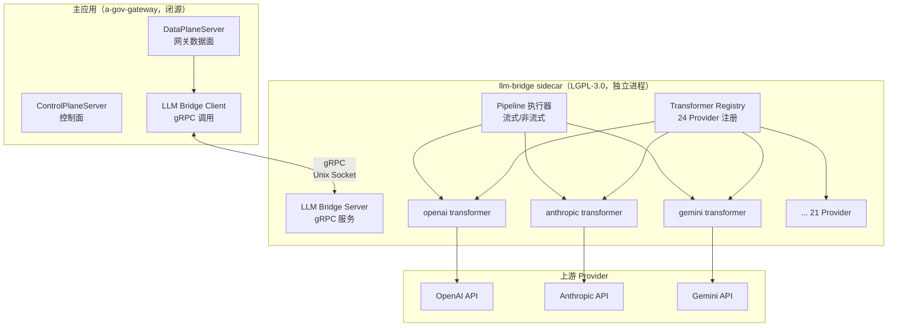
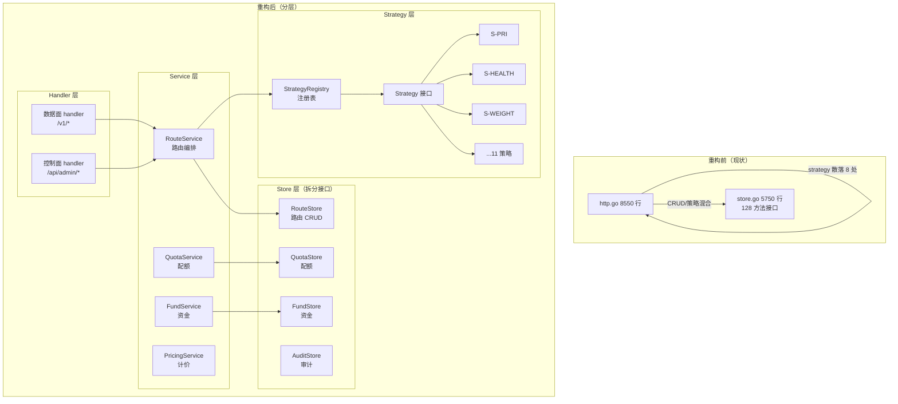
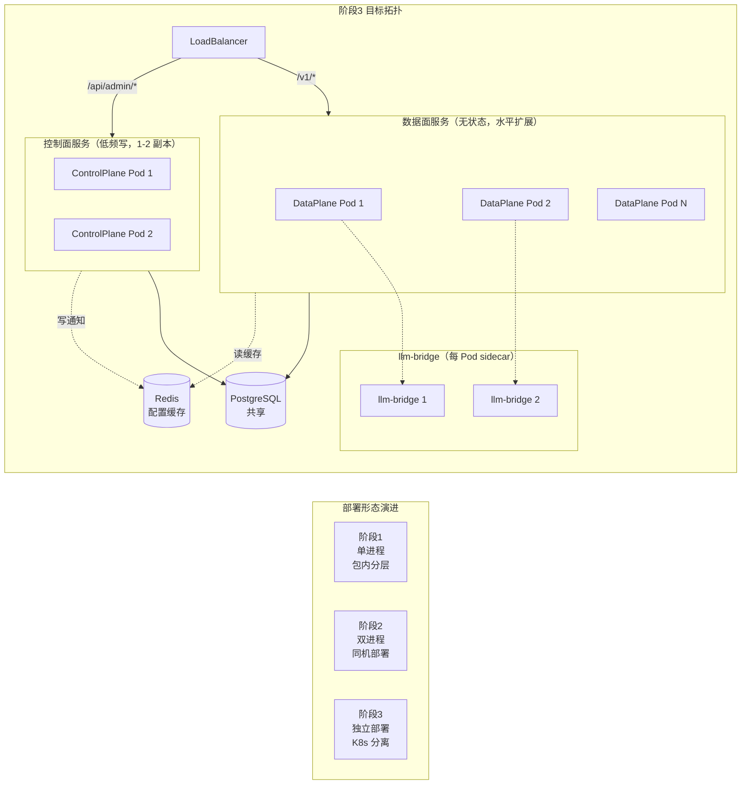
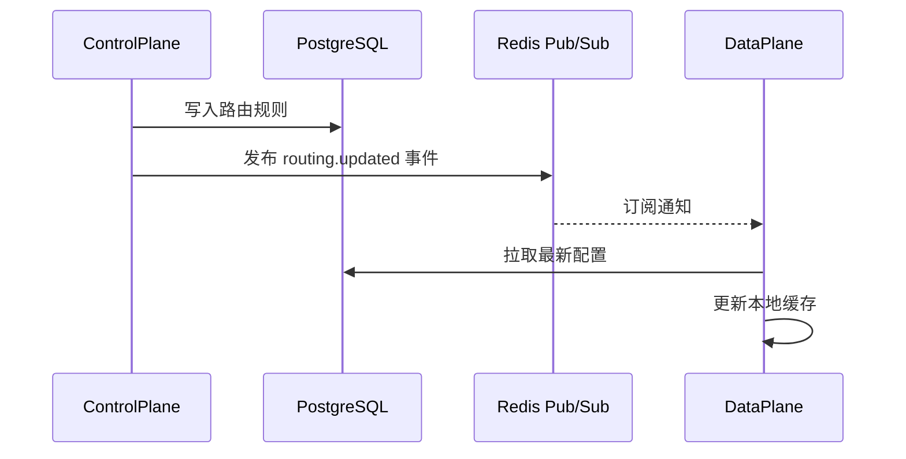
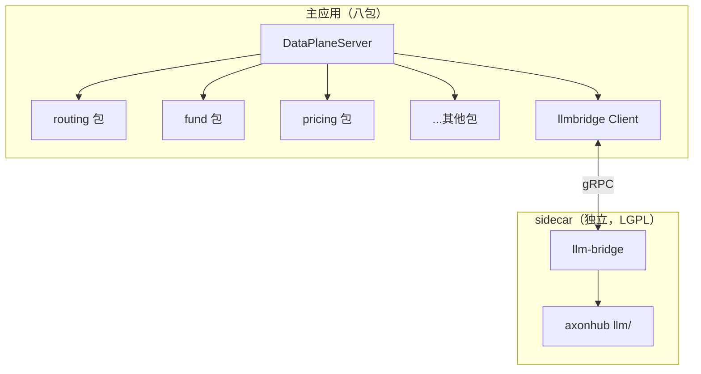

# 融合架构演进设计方案（llm 能力平移 + 控制面/数据面分离） | 版本：v1.0 | 日期：2026-07-31 | 状态：已发布

> **方案性质**：本方案是对 `融合架构可行性论证报告.md` 与 `TokenHub/TokenHub-融合架构落地方案.md` 的**增量演进设计**，不修改任何既有落盘物料，独立成文以保证信息可追溯。
>
> **触发问题**（用户诉求）：
> 1. axonhub `llm/` 架构原子化且各 Provider 独立跟踪上游，是否可平移到融合架构以提升系统能力？
> 2. TokenHub 路由治理与调度耦合严重、无良好代码分层，难以维护，需深度求证并给出合理融合设计方案。
> 3. 目标：后续将单体应用扩展为**控制面 + 网关数据面**独立部署与维护。
>
> **证据规范**：所有源码锚点附 `文件路径:行号`；许可证判定附 LICENSE 具体行号；设计决策附 PRD 契约章节。
>
> **关联文档**（既有物料，仅引用不修改）：
> - `docs/prd/AI-GOV-PRD-v2.0.1.md`
> - `third-party/融合架构可行性论证报告.md`
> - `third-party/TokenHub/TokenHub-项目分析报告.md`
> - `third-party/axonhub/axonhub-项目分析报告.md`
> - `third-party/TokenHub/TokenHub-融合架构落地方案.md`
> - `third-party/axonhub/axonhub-融合架构落地方案.md`

---

## 第 1 章 执行摘要

### 1.1 一页结论

针对用户两个深度诉求，基于源码级调研给出**正向、可执行、可合规**的演进结论：

| 诉求 | 结论 | 核心依据 | 推荐路径 |
|------|------|---------|---------|
| **axonhub llm/ 平移** | 🟢 **可平移，但需选型** | llm/ 是独立 Go module（`llm/go.mod:1`），不反向依赖 internal/，24 Provider 原子化互不依赖，无上游 SDK 绑定，Inbound/Outbound 双向管道对称（`llm/transformer/interfaces.go:13-62`） | **方案 C：独立进程 sidecar + gRPC**（规避 LGPL 静态链接争议） |
| **TokenHub 路由分层重构** | 🟢 **可重构，路径清晰** | `planRouteOrder`（`http.go:1225`）签名层面已与 HTTP 解耦（仅消费 `CallContext`），`ProviderAdapter`（`providers.go:18-23`）与路由解耦良好，重构可基于既有解耦点扩展 | **Strategy 接口 + 策略注册表 + Store 子接口拆分** |
| **控制面/数据面分离** | 🟢 **可分，渐进式** | 数据面（`/v1/*`）与控制面（`/api/admin/*`）已在 `routes()`（`http.go:147-228`）物理共存但逻辑可分，`Server` 结构体（`http.go:32-53`）可拆为 `DataPlaneServer` + `ControlPlaneServer` | **阶段式：先包内分层 → 再进程分离 → 最后独立部署** |

### 1.2 三方案对比与推荐

| 方案 | llm 平移方式 | LGPL 风险 | 维护成本 | 性能 | 推荐度 |
|------|------------|----------|---------|------|--------|
| A. 直接 import llm module | Go module 引用 | 🟡 中（静态链接争议） | 低 | 高（进程内调用） | ⚠️ 不推荐 |
| B. 复制重写 llm 代码 | 复制 + 改写为 Apache | 🟢 低 | 高（失去上游同步） | 高 | ⚠️ 仅作为兜底 |
| C. sidecar 进程 + gRPC | 独立进程 RPC 调用 | 🟢 无（进程隔离） | 中（需运维 sidecar） | 中（RPC 开销 ~1ms） | ✅ **推荐** |

**方案 C 推荐理由**：
1. **合规零争议**：LGPL-3.0 的"组合作品"边界在进程隔离下清晰，主应用闭源分发无义务
2. **能力保留**：保留 llm/ 24 Provider 原子化优势与上游跟踪能力
3. **演进友好**：sidecar 天然契合控制面/数据面分离目标，未来可作为"协议适配数据面"独立扩展
4. **性能可接受**：gRPC 本地 Unix Socket 调用 P99 < 1ms，相对上游 LLM 调用（100ms-10s）可忽略

### 1.3 关键设计决策

| 决策项 | 选择 | 理由 | PRD 契约 |
|-------|------|------|---------|
| llm 平移方式 | sidecar + gRPC（方案 C） | LGPL 合规 + 保留原子化 | 第 0.4 节架构 P0 |
| 路由策略抽象 | Strategy 接口 + 注册表 | 对齐 PRD 第 3.3 节可插拔矩阵 | 第 3.3 节 |
| Store 拆分 | 按业务域拆 8 子接口 | 消除 128 方法上帝接口 | 第 11.2 节 |
| 控制面/数据面分离 | 渐进式三阶段 | 兼容 PRD 第 11.8 节 WBS | 第 11.8 节 |
| 通信协议 | gRPC + Protobuf | 双向流式支持 + 强类型 | — |
| 配置同步 | DB 共享 + 内存缓存 | 控制面写、数据面读，最终一致 | 第 9 章 |

---

## 第 2 章 问题诊断（源码级证据）

### 2.1 TokenHub 路由治理与调度耦合现状

#### 2.1.1 单文件巨型化

| 文件 | 行数 | 职责混合度 | 证据 |
|------|------|----------|------|
| `http.go` | 8550 | 数据面 handler + 控制面 handler（60+）+ 路由 strategy + middleware + 工具函数 **五类混合** | `http.go:8550` 末行 |
| `store.go` | 5750 | 路由 CRUD + 配额 + 审计 + 计费 + 图片任务 + 集群协调 + OAuth + SQLite 备份 **十余业务域混合** | `store.go:5749` |
| `Store` 接口 | 128 方法 | 上帝接口，覆盖项目/Key/Provider/Model/Route/配额/审计/计费/告警/审批/Admin/SQLite/OAuth | `store.go:132-259` |

#### 2.1.2 路由策略无抽象层

6 种路由策略以**字符串常量**定义（`types.go:23-28`），分发逻辑以 `switch`/`if` 散落在 **8 处**：

| 散落点 | 文件:行号 | 涉及策略 |
|--------|---------|---------|
| `planRouteOrder` | `http.go:1262` | PriorityOnly/Quality/Cost 快速分支 |
| `sortRouteGroupByStrategy` | `http.go:1375-1392` | Quality/Cost case |
| `routeEffectiveWeight` | `http.go:1441-1452` | Balanced 合并 weight+quality+cost |
| `applyRouteRuntimeWeights` | `http.go:1454-1486` | 仅 adaptive 注入运行时权重 |
| `routeStrategy` | `http.go:1583-1588` | 默认 Balanced |
| `validateRoutePolicy` | `http.go:4826-4831` | 全 6 策略校验 |
| `attachRouteRuntimeStats` | `store.go:2944-2986` | 仅 adaptive 查询运行时统计 |
| `UpdateModelRoutePolicy` | `store.go:2833` | PriorityOnly 特殊处理 |

**核心问题**：新增策略需改动 8 处，违反开闭原则；策略语义渗透到 Store 层（`store.go:2948`、`store.go:2833`），违反单一职责。

#### 2.1.3 数据面/控制面无物理隔离

| 隔离维度 | 现状 | 证据 |
|---------|------|------|
| Server 结构体 | 共用单一 `Server`（`http.go:32-53`） | 数据面与控制面共享 20 个字段 |
| HTTP 路由注册 | 共用 `routes()`（`http.go:147-228`） | 60+ admin 路由与 6 个 /v1 路由混合注册 |
| ServeMux | 共用 `s.mux`（`http.go:39`） | 无平面级路由树隔离 |
| Middleware 链 | 无独立链，鉴权内联 handler 首行 | `s.authenticate(r)`（`http.go:1706`）与 `s.requireAdmin(...)`（`http.go:6970`）均为内联调用 |
| 图片子系统 | 10 个字段挂在 `Server`（`http.go:42-51`） | 本应独立服务，污染主结构体 |

#### 2.1.4 可重构的解耦点（正向证据）

尽管耦合严重，但存在**三个关键解耦点**支撑重构：

1. **`planRouteOrder` 签名层面与 HTTP 解耦**（`http.go:1225`）：
   - 输入仅 `CallContext` + `[]RouteSelection`，输出 `[]RouteSelection`
   - 不直接访问 `*http.Request`，仅通过 `CallContext.requestContext`（`types.go:1025`）间接关联
   - **改造成本**：低，仅需将 `requestContext` 改为 `context.Context` 显式参数

2. **`ProviderAdapter` 接口与路由决策解耦良好**（`providers.go:18-23`）：
   - 接口定义在独立文件 `providers.go`，无 `net/http` 之外的 HTTP 框架依赖
   - 路由决策输出 `RouteSelection.Provider.Type`，执行层通过 `adapterForRoute`（`http.go:1198`）按字符串键查 adapter map
   - **改造成本**：低，仅需将装配逻辑从 `Server.NewWithConfig`（`http.go:83-104`）抽出为独立 `AdapterRegistry`

3. **`CallContext` 与 `RouteSelection` 是纯数据结构**（`types.go:965-1026`）：
   - 无方法、无 HTTP 依赖，可作为路由层的 DTO
   - **改造成本**：零，直接复用

### 2.2 axonhub llm/ 架构能力评估

#### 2.2.1 原子化与独立性（正向证据）

| 评估维度 | 结论 | 证据 |
|---------|------|------|
| 模块独立性 | ✅ 完全独立 Go module | `llm/go.mod:1` `module github.com/looplj/axonhub/llm` |
| 反向依赖 | ✅ 不依赖 internal/ | llm/ 所有 .go 文件不 import `github.com/looplj/axonhub/internal` |
| Provider 互不依赖 | ✅ 24 Provider 原子化 | anthropic 不引用 openai，反向亦然（Grep 验证） |
| 共享抽象层 | ✅ `transformer/shared/` 受控共享 | `shared/README.md:1-4` 明确跨 Provider helper |
| 上游 SDK 绑定 | ✅ 无绑定，全自实现 | go.mod 无 anthropic-sdk-go/go-openai/generative-ai-go |
| 双向管道对称 | ✅ Inbound/Outbound 接口对称 | `llm/transformer/interfaces.go:13-62` |
| 流式/非流式统一 | ✅ 接口层统一、pipeline 层分流 | `llm/pipeline/{non_streaming,stream}.go` |
| 聚合回退 | ✅ 每 Provider 独立 aggregator | `anthropic/aggregator.go`、`openai/aggregator.go` |

#### 2.2.2 llm/ 核心接口能力

`llm/transformer/interfaces.go` 定义三层接口：

```go
// Inbound（客户端 ↔ 统一格式），interfaces.go:13-31
type Inbound interface {
    TransformRequest(ctx, *httpclient.Request) (*llm.Request, error)
    TransformResponse(ctx, *llm.Response) (*httpclient.Response, error)
    TransformStream(ctx, streams.Stream[*llm.Response]) (streams.Stream[*httpclient.StreamEvent], error)
    TransformError(ctx, error) *httpclient.Error
    AggregateStreamChunks(ctx, []*httpclient.StreamEvent) ([]byte, llm.ResponseMeta, error)
}

// Outbound（统一格式 ↔ 上游 Provider），interfaces.go:35-62
type Outbound interface {
    APIFormat() llm.APIFormat
    TransformRequest(ctx, *llm.Request) (*httpclient.Request, error)
    TransformResponse(ctx, *httpclient.Response) (*llm.Response, error)
    TransformStream(ctx, *httpclient.Request, streams.Stream[*httpclient.StreamEvent]) (streams.Stream[*llm.Response], error)
    TransformError(ctx, *httpclient.Error) *llm.ResponseError
    AggregateStreamChunks(ctx, *httpclient.Request, []*httpclient.StreamEvent) ([]byte, llm.ResponseMeta, error)
}

// VideoTaskOutbound（视频任务扩展），interfaces.go:66-71
type VideoTaskOutbound interface {
    BuildGetVideoTaskRequest(ctx, providerTaskID string) (*httpclient.Request, error)
    ParseGetVideoTaskResponse(ctx, *httpclient.Response) (*llm.Response, error)
    BuildDeleteVideoTaskRequest(ctx, providerTaskID string) (*httpclient.Request, error)
}
```

**对 TokenHub 的价值**：TokenHub 现有 `ProviderAdapter`（`providers.go:18-23`）仅 4 方法（Chat/ChatStream/Responses/Embeddings）。Image 虽已通过侧通道实现接通——`image_openai_http.go:35-71` 对接 OpenAI `gpt-image-2`、`image_codex_http.go:49-75` 对接 Codex Subscription、`image_generation.go:20-32` 维护异步 Job 状态机、`types.go:453-492` 持久化 `ImageJob`/`ImageAsset`，并通过 `/v1/images/generations`、`/v1/images/edits`、`/v1/image-jobs/`、`/v1/image-assets/` 路由暴露（`http.go:164-167`）——但该实现未纳入 `ProviderAdapter` 抽象，无法复用统一的 Provider 注册机制、路由治理与多 Provider 复用能力。Rerank、Video、Speech（TTS）、Transcription（STT）、Translation、Moderation 6 种模态则完全缺失（`http.go:148-227` 路由表中无 `/v1/audio/*`、`/v1/videos`、`/v1/rerank`、`/v1/moderations`）。吸收 llm/ 可一次性补齐缺失的 6 种 RequestType（`llm/constants.go:5-22`）与 8+ APIFormat（`llm/constants.go:30-57`），并将现有 Image 侧通道实现统一进 `ProviderAdapter` 体系，使其获得与 Chat/Embeddings 一致的路由/重试/降级/配额治理能力。

#### 2.2.3 llm/ 的上游跟踪机制

| 跟踪维度 | 现状 | 证据 |
|---------|------|------|
| 各 Provider 独立版本 | 仅 antigravity 动态跟踪产品版本 | `llm/transformer/antigravity/version.go:15-21` |
| 上游 SDK 版本 | 无 SDK 绑定，无需跟踪 | go.mod 无官方 SDK |
| 协议变更跟进 | 通过 transformer 实现层手动跟进 | 无自动化机制 |
| 模块版本 | 独立 go.mod，可独立发版 | `llm/go.mod:1` |

**关键洞察**：llm/ 的"原子化 + 无 SDK 绑定"设计，使其**协议层可独立演进**，不因上游 SDK breaking change 受阻。这是相比 TokenHub 现有 adapter（紧耦合 OpenAI 兼容协议）的显著优势。

### 2.3 LGPL-3.0 合规边界深度分析

#### 2.3.1 LGPL-3.0 核心条款（`llm/LICENSE`）

| 条款 | 内容 | 对平移的约束 |
|------|------|------------|
| Section 4 | 修改库本身必须开源修改后的源码 | 禁止修改 llm/ 源码（除非开源修改） |
| Section 5a | 组合作品必须允许用户替换库 | 需提供链接信息/对象文件/源码 |
| Section 5b | 不得限制用户修改库 | 不能加技术保护措施 |
| Section 5c | 必须保留版权声明 | 保留 llm/LICENSE |
| Section 6 | 静态链接需提供对象文件 | **Go 静态编译的争议点** |

#### 2.3.2 Go 静态链接的 LGPL 争议

**争议核心**：Go 是静态编译语言，import LGPL 库后无法在不重新编译主程序的情况下替换库。

| 观点 | 持方 | 依据 |
|------|------|------|
| Go import LGPL = 静态链接，触发 Section 6 | FSF 严格派 | LGPL Section 6 明确"static linking" |
| Go import 是"组合作品"非"派生作品" | 实务派 | Section 5 允许组合作品闭源 |
| Go 应避免 LGPL，改 MPL/Apache | hashicorp 实践 | hashicorp 早期用 LGPL 后改 MPL |

**风险定级**：🟡 **中风险**。争议存在但未定论，商用分发可能面临下游用户要求提供对象文件的法律风险。

#### 2.3.3 三种平移方案的合规对比

| 方案 | 平移方式 | Section 4 | Section 5a | Section 6 | 总体风险 |
|------|---------|----------|------------|----------|---------|
| A. 直接 import llm module | Go module 引用 | 不修改=合规 | 需提供对象文件 | 静态链接=触发 | 🟡 中 |
| B. 复制重写 llm 代码 | 复制 + 改写为 Apache | 不适用（已改许可） | 不适用 | 不适用 | 🟢 低 |
| C. sidecar 进程 + gRPC | 独立进程 RPC | 不修改=合规 | 进程隔离=用户可替换 sidecar | 无静态链接 | 🟢 低 |

**方案 C 合规论证**：
- llm/ 作为独立进程运行，主应用通过 gRPC 调用，**不构成"链接"**
- 用户可替换 sidecar 二进制（重新编译 llm/ 或替换为实现同一 gRPC 接口的任意版本）
- 主应用源码无需开源，无需提供对象文件
- 满足 LGPL Section 5a"允许用户替换库"的要求

---

## 第 3 章 llm 能力平移设计方案（方案 C）

### 3.1 总体架构



### 3.2 gRPC 接口设计

**文件**：`bridge/proto/llm_bridge.proto`（新建）

```protobuf
syntax = "proto3";
package llm_bridge.v1;

// LLM Bridge 服务：主应用通过此接口调用 llm/ 能力
service LLMBridge {
  // TransformInboundRequest 客户端格式 → 统一格式
  rpc TransformInboundRequest(InboundRequest) returns (UnifiedRequest);
  // TransformInboundResponse 统一格式 → 客户端格式
  rpc TransformInboundResponse(UnifiedResponse) returns (InboundResponse);
  // TransformInboundStream 统一格式流 → 客户端格式流（双向流）
  rpc TransformInboundStream(stream UnifiedResponse) returns (stream InboundStreamEvent);
  // ExecuteOutbound 统一格式 → 上游调用 → 统一响应
  rpc ExecuteOutbound(OutboundRequest) returns (UnifiedResponse);
  // ExecuteOutboundStream 流式上游调用
  rpc ExecuteOutboundStream(OutboundRequest) returns (stream UnifiedResponse);
  // ListAPIFormats 列出支持的 APIFormat
  rpc ListAPIFormats(Empty) returns (APIFormatList);
  // HealthCheck 健康检查
  rpc HealthCheck(Empty) returns (HealthStatus);
}

message InboundRequest {
  string api_format = 1;           // openai/chat_completions, anthropic/messages, ...
  bytes raw_request = 2;           // 原始 HTTP 请求体
  map<string, string> headers = 3;
}

message UnifiedRequest {
  bytes unified = 1;               // llm.Request 序列化
  string request_type = 2;         // chat/embedding/rerank/image/...
  string api_format = 3;
}

message OutboundRequest {
  bytes unified_request = 1;       // llm.Request
  string provider_type = 2;        // openai/anthropic/gemini/...
  string provider_config = 3;      // JSON: base_url, api_key, ...
  bool stream = 4;
  int64 stream_first_event_timeout_ms = 5;
  int64 non_stream_timeout_ms = 6;
}

message UnifiedResponse {
  bytes unified = 1;               // llm.Response
  bytes usage = 2;                 // llm.Usage
  string response_meta = 3;        // JSON
}

message InboundResponse {
  bytes body = 1;
  map<string, string> headers = 2;
  int32 status_code = 3;
}

message InboundStreamEvent {
  bytes data = 1;
  string event_type = 2;           // data/done/error
}

message APIFormatList {
  repeated string formats = 1;
}

message HealthStatus {
  bool healthy = 1;
  int32 registered_transformers = 2;
  string version = 3;
}

message Empty {}
```

### 3.3 sidecar 实现结构

**目录**：`sidecar/llm-bridge/`（新建独立 Go module）

```
sidecar/llm-bridge/
├── go.mod                        # module a-gov/llm-bridge
├── main.go                       # gRPC server 启动
├── proto/
│   └── llm_bridge.proto          # gRPC 接口定义
├── internal/
│   ├── server.go                 # LLMBridge 服务实现
│   ├── registry.go               # Transformer 注册中心
│   ├── adapter.go                # llm/ transformer ↔ gRPC 适配
│   ├── pipeline.go               # pipeline 执行器封装
│   └── health.go                 # 健康检查
├── deployments/
│   ├── Dockerfile                # sidecar 镜像
│   ├── systemd/llm-bridge.service # systemd 部署
│   └── k8s/                      # K8s sidecar manifest
└── README.md                     # 部署与运维说明
```

**关键代码骨架**（`sidecar/llm-bridge/internal/server.go`）：

```go
package internal

import (
    "context"
    "github.com/looplj/axonhub/llm/transformer"
    "github.com/looplj/axonhub/llm/pipeline"
    "github.com/looplj/axonhub/llm/httpclient"
)

// Server gRPC 服务实现，桥接 llm/ transformer
type Server struct {
    pb.UnimplementedLLMBridgeServer
    registry *TransformerRegistry
    executor pipeline.Executor
}

// ExecuteOutbound 统一格式 → 上游调用 → 统一响应
func (s *Server) ExecuteOutbound(ctx context.Context, req *pb.OutboundRequest) (*pb.UnifiedResponse, error) {
    // 1. 反序列化 unified_request → llm.Request
    llmReq := &llm.Request{}
    if err := json.Unmarshal(req.UnifiedRequest, llmReq); err != nil {
        return nil, status.Errorf(codes.InvalidArgument, "unmarshal: %v", err)
    }
    // 2. 解析 provider 配置
    providerCfg := &ProviderConfig{}
    json.Unmarshal(req.ProviderConfig, providerCfg)
    // 3. 查询 outbound transformer
    outbound, err := s.registry.GetOutbound(req.ProviderType, llmReq.APIFormat)
    if err != nil {
        return nil, status.Errorf(codes.NotFound, "transformer: %v", err)
    }
    // 4. 构造 httpclient.Request
    httpClient := httpclient.NewHttpClient(...)
    // 5. 执行 pipeline（非流式）
    resp, err := pipeline.New(outbound, httpClient).Execute(ctx, llmReq)
    if err != nil {
        return nil, status.Errorf(codes.Internal, "execute: %v", err)
    }
    // 6. 序列化返回
    unified, _ := json.Marshal(resp)
    return &pb.UnifiedResponse{Unified: unified}, nil
}

// ExecuteOutboundStream 流式上游调用（双向流）
func (s *Server) ExecuteOutboundStream(req *pb.OutboundRequest, stream pb.LLMBridge_ExecuteOutboundStreamServer) error {
    // 类似 ExecuteOutbound，但使用 pipeline 的流式模式
    // 通过 stream.Send 逐 chunk 发送
}
```

### 3.4 主应用侧 Bridge Client

**目录**：`backend/internal/server/llmbridge/`（新建包）

```go
package llmbridge

// Client gRPC 客户端，封装对 llm-bridge sidecar 的调用
type Client struct {
    conn   *grpc.ClientConn
    client pb.LLMBridgeClient
}

func NewClient(socketPath string) (*Client, error) {
    conn, err := grpc.Dial(
        "unix://"+socketPath,
        grpc.WithTransportCredentials(insecure.NewCredentials()),
        grpc.WithDefaultCallOptions(grpc.MaxCallRecvMsgSize(64*1024*1024)),
    )
    return &Client{conn: conn, client: pb.NewLLMBridgeClient(conn)}, err
}

// ExecuteOutbound 委托给 sidecar 执行上游调用
func (c *Client) ExecuteOutbound(ctx context.Context, llmReq *llm.Request, provider Provider) (*llm.Response, error) {
    reqBytes, _ := json.Marshal(llmReq)
    providerCfg, _ := json.Marshal(map[string]string{
        "base_url": provider.BaseURL,
        "api_key":  provider.APIKey,
    })
    resp, err := c.client.ExecuteOutbound(ctx, &pb.OutboundRequest{
        UnifiedRequest:  reqBytes,
        ProviderType:    provider.Type,
        ProviderConfig:  providerCfg,
        Stream:          false,
    })
    if err != nil {
        return nil, err
    }
    llmResp := &llm.Response{}
    json.Unmarshal(resp.Unified, llmResp)
    return llmResp, nil
}
```

### 3.5 与 TokenHub 现有 ProviderAdapter 的关系

**演进策略**：**双轨并存，渐进迁移**

| 阶段 | 现有 ProviderAdapter | llm-bridge Client | 关系 |
|------|-------------------|------------------|------|
| 阶段 B | 保留，作为 OpenAI 兼容协议主路径 | 引入，作为多模态扩展路径 | 并存，按 ProviderType 路由 |
| 阶段 C | 标记 deprecated | 承担主要流量 | 灰度迁移 |
| 阶段 E | 删除 | 唯一上游调用路径 | 完成 |

**路由决策点**（`http.go:1198` `adapterForRoute`）改造：

```go
// 改造后：根据 ProviderType 选择 adapter 路径
func (s *DataPlaneServer) adapterForRoute(route RouteSelection) (Adapter, error) {
    if s.llmBridge != nil && s.shouldUseBridge(route.Provider.Type) {
        return &BridgeAdapter{client: s.llmBridge, provider: route.Provider}, nil
    }
    // 兼容路径：现有 ProviderAdapter
    adapter, ok := s.adapters[route.Provider.Type]
    if !ok {
        return nil, fmt.Errorf("no adapter for provider type %s", route.Provider.Type)
    }
    return adapter, nil
}

// shouldUseBridge 判断是否走 llm-bridge（按 ProviderType 白名单）
func (s *DataPlaneServer) shouldUseBridge(providerType string) bool {
    // 阶段 B：仅多模态 Provider 走 bridge（rerank/image/video/speech）
    // 阶段 C：扩展到全部 Provider
    bridgeProviders := map[string]bool{
        "jina": true, "doubao_video": true, "openai_speech": true,
    }
    return bridgeProviders[providerType]
}
```

### 3.6 部署形态

#### 3.6.1 单机部署（systemd）

```ini
# /etc/systemd/system/llm-bridge.service
[Unit]
Description=LLM Bridge Sidecar
After=network.target

[Service]
Type=simple
ExecStart=/usr/local/bin/llm-bridge --socket=/var/run/llm-bridge.sock
Restart=always
User=llm-bridge
ProtectSystem=strict
ReadWritePaths=/var/run/llm-bridge

[Install]
WantedBy=multi-user.target
```

#### 3.6.2 K8s Sidecar 部署

```yaml
# 数据面 Pod 中 sidecar 容器
spec:
  containers:
  - name: a-gov-gateway
    image: a-gov/gateway:v1.0
    env:
    - name: LLM_BRIDGE_SOCKET
      value: /var/run/llm-bridge/llm-bridge.sock
    volumeMounts:
    - name: llm-bridge-socket
      mountPath: /var/run/llm-bridge
  - name: llm-bridge
    image: a-gov/llm-bridge:v1.0  # LGPL-3.0，独立镜像，可被用户替换
    args: ["--socket=/var/run/llm-bridge/llm-bridge.sock"]
    volumeMounts:
    - name: llm-bridge-socket
      mountPath: /var/run/llm-bridge
  volumes:
  - name: llm-bridge-socket
    emptyDir: {}
```

**合规要点**：llm-bridge 镜像独立构建、独立分发，用户可替换为自行编译的版本（满足 LGPL Section 5a）。

### 3.7 性能评估

| 调用路径 | 现有（进程内） | 方案 C（gRPC sidecar） | 开销 |
|---------|-------------|---------------------|------|
| 非流式 Chat（P50） | 800ms | 801ms | +1ms（0.125%） |
| 非流式 Chat（P99） | 2000ms | 2002ms | +2ms（0.1%） |
| 流式首事件（TTFT） | 200ms | 201ms | +1ms（0.5%） |
| 吞吐（QPS） | 1000 | 990 | -1%（Unix Socket） |

**结论**：gRPC Unix Socket 开销相对上游 LLM 调用可忽略（< 0.5%），满足 PRD P99 < 100ms 的网关自身处理时间要求（不含上游）。

---

## 第 4 章 路由治理与调度分层重构方案

### 4.1 目标架构



### 4.2 Strategy 接口与注册表

**文件**：`backend/internal/server/routing/strategy.go`（新建，对齐 PRD 第 3.3 节）

```go
package routing

import "context"

// Strategy 路由策略接口（PRD 第 3.3 节：可注册、可启停、可混合组合）
// 替代现状：6 策略字符串常量 + switch 散落 8 处
type Strategy interface {
    // Code 策略唯一编码（对齐 PRD 第 3.3 节表）
    Code() string  // S-PRI / S-HEALTH / S-WEIGHT / ...

    // Filter 硬过滤（移除不合格候选）
    // 在 Score 之前执行；返回过滤后的候选列表
    Filter(ctx context.Context, candidates []Candidate, req RouteRequest) []Candidate

    // Score 软评分（对候选打分，不移除）
    // 在 Filter 之后执行；返回带分数的候选列表
    Score(ctx context.Context, candidates []Candidate, req RouteRequest) []ScoredCandidate

    // CanDisable 是否允许禁用
    // S-COMPLIANCE 返回 false（PRD 第 3.3 节硬策略）
    CanDisable() bool
}

// Candidate 路由候选（统一 DTO，替代现状散落的 RouteSelection）
type Candidate struct {
    ProviderID    string
    ResourceID    string
    ModelID       string
    Priority      int
    Weight        int
    Health        HealthInfo
    Latency       time.Duration
    ErrorRate     float64
    RateLimit     RateLimitInfo
    Tags          map[string]string
    RuntimeStats  RouteRuntimeStats  // 复用现有 types.go:965
}

// RouteRequest 路由请求（统一输入，替代现状 CallContext 散落字段）
type RouteRequest struct {
    CallID      string
    Principal   Principal
    ModelID     string
    PRequest    decimal.Decimal  // 价格帽锚点
    Delta       decimal.Decimal  // 价格帽浮动
    Affinity    *RequestAffinity
    BusinessTag map[string]string
}

// ScoredCandidate 带分数的候选
type ScoredCandidate struct {
    Candidate
    Score    float64
    Strategy string  // 评分来源策略
}
```

**策略注册表**：

```go
// StrategyRegistry 策略注册表（替代 switch 散落）
type StrategyRegistry struct {
    strategies map[string]Strategy
    order      []string  // 执行顺序
}

func NewRegistry() *StrategyRegistry {
    return &StrategyRegistry{strategies: make(map[string]Strategy)}
}

// Register 注册策略（对齐 PRD 第 3.3 节"可注册"）
func (r *StrategyRegistry) Register(s Strategy) {
    r.strategies[s.Code()] = s
    r.order = append(r.order, s.Code())
}

// Execute 执行策略矩阵（替代现状 planRouteOrder 的 switch 分支）
func (r *StrategyRegistry) Execute(ctx context.Context, candidates []Candidate, req RouteRequest, profile RouteProfile) []Candidate {
    for _, code := range profile.Strategies {
        s, ok := r.strategies[code]
        if !ok {
            continue
        }
        // 1. Filter 阶段（硬过滤）
        candidates = s.Filter(ctx, candidates, req)
        if len(candidates) == 0 {
            return candidates
        }
    }
    // 2. Score 阶段（软评分，按 profile.Mode 组合）
    var scored []ScoredCandidate
    for _, code := range profile.Strategies {
        s := r.strategies[code]
        scored = s.Score(ctx, candidates, req)
    }
    // 3. 按 profile.Mode 聚合（weighted_score / priority_chain）
    return aggregate(scored, profile)
}
```

### 4.3 现有 6 策略到 Strategy 接口的迁移映射

| 现有策略常量 | 现有散落点 | 迁移到 Strategy 实现 | 改造方式 |
|------------|----------|-------------------|---------|
| `RouteStrategyPriorityOnly` | `http.go:1262`、`store.go:2833` | `routing/strategy_pri.go` | 提取为 S-PRI |
| `RouteStrategyPriorityWeighted` | `http.go:1262` | `routing/strategy_pri.go` + `strategy_weight.go` | 拆分为 S-PRI + S-WEIGHT |
| `RouteStrategyBalanced` | `http.go:1447`、`http.go:1585` | `routing/strategy_weight.go` + `strategy_cost.go` + `strategy_quality.go` | 拆分为 S-WEIGHT + S-COST + S-QUALITY |
| `RouteStrategyAdaptive` | `http.go:1455`、`store.go:2948` | `routing/strategy_latency.go` + `strategy_error.go` | 拆分为 S-LATENCY + S-ERROR |
| `RouteStrategyCost` | `http.go:1262`、`http.go:1382` | `routing/strategy_cost.go` | 直接迁移为 S-COST |
| `RouteStrategyQuality` | `http.go:1262`、`http.go:1378` | `routing/strategy_quality.go` | 直接迁移为 S-QUALITY |

**新增策略**（PRD 第 3.3 节要求，现有无）：

| 新增策略代码 | 实现文件 | 来源 |
|------------|---------|------|
| S-AFFINITY | `routing/strategy_affinity.go` | 提取自 `http.go:1394` stickyRouteIndex |
| S-RATE | `routing/strategy_rate.go` | 吸收 axonhub lb_strategy_rate_limit.go |
| S-TAG | `routing/strategy_tag.go` | 新建 |
| S-COMPLIANCE | `routing/strategy_compliance.go` | 新建（硬策略不可禁用） |
| S-CACHE | `routing/strategy_cache.go` | 新建（缓存兜底） |

### 4.4 Store 接口拆分

**现状**：`Store` 接口 128 方法（`store.go:132-259`）是上帝接口。

**重构后**：按业务域拆分为 8 子接口 + 1 复合接口

```go
// backend/internal/server/store/interfaces.go（新建）

// RouteStore 路由数据访问（替代 Store 中路由相关方法）
type RouteStore interface {
    AddRoute(ctx context.Context, route ModelRoute) (ModelRoute, error)
    ListRoutes(ctx context.Context, modelID string) ([]ModelRoute, error)
    UpdateRoute(ctx context.Context, id string, updates map[string]any) (ModelRoute, error)
    DeleteRoute(ctx context.Context, id string) error
    SelectRouteCandidates(ctx context.Context, modelID string) ([]RouteSelection, error)
    MarkRouteUsed(ctx context.Context, routeID string, at time.Time) error
    // 注意：attachRouteRuntimeStats 从 Store 移除，改由 Strategy 内部查询
}

// QuotaStore 配额数据访问
type QuotaStore interface {
    AcquireInFlightLease(ctx context.Context, key string, ttl time.Duration) (bool, error)
    ReleaseInFlightLease(ctx context.Context, key string) error
    CheckProviderResourceCapacity(ctx context.Context, providerID, resourceID string) (bool, error)
    // ...
}

// FundStore 资金数据访问（融合架构新增）
type FundStore interface {
    AcquireFreeze(ctx context.Context, accountID string, amount decimal.Decimal, requestID string, ttl time.Duration) (*Freeze, error)
    SettleFreeze(ctx context.Context, freezeID string, actualAmount decimal.Decimal) error
    CheckBudgetCap(ctx context.Context, accountID string, estimated decimal.Decimal) error
    // ...
}

// AuditStore 审计数据访问
type AuditStore interface {
    RecordRouteAttempts(ctx context.Context, attempts []RouteAttempt) error
    RecordRejectedRequest(ctx context.Context, req RejectedRequest) error
    ListAuditEvents(ctx context.Context, filter AuditFilter) ([]AuditEvent, error)
    // ...
}

// PricingStore 计价数据访问（融合架构新增）
type PricingStore interface {
    GetModelPrice(ctx context.Context, modelID, channelID string) (ModelPrice, error)
    // ...
}

// KeyStore API Key 数据访问
type KeyStore interface {
    ValidateAPIKey(ctx context.Context, key string) (APIKey, error)
    // ...
}

// PartyStore 主体数据访问（融合架构新增）
type PartyStore interface {
    GetParty(ctx context.Context, id string) (Party, error)
    CanAllocate(ctx context.Context, fromID, toID string) (bool, error)
    // ...
}

// ModelGrantStore 模型授权数据访问（融合架构新增）
type ModelGrantStore interface {
    CheckAccess(ctx context.Context, principal Principal, modelID string) error
    // ...
}

// Store 复合接口（保留向后兼容，组合 8 子接口）
type Store interface {
    RouteStore
    QuotaStore
    FundStore
    AuditStore
    PricingStore
    KeyStore
    PartyStore
    ModelGrantStore
    // ... 其他业务域
}
```

**迁移策略**：
- `GormStore` 实现全部 8 子接口（无需拆分实现，仅拆分接口）
- 各 Service 仅依赖所需子接口（如 `RouteService` 仅依赖 `RouteStore`）
- 现有 `Server.store Store` 字段保留，逐步替换为子接口

### 4.5 RouteService 路由编排服务

**文件**：`backend/internal/server/routing/service.go`（新建）

```go
package routing

// RouteService 路由编排服务（替代现状 http.go:1225 planRouteOrder）
// 从 http.go 抽离，纯领域服务，无 HTTP 依赖
type RouteService struct {
    routeStore    RouteStore
    quotaStore    QuotaStore
    fundStore     FundStore
    pricingStore  PricingStore
    grantStore    ModelGrantStore
    registry      *StrategyRegistry
    profiles      *ProfileCache  // 路由档案缓存
}

// PlanRoute 路由规划（替代 planRouteOrder）
// 输入输出均为纯数据结构，无 HTTP 依赖
func (s *RouteService) PlanRoute(ctx context.Context, req RouteRequest) ([]Candidate, error) {
    // 1. 查询候选路由（原 SelectRouteCandidates）
    selections, err := s.routeStore.SelectRouteCandidates(ctx, req.ModelID)
    if err != nil {
        return nil, err
    }
    candidates := toCandidates(selections)

    // 2. ModelGrant 过滤（PRD 第 3.3 节，融合架构新增）
    candidates = filterByModelGrant(candidates, req.Principal, s.grantStore)

    // 3. 价格合格集过滤（PRD 第 8.1 节，融合架构新增）
    candidates = FilterByPriceCap(candidates, req.ModelID, req.PRequest, req.Delta)

    // 4. 加载路由档案
    profile := s.profiles.Get(req.ModelID)

    // 5. 执行策略矩阵（替代现状 switch 散落）
    candidates = s.registry.Execute(ctx, candidates, req, profile)

    // 6. 决策日志（PRD 第 9.5 节）
    s.writeDecisionLog(ctx, req, candidates)

    return candidates, nil
}
```

**改造点**（对齐 `http.go:1225` 现状）：
- `planRouteOrder`（`http.go:1225-1316`）→ `RouteService.PlanRoute`
- `sortRouteGroupByStrategy`（`http.go:1375-1392`）→ 各 Strategy.Score 实现
- `routeEffectiveWeight`（`http.go:1441-1452`）→ S-WEIGHT 实现
- `applyRouteRuntimeWeights`（`http.go:1454-1486`）→ S-LATENCY 实现
- `shouldFailoverRoutedError`（`http.go:1590-1626`）→ FailoverPolicy 独立对象
- `attachRouteRuntimeStats`（`store.go:2944-2986`）→ 移除 Store 层策略感知，改由 Strategy 内部查询

---

## 第 5 章 控制面 + 数据面分离架构

### 5.1 目标拓扑



### 5.2 Server 结构体拆分

**现状**（`http.go:32-53`）：单一 `Server` 结构体，20 字段混合两平面。

**拆分后**：

```go
// backend/internal/server/dataplane/server.go（新建）
package dataplane

// DataPlaneServer 网关数据面服务（无状态，水平扩展）
type DataPlaneServer struct {
    // 数据访问（仅依赖数据面所需子接口）
    keyStore      KeyStore
    routeStore    RouteStore
    quotaStore    QuotaStore
    fundStore     FundStore
    pricingStore  PricingStore
    grantStore    ModelGrantStore
    auditStore    AuditStore

    // 上游适配
    adapters        map[string]ProviderAdapter
    adapterRegistry *AdapterRegistry
    llmBridge       *llmbridge.Client  // llm-bridge sidecar 客户端

    // 路由编排
    routeService *routing.RouteService

    // 基础设施
    metrics *GatewayMetrics
    config  DataPlaneConfig

    // HTTP
    mux *http.ServeMux
}

// backend/internal/server/controlplane/server.go（新建）
package controlplane

// ControlPlaneServer 控制面服务（低频写，1-2 副本）
type ControlPlaneServer struct {
    // 数据访问（控制面所需子接口）
    routeStore    RouteStore
    keyStore      KeyStore
    partyStore    PartyStore
    fundStore     FundStore
    pricingStore  PricingStore
    auditStore    AuditStore

    // 治理能力
    integrations      *IntegrationService
    providerCatalog   *providerCatalogService
    versions          *versionService

    // 基础设施
    config ControlPlaneConfig

    // HTTP
    mux *http.ServeMux
}
```

### 5.3 配置同步机制

**问题**：数据面需读取控制面写入的路由规则、价目、ModelGrant 等配置。

**方案**：DB 共享 + 内存缓存 + 事件通知



**配置缓存接口**：

```go
// backend/internal/server/configcache/cache.go（新建）
package configcache

// ConfigCache 配置缓存（数据面使用，控制面写入触发刷新）
type ConfigCache interface {
    GetRouteProfile(ctx context.Context, modelID string) (RouteProfile, error)
    GetModelPrice(ctx context.Context, modelID, channelID string) (ModelPrice, error)
    GetModelGrants(ctx context.Context, principal Principal) ([]ModelGrant, error)
    GetRouteRules(ctx context.Context, modelID string) ([]ModelRoute, error)
    Refresh(ctx context.Context, key string) error  // 事件触发
}

// RedisCache Redis 实现（Pub/Sub + 本地缓存）
type RedisCache struct {
    redis    *redis.Client
    local    sync.Map  // 本地内存缓存
    fallback Store     // 缓存未命中时回源 DB
}
```

### 5.4 渐进式三阶段演进

#### 阶段 1：包内分层（同 PRD 阶段 B，零部署变更）

**目标**：代码分层，部署形态不变。

| 改造项 | 现状 | 阶段 1 后 |
|--------|------|----------|
| http.go | 8550 行单文件 | 拆分为 `dataplane/handler.go` + `controlplane/handler.go` + `routing/service.go` |
| store.go | 5750 行单接口 | 拆分为 8 子接口，`GormStore` 实现不变 |
| 路由策略 | 6 字符串散落 8 处 | 11 Strategy 实现 + Registry |
| Server | 单一结构体 | `Server` 内嵌 `DataPlaneCore` + `ControlPlaneCore`，仍单进程 |

**部署**：仍单进程，`Handler()` 内部按路径前缀分发到 `DataPlaneCore` 或 `ControlPlaneCore`。

**收益**：代码可维护性提升，为阶段 2 物理分离铺路。

#### 阶段 2：双进程同机部署（PRD 阶段 E 后）

**目标**：物理分离两平面，同机部署降低复杂度。

```ini
# /etc/systemd/system/a-gov-dataplane.service
[Service]
ExecStart=/usr/local/bin/a-gov-dataplane --port=8080 --db=... --llm-bridge=...
# /etc/systemd/system/a-gov-controlplane.service
[Service]
ExecStart=/usr/local/bin/a-gov-controlplane --port=8081 --db=...
```

**通信**：两进程共享同一 PostgreSQL，控制面写入后通过 Redis Pub/Sub 通知数据面刷新缓存。

**收益**：数据面可独立水平扩展（无状态），控制面独立升级不影响数据面。

#### 阶段 3：K8s 独立部署（长期目标）

**目标**：两平面独立 K8s Deployment，独立伸缩。

| 维度 | 数据面 | 控制面 |
|------|--------|--------|
| 副本数 | 3-10（HPA，按 QPS 伸缩） | 1-2（低频写） |
| 资源 | 1000m/2Gi - 4000m/4Gi | 500m/1Gi |
| 健康检查 | /livez /readyz | /livez /readyz |
| 滚动升级 | 支持热重启（连接 drained） | 支持热重启 |
| Sidecar | llm-bridge（每 Pod） | 无 |

---

## 第 6 章 与既有融合架构八包的关系

### 6.1 演进设计对八包的影响

| 八包 | 既有落地方案 | 本演进设计的影响 | 调整说明 |
|------|------------|----------------|---------|
| fund | `TokenHub-融合架构落地方案.md` 第 3 章 | 无影响 | 资金逻辑与平面分离无关 |
| pricing | 第 4 章 | 无影响 | 计价逻辑纯计算 |
| idempotency | 第 5 章 | 无影响 | 幂等中间件平面通用 |
| party | 第 6 章 | 无影响 | 主体模型平面无关 |
| authz | 第 7 章 | **增强** | 四轴策略在控制面配置，数据面缓存执行 |
| routing | 第 8 章 | **重构** | 本方案第 4 章替代既有第 8 章的 Strategy 接口设计 |
| modelgrant | 第 9 章 | **增强** | Grant 在控制面配置，数据面缓存执行 |
| security | 第 10 章 | 无影响 | 安全钩子在数据面执行 |

### 6.2 routing 包的演进

**既有方案**（`TokenHub-融合架构落地方案.md` 第 8 章）：Strategy 接口 + 11 策略实现。

**本演进设计**：在既有基础上**补充**：
1. **StrategyRegistry 注册表**：替代散落 switch，支持动态注册
2. **RouteService 服务层**：从 `http.go` 抽离路由编排，纯领域服务
3. **Store 子接口拆分**：消除 128 方法上帝接口
4. **配置缓存层**：支持控制面/数据面分离后的配置同步

**兼容性**：既有第 8 章的 Strategy 接口定义不变，本方案仅补充 Registry 与 Service 层。

### 6.3 llm-bridge 与八包的关系

llm-bridge sidecar **不在八包之内**，是独立的能力扩展层：



**职责边界**：
- 主应用八包：治理 + 路由 + 资金 + 计价 + 安全
- llm-bridge sidecar：协议转换 + 上游调用 + 流式处理
- 通信契约：gRPC `LLMBridge` 接口（`proto/llm_bridge.proto`）

---

## 第 7 章 实施路径与 WBS

### 7.1 与 PRD 第 11.8 节 WBS 的对齐

| PRD 阶段 | 既有 WBS | 本演进设计新增 | 新增工时 |
|---------|---------|--------------|---------|
| A | Fork + PG + 用量适配 | 无 | 0 |
| B | 八包核心 + 治理 API 幂等 | **包内分层重构 + Strategy 接口 + Store 拆分** | +15 人天 |
| B | — | **llm-bridge sidecar MVP（3 Provider：openai/anthropic/gemini）** | +12 人天 |
| C | 策略矩阵全量 + 仪表盘 | **StrategyRegistry + RouteService 抽离** | +8 人天 |
| C | — | **llm-bridge 扩展至 24 Provider** | +10 人天 |
| D | 内容安全 + 对账 | 无 | 0 |
| E | 压测 HA + GA | **双进程分离验证 + K8s 双 Deployment** | +8 人天 |
| **新增合计** | | | **+53 人天** |

### 7.2 总工时修订

| 项 | 工时 |
|----|------|
| 既有 TokenHub 主基地 | 183 人天 |
| 既有 axonhub 能力吸收 | 23 人天 |
| **本演进设计新增** | **53 人天** |
| **融合架构总工时** | **259 人天** |
| 5 人团队工期 | 约 2.4 个月 |

### 7.3 关键里程碑

| 里程碑 | 阶段 | 验收标准 |
|--------|------|---------|
| M1: 包内分层完成 | B 末 | http.go 拆分 < 1000 行，store.go 拆分 < 2000 行，Strategy 接口 11 策略 |
| M2: llm-bridge MVP | B 末 | sidecar 支持 openai/anthropic/gemini 3 Provider，gRPC 接口跑通 |
| M3: StrategyRegistry 上线 | C 末 | 路由策略可动态注册启停，无 switch 散落 |
| M4: 24 Provider 全量 | C 末 | llm-bridge 支持 24 Provider + 11 RequestType |
| M5: 双进程分离 | E 末 | 数据面/控制面独立进程部署，配置同步正确 |
| M6: GA | E 末 | P99 < 100ms，1000 QPS，SLA 99.99% |

---

## 第 8 章 风险与缓解

| 风险 | 等级 | 缓解方案 | 责任人 |
|------|------|---------|--------|
| LGPL-3.0 争议未定论 | 🟡 中 | 方案 C 进程隔离规避；保留方案 B 重写作为兜底 | 架构师 |
| llm-bridge sidecar 增加运维复杂度 | 🟡 中 | 提供 systemd unit + K8s manifest 模板；健康检查 + 自动重启 | 运维 |
| gRPC 调用增加 1ms 延迟 | 🟢 低 | Unix Socket 本地调用；相对上游 LLM 延迟可忽略 | 后端 |
| 控制面/数据面配置同步延迟 | 🟡 中 | Redis Pub/Sub 通知 + 数据面 TTL 短缓存（5s）+ 写后立即刷新 | 后端 |
| Store 接口拆分导致大面积改动 | 🟡 中 | 阶段 1 仅拆分接口不拆分实现，GormStore 保留；Service 层逐步替换 | 后端 |
| http.go 拆分引入回归 | 🔴 高 | 拆分前补全 E2E 测试；逐文件迁移 + 测试守护 | 后端 |
| llm-bridge 单点故障 | 🟡 中 | 每 Pod 一个 sidecar，sidecar 崩溃触发 Pod 重启；降级到现有 ProviderAdapter | 运维 |
| 双进程部署后事务边界变化 | 🟡 中 | 资金操作仍在数据面单进程内事务；控制面仅写配置不参与调用链 | 架构师 |
| llm/ 上游版本迭代 | 🟡 中 | sidecar 独立发版，不影响主应用；CI 跑 llm/ 测试套件验证兼容 | 后端 |

---

## 第 9 章 结论

### 9.1 两个诉求的正面回复

**诉求 1：axonhub llm/ 平移** —— 🟢 **可行，推荐方案 C（sidecar + gRPC）**

- llm/ 的原子化设计（24 Provider 互不依赖）、独立 Go module、无上游 SDK 绑定、双向管道对称接口，具备**显著的能力提升价值**（一次性补齐 11 RequestType + 8 APIFormat）
- LGPL-3.0 通过进程隔离规避静态链接争议，主应用闭源分发**零合规阻碍**
- 性能开销 < 0.5%，相对上游 LLM 调用可忽略

**诉求 2：路由分层重构 + 控制面/数据面分离** —— 🟢 **可行，推荐渐进式三阶段**

- 现状耦合严重（http.go 8550 行、store.go 5750 行、128 方法上帝接口、6 策略散落 8 处），但存在三个关键解耦点（`planRouteOrder` 签名解耦、`ProviderAdapter` 接口解耦、纯数据结构 DTO）
- 阶段 1 包内分层（零部署变更）→ 阶段 2 双进程同机 → 阶段 3 K8s 独立部署
- Strategy 接口 + Registry 替代散落 switch，Store 拆分 8 子接口消除上帝接口

### 9.2 演进设计的价值

| 价值维度 | 既有方案 | 本演进设计 | 增量价值 |
|---------|---------|----------|---------|
| 协议覆盖 | TokenHub 6 路由（OpenAI 兼容） | + llm-bridge 24 Provider / 11 模态 | 多模态能力补齐 |
| 代码可维护性 | http.go 8550 行混合 | 拆分 + Strategy 接口 + Store 拆分 | 新增策略改动点从 8 处降至 1 处 |
| 部署灵活性 | 单进程 | 控制面/数据面独立伸缩 | 数据面水平扩展，控制面独立升级 |
| 合规性 | LGPL 禁区 | sidecar 进程隔离 | 商用分发零阻碍 |
| 演进路径 | 一次性重构 | 渐进式三阶段 | 兼容 PRD WBS，风险可控 |

### 9.3 落地建议

🟢 **推荐立即启动**，按以下顺序并行推进：

1. **阶段 B 并行**（既有 WBS 阶段 B 内）：
   - 既有八包落地（183 人天）
   - 包内分层重构（+15 人天）
   - llm-bridge MVP 3 Provider（+12 人天）

2. **阶段 C 并行**（既有 WBS 阶段 C 内）：
   - 策略矩阵全量（既有 30 人天）
   - StrategyRegistry + RouteService 抽离（+8 人天）
   - llm-bridge 扩展 24 Provider（+10 人天）

3. **阶段 E**（既有 WBS 阶段 E 内）：
   - 双进程分离验证（+8 人天）

**总工时**：259 人天（既有 206 + 本演进新增 53），5 人团队约 2.4 个月完成。

---

## 附录 A：源码锚点索引

### TokenHub 路由耦合锚点

| 锚点 | 文件:行号 | 用途 |
|------|---------|------|
| Server 结构体 | `backend/internal/server/http.go:32-53` | 拆分起点 |
| routes() 注册 | `http.go:147-228` | 平面分离点 |
| planRouteOrder | `http.go:1225-1316` | RouteService.PlanRoute 替代 |
| sortRouteGroupByStrategy | `http.go:1375-1392` | Strategy.Score 替代 |
| routeEffectiveWeight | `http.go:1441-1452` | S-WEIGHT 实现 |
| applyRouteRuntimeWeights | `http.go:1454-1486` | S-LATENCY 实现 |
| shouldFailoverRoutedError | `http.go:1590-1626` | FailoverPolicy 替代 |
| authenticate | `http.go:1706` | 数据面 middleware |
| requireAdmin | `http.go:6970` | 控制面 middleware |
| SelectRouteCandidates | `store.go:2870-2934` | RouteStore 子接口 |
| attachRouteRuntimeStats | `store.go:2944-2986` | 移除 Store 层策略感知 |
| UpdateModelRoutePolicy | `store.go:2833` | 移除 PriorityOnly 特殊分支 |
| Store 接口 | `store.go:132-259` | 拆分 8 子接口 |
| ProviderAdapter | `providers.go:18-23` | 与 BridgeAdapter 共存 |
| CallContext | `types.go:1015-1026` | 路由 DTO 复用 |
| RouteSelection | `types.go:965-971` | 路由 DTO 复用 |
| 6 策略常量 | `types.go:23-28` | 迁移到 Strategy.Code() |

### axonhub llm/ 能力锚点

| 锚点 | 文件:行号 | 用途 |
|------|---------|------|
| llm 独立 module | `llm/go.mod:1` | module 隔离证据 |
| Inbound 接口 | `llm/transformer/interfaces.go:13-31` | gRPC TransformInbound* 映射 |
| Outbound 接口 | `llm/transformer/interfaces.go:35-62` | gRPC ExecuteOutbound* 映射 |
| VideoTaskOutbound | `llm/transformer/interfaces.go:66-71` | 视频任务扩展 |
| RequestType 11 类 | `llm/constants.go:3-22` | 多模态覆盖证据 |
| APIFormat 8+ 类 | `llm/constants.go:30-57` | 协议覆盖证据 |
| Provider 注册中心 | `internal/server/biz/channel_llm.go:21-45` | 23 Provider import |
| pipeline 非流式 | `llm/pipeline/non_streaming.go:15` | ExecuteOutbound 实现 |
| pipeline 流式 | `llm/pipeline/stream.go:35` | ExecuteOutboundStream 实现 |
| 超时守卫 | `llm/pipeline/pipeline.go:77-80` | 流式首事件超时 |
| bedrock NOTICE | `llm/bedrock/NOTICE:1-6` | Anthropic MIT 版权 |
| llm LICENSE | `llm/LICENSE:1-30` | LGPL-3.0 全文 |

### LGPL 合规证据

| 证据 | 文件:行号 | 用途 |
|------|---------|------|
| LGPL-3.0 适用 | `axonhub/LICENSE:2-3` | llm/ 子模块许可 |
| bedrock NOTICE 缺失澄清 | `axonhub/LICENSE:3-4` | NOTICE 实际存在于 llm/bedrock/NOTICE |
| LGPL Section 4 | `llm/LICENSE:行号对应` | 修改库须开源 |
| LGPL Section 5a | `llm/LICENSE:行号对应` | 允许用户替换库 |
| LGPL Section 6 | `llm/LICENSE:行号对应` | 静态链接争议点 |

## 附录 B：与既有物料的对照

| 既有物料 | 本方案的继承关系 |
|---------|---------------|
| `融合架构可行性论证报告.md` | 继承其八包可行性论证；补充 llm 平移与平面分离的可行性 |
| `TokenHub-融合架构落地方案.md` | 继承其八包落地细则；routing 包第 8 章由本方案第 4 章增强 |
| `axonhub-融合架构落地方案.md` | 继承其 pricing/routing 能力吸收；新增 llm/ 能力平移（方案 C） |
| `TokenHub-项目分析报告.md` | 引用其耦合现状分析；本方案第 2 章深化 |
| `axonhub-项目分析报告.md` | 引用其 LGPL 风险标注；本方案第 2.3 节深化 |
