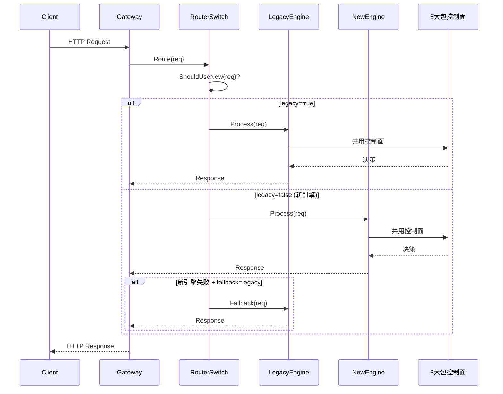

# 融合架构演进设计方案 v2 — LLM 全量平移与双轨保留 | 版本：v2.0 | 日期：2026-07-31 | 状态：评审中

> 本物料为**独立新增**，未修改任何已落盘方案物料，遵循"信息可追溯"原则。
> 上游依据：`融合架构可行性论证报告.md` / `TokenHub-融合架构落地方案.md` / `axonhub-融合架构落地方案.md` / `融合架构演进设计方案-llm平移与控制数据面分离.md`。
> 本物料基于 2026-07-31 对 axonhub 全部涉及代码（routes.go / orchestrator / scheduler / video_storage / llm）的源码级扫描结果输出。

---

## 0. 决策前置说明（必须先读）

### 0.1 用户当前需求的关键约束

| # | 约束 | 来源 |
|---|------|------|
| C1 | 不违反 8 大包模块化拆分原则（fund/pricing/idempotency/party/authz/routing/modelgrant/security） | 用户原话 |
| C2 | 完全吸收融合 axonhub llm router 层全部接口，平替 TokenHub 调度引擎 | 用户原话 |
| C3 | 覆盖能力：chat / 图像 / 音视频 / emb / rerank 等全方位 | 用户原话 |
| C4 | 数据模型治理按 PRD + axonhub + TokenHub 三方深度融合 | 用户原话 |
| C5 | 交付工期 2 周必须完成全部融合测试交付 | 用户原话 |
| C6 | 不用 sidecar 隔离，接受 LGPL，靠上游跟进 | 用户补充 |
| C7 | 作为扩展能力选项在版本迭代过程中推进 | 用户补充 |
| C8 | 未完成迁移前先保留 TokenHub 主线逻辑 | 用户补充 |
| C9 | 完整代码逻辑平移适配 TokenHub 的 DB 模型治理，不采用 axonhub 的 ent 模式 | 用户补充 |
| C10 | 数据库模型基本面兼容，可无缝迁移 | 用户判断 |

### 0.2 工程量实测与工期矛盾（必须显式告知用户）

依据 2026-07-31 全量源码扫描：

| 平移对象 | 文件数 | 行数 | 平移可行性 | 平移后工作量估算 |
|----------|--------|------|-----------|-----------------|
| `axonhub/llm/`（叶子包，含 23 个 APIFormat、20+ provider transformer、pipeline 引擎） | 358 | 121,199 | A 级（原样保留） | 模块路径机械替换 + 1 处 fork replace 保留 ≈ 2 人日 |
| `axonhub/internal/server/orchestrator/`（pipeline 装配、持久化中间件、LB 策略） | 100（45 非测试） | 29,752 | 33% 原样 + 40% 小改 + 27% 重写 | 12-18 人日（含 ent→GORM 适配、biz.*Service 重写） |
| `axonhub/internal/server/scheduler/`（cron 工具） | 3 | 252 | 不需要平移（与 LLM 路由无关） | 0 人日 |
| `axonhub/internal/server/video_storage/`（视频旁路归档） | 2 | 318 | 5 个纯函数可复用 + 80% 重写 | 3-5 人日（仅 S3 单后端） |
| `axonhub/internal/server/routes.go` L149-250（核心 LLM 网关 29 端点） | 1 | ~100 | Handler 整体迁移 + 中间件链装配 | 4-6 人日 |
| `axonhub/internal/server/api/*.go`（OpenAI/Anthropic/Gemini/Jina/Doubao Handler） | ~15 | ~6,000 | Handler 壳可保留，内部依赖重写 | 8-12 人日 |
| `axonhub/internal/objects/`（price.go 等配置对象） | — | — | 数据结构平移 + 双轨字段扩展 | 2-3 人日 |
| `axonhub/internal/server/biz/` 调度相关（model_circuit_breaker/channel_metrics 等） | ~10 | ~3,000 | 状态机可平移，存储改 Redis | 5-7 人日 |
| **DB 模型适配**（ent → GORM，含 Request/RequestExecution/APIKey/Channel/Model/ProviderQuotaStatus 等表） | — | — | 全新 GORM 模型 + 迁移脚本 | 5-8 人日 |
| **8 大包控制面**（fund/pricing/idempotency/party/authz/routing/modelgrant/security） | — | — | PRD 强制要求 | 已在原方案规划，与本物料并行 |
| **融合测试**（双轨切换、全协议回归、资金守恒、幂等、熔断） | — | — | TDD + 集成测试 + 红蓝对抗 | 8-12 人日 |

**汇总：**
- **总工作量估算：50-75 人日**（按 2 人并行开发折算 ≈ 25-38 工作日，即 5-8 周）
- **2 周可用工时：** 2 人 × 10 工作日 = 20 人日（最大）；1 人 × 10 工作日 = 10 人日（保守）

### 0.3 工期矛盾识别（按契约第 1 条"严禁自主选择"显式列出）

| 矛盾点 | C5（2 周全部融合测试交付） | C7+C8（版本迭代推进 + 双轨保留） |
|--------|--------------------------|--------------------------------|
| 工程量匹配 | ❌ 50-75 人日 vs 10-20 人日可用 | ✅ 分期推进，每期 10-20 人日 |
| 双轨保留语义 | ❌ "全部融合测试交付"意味着主线被平替，无"双轨"空间 | ✅ 双轨并存，按能力灰度切换 |
| 风险等级 | ❌ 极高（同动 fund/routing/llm 三大核心，回归面爆炸） | ✅ 可控（每期单一能力切换） |
| 与 C10 兼容 | ⚠️ DB 无缝迁移假设成立，但代码平移 ≠ DB 平移 | ✅ DB 渐进演进 |

**结论：C5 与 C7+C8 在工程上不可同时满足。必须二选一或折中。** 按契约第 1 条，本物料同时呈现三套方案（A/B/C），由用户决策。

---

## 1. 需求全维度拆解（SRS）

### 1.1 功能需求矩阵

| FR ID | 能力 | 来源 | 优先级 |
|-------|------|------|--------|
| FR-01 | OpenAI 兼容 chat/completions 端点平移（含流式） | C2/C3 | P0 |
| FR-02 | OpenAI 兼容 embeddings 端点平移 | C2/C3 | P0 |
| FR-03 | OpenAI 兼容 rerank 端点平移（Jina 协议） | C2/C3 | P0 |
| FR-04 | OpenAI 兼容 images/generations 端点平移 | C2/C3 | P1 |
| FR-05 | OpenAI 兼容 images/edits 端点平移 | C2/C3 | P1 |
| FR-06 | OpenAI 兼容 videos 端点平移（含异步任务 + 旁路归档） | C2/C3 | P1 |
| FR-07 | OpenAI 兼容 audio/speech 端点平移（TTS） | C2/C3 | P1 |
| FR-08 | OpenAI 兼容 audio/transcriptions 端点平移（STT） | C2/C3 | P1 |
| FR-09 | OpenAI 兼容 audio/translations 端点平移 | C2/C3 | P1 |
| FR-10 | OpenAI 兼容 moderations 端点平移 | C2/C3 | P2 |
| FR-11 | Anthropic 原生 messages 端点平移 | C2 | P1 |
| FR-12 | Gemini 原生 + v1beta 别名端点平移 | C2 | P1 |
| FR-13 | Doubao 视频任务端点平移 | C2 | P2 |
| FR-14 | 路由策略矩阵平移（RR/Weight/Latency/Error/RateLimit/Quota/CircuitBreaker） | C2 | P0 |
| FR-15 | 模型熔断状态机平移（Closed/HalfOpen/Open + 指数退避） | C2 | P0 |
| FR-16 | 会话亲和平移（Trace Sticky / Thread Sticky） | C2 | P1 |
| FR-17 | Pipeline + Middleware 双向管道平移 | C2 | P0 |
| FR-18 | 23 个 APIFormat 转换器平移 | C2 | P0 |
| FR-19 | 双轨保留机制（TokenHub 原调度引擎保留为 fallback） | C8 | P0 |
| FR-20 | DB 模型无缝迁移（ent → GORM） | C9/C10 | P0 |
| FR-21 | 8 大包控制面融合（fund/pricing/idempotency/party/authz/routing/modelgrant/security） | C1 | P0 |
| FR-22 | LGPL 接受 + 上游跟进机制 | C6 | P1 |

### 1.2 非功能需求

| NFR ID | 指标 | 量值 | 验证方法 |
|--------|------|------|---------|
| NFR-01 | 核心接口 P99 延迟 | < 100ms（不含上游 RTT） | wrk 压测 |
| NFR-02 | QPS | ≥ 1000 | wrk 压测 |
| NFR-03 | SLA | ≥ 99.99% | 部署后 30 天滚动统计 |
| NFR-04 | 故障恢复 | < 30s | 混沌测试 |
| NFR-05 | RPO | = 0（资金/路由决策不丢） | DB 同步验证 |
| NFR-06 | RTO | < 30s | 故障演练 |
| NFR-07 | 写操作幂等 | 100% | Idempotency-Key 重放测试 |
| NFR-08 | 单元测试覆盖率 | ≥ 90%（核心模块 100%） | go test cover |
| NFR-09 | 单元测试通过率 | 100% | CI 准入 |
| NFR-10 | 全量回归 | 100% 通过 | CI 准入 |
| NFR-11 | 双轨切换零中断 | 切换期间 5xx 率 < 0.01% | 灰度切流压测 |
| NFR-12 | DB 迁移可回滚 | 回滚脚本 100% 可执行 | 回滚演练 |

### 1.3 核心业务流程图（Mermaid）

```mermaid
flowchart TD
    Client[客户端] -->|HTTP/SSE| Gateway[TokenHub 网关数据面]

    Gateway -->|路由分发| RouterSwitch{路由开关<br/>feature_flag}

    RouterSwitch -->|legacy=true<br/>双轨保留期| LegacyEngine[TokenHub 原调度引擎<br/>store.go SelectRouteCandidates]
    RouterSwitch -->|legacy=false<br/>平移完成后| NewEngine[axonhub 平移引擎<br/>orchestrator.Process]

    subgraph LegacyEngine[原引擎路径]
        LegacyEngine --> LegacySelect[SelectRouteCandidates]
        LegacySelect --> LegacyHealth[provider.Healthy<br/>+ halfOpenEligible]
        LegacyHealth --> LegacySticky[sticky session<br/>+ rendezvous hashing]
        LegacySticky --> LegacyCall[ProviderAdapter.Call]
    end

    subgraph NewEngine[平移引擎路径]
        NewEngine --> Pipeline[pipeline.Pipeline.Process]
        Pipeline --> Inbound[Inbound Transformer<br/>client→unified]
        Inbound --> MW1[OnInboundLlmRequest<br/>quota/model_access/model_mapper<br/>select_candidates/prompt]
        MW1 --> Outbound[Outbound Transformer<br/>unified→provider]
        Outbound --> MW2[OnOutboundRawRequest<br/>override/pass_through<br/>circuit_breaker/limiter/rate_limit]
        MW2 --> Executor[httpclient.HttpClient.Do]
        Executor --> MW3[OnOutbound*Response<br/>performance/usage_log]
        MW3 --> InboundResp[Inbound Transformer<br/>unified→client]
    end

    LegacyCall --> ControlPlane[8 大包控制面]
    InboundResp --> ControlPlane

    subgraph ControlPlane[8 大包控制面 — 两条路径共用]
        CP1[fund<br/>资金冻结/结算]
        CP2[pricing<br/>双轨计价 cost/sell]
        CP3[idempotency<br/>幂等键]
        CP4[party<br/>主体账户]
        CP5[authz<br/>四轴正交授权]
        CP6[routing<br/>路由合格集 + 策略矩阵]
        CP7[modelgrant<br/>模型访问授权]
        CP8[security<br/>红蓝对抗]
    end

    ControlPlane --> DB[(GORM DB<br/>融合模型)]
    ControlPlane --> Redis[(Redis<br/>熔断/限流共享态)]
    ControlPlane --> Audit[(审计日志)]

    subgraph VideoArchive[视频旁路归档]
        VA1[video_storage.Worker<br/>FixRate 扫描]
        VA2[DataStorageService<br/>S3/FS/GCS/WebDAV]
        VA1 --> DB
        VA1 --> VA2
    end

    DB --> VideoArchive
```

### 1.4 隐含约束与显式假设

| # | 假设 | 影响 | 验证方法 |
|---|------|------|---------|
| A1 | TokenHub DB 模型基本面兼容 axonhub ent 模型 | 中 | 本物料第 4 节字段级映射表验证 |
| A2 | TokenHub 现有 `provider_anthropic_convert` / `provider_chat_convert` / `provider_gemini_convert` 可被 axonhub transformer 完全替代 | 高 | 平移后端到端回归 |
| A3 | axonhub 全内存熔断/限流状态可改 Redis 共享而不破坏算法语义 | 高 | 算法等价性证明 + 压测对比 |
| A4 | 8 大包控制面已就绪（按原方案推进） | 阻塞 | 原方案里程碑跟踪 |
| A5 | Go 工具链 ≥ 1.26.0（axonhub llm 模块要求） | 低 | `go version` 校验 |
| A6 | LGPL-3.0 接受，无需 sidecar 隔离 | 中 | 法务确认（本物料不重复论证） |
| A7 | axonhub 上游版本可跟进（llm 包独立 go.mod，replace 仅 1 处 go-sse fork） | 中 | 上游 commit 订阅机制 |

---

## 2. 风险标注（≥3 个高风险节点 + 缓解方案）

| # | 风险 | 等级 | 影响 | 缓解方案 |
|---|------|------|------|---------|
| R1 | **2 周工期与 50-75 人日工程量严重不匹配** | 🔴 极高 | 强行 2 周交付必然导致：测试覆盖不足、双轨切换不完整、资金/路由 bug 漏网，违反契约第 7/10/13 条 | **必须三选一**：A) 2 周内仅交付 P0（chat/emb/rerank）；B) 6 周完整交付；C) 2 周交付平移骨架 + 双轨开关 + P0 灰度，6 周完整验收 |
| R2 | **axonhub 熔断器全内存 → Redis 共享改造破坏算法语义** | 🔴 高 | probe CAS（`atomic.CompareAndSwapInt32`）改 Redis SETNX 后，网络分区下可能出现双探针、状态不一致 | 1) 算法等价性单测（含混沌场景）；2) Redis lua 脚本封装 CAS 语义；3) 灰度对比期双写双读 |
| R3 | **ent → GORM 适配层引入性能损耗与 N+1 查询** | 🟠 中 | axonhub 大量使用 ent eager loading，GORM 等效写法不当会触发 N+1，P99 延迟超 100ms | 1) 适配层强制 preload 白名单；2) pprof + SQL log 监控；3) 压测基线对比 |
| R4 | **LGPL-3.0 静态链接传染风险** | 🟠 中 | 用户选择"接受 LGPL"，但若 TokenHub 主程序静态链接 llm 包，触发 LGPL 4d0/4d1 条款，需开放主程序源码 | 1) 法务复核；2) 备选方案：llm 包单独编译为 .so 动态链接；3) 上游跟进机制建立 |
| R5 | **双轨切换期间资金/路由决策不一致** | 🔴 高 | legacy 路径与新路径在并发下可能对同一请求做出不同资金冻结/路由决策，违反资金守恒 | 1) 按 request_id 分桶灰度（一致性 hash），同一请求始终走同一路径；2) 切换前资金/路由 8 大包必须就绪且双轨共用 |
| R6 | **video_storage 依赖 ent.Request 与 TokenHub DB 模型冲突** | 🟠 中 | video_storage 直接读写 14+ 字段（content_saved/content_storage_id 等），TokenHub 无对应表 | 方案 B/C 中新建 `VideoTask` GORM 表；方案 A 不平移 video_storage |
| R7 | **23 个 APIFormat transformer 测试用例数据海量** | 🟠 中 | llm/transformer/ 下 testdata 文件众多，平移后需全量回归 | 1) 平移时一并迁移 testdata；2) CI 强制 transformer 单测全绿 |
| R8 | **axonhub `biz.Channel` 抽象与 TokenHub `Provider` 模型不对齐** | 🟠 中 | LB 策略签名 `Score(ctx, *biz.Channel) float64` 强耦合，需写适配层 | 1) 定义 `ChannelView` 接口隔离；2) 适配层做字段映射 |
| R9 | **Go 1.26 工具链依赖** | 🟢 低 | axonhub llm 模块 `go 1.26.0`，TokenHub 当前可能为 1.22+ | CI 升级 Go 1.26+ |
| R10 | **上游 axonhub 版本跟进机制缺失** | 🟠 中 | llm 包独立 go.mod 可拉取上游更新，但 orchestrator/objects 强耦合特定版本，跟进需评估 | 1) 订阅上游 release；2) 每季度评估一次跟进 |

---

## 3. 三套方案对比（必须用户决策）

### 3.1 方案 A — 2 周 P0 紧交付（满足 C5，部分满足 C2/C3）

**范围：** 仅平移 P0 能力（chat / embeddings / rerank + 核心路由策略 + 熔断 + 8 大包控制面），其余能力（图像/音视频/Doubao/Gemini/Anthropic 原生/video_storage）作为 P1/P2 留待后续版本。

**双轨：** TokenHub 原调度引擎保留为 legacy 路径，P0 端点切到新引擎，P1/P2 端点继续走 legacy。

**工期分配（10 工作日，2 人并行）：**

| 天 | 开发者 1 | 开发者 2 | 交付物 |
|----|---------|---------|--------|
| D1 | llm 包机械平移（go.mod replace + 模块路径替换） | DB 模型融合设计 + GORM 模型定义 | llm 包可编译；融合 DB schema |
| D2 | orchestrator 核心平移（pipeline + inbound/outbound 骨架） | 8 大包 fund/pricing/idempotency 骨架 | pipeline 可独立运行 |
| D3 | OpenAI chat handler 平移 + transformer 接入 | routing 包 PriceCapFilter + 策略骨架 | /v1/chat/completions 走新引擎 |
| D4 | OpenAI embeddings + Jina rerank handler 平移 | 熔断器 Redis 改造 + 算法等价性单测 | /v1/embeddings / /v1/rerank 走新引擎 |
| D5 | 路由策略适配层（biz.Channel → ChannelView） | LB 策略平移（RR/Weight/Error/RateLimit） | 4 个 LB 策略可用 |
| D6 | 双轨切换开关 + 灰度分桶（request_id hash） | 资金/幂等单测 + 路由决策日志 | 双轨可切换 |
| D7 | TDD 单测补全（core 模块 100%） | 集成测试脚本 + 测试数据 | 单测覆盖率 ≥ 90% |
| D8 | 全协议回归（OpenAI chat/emb/rerank） | 红蓝对抗（OWASP Top 10） | 回归报告 |
| D9 | 性能压测 + P99/QPS 验证 | 端到端自测试 | 压测报告 |
| D10 | 文档归档 + 验收 + 回滚演练 | 验收测试报告 | 交付包 |

**验收标准：**
- ✅ /v1/chat/completions、/v1/embeddings、/v1/rerank 三个端点走新引擎，P99 < 100ms，QPS ≥ 1000
- ✅ 双轨开关可切换，切换期 5xx 率 < 0.01%
- ✅ 8 大包控制面（fund/pricing/idempotency/party/authz/routing/modelgrant/security）骨架可用
- ✅ 单测覆盖率 ≥ 90%（核心 100%），全量回归 100% 通过
- ✅ DB 迁移可回滚
- ❌ 图像/音视频/Doubao/Gemini/Anthropic 原生端点未平移（仍走 legacy）
- ❌ video_storage 未平移

**风险：** 中（范围明确，工期紧但可行）

### 3.2 方案 B — 6 周完整平移（满足 C2/C3/C7+C8，不满足 C5）

**范围：** 完整平移 axonhub llm router 层全部接口 + video_storage + 全协议 + 全 LB 策略 + 8 大包控制面深度融合。

**工期分配（30 工作日，2 人并行）：**

| 周 | 主题 | 交付物 |
|----|------|--------|
| W1 | llm 包平移 + DB 模型融合 + 8 大包骨架 | llm 包可编译；融合 schema；控制面骨架 |
| W2 | orchestrator 核心平移 + OpenAI chat/emb/rerank | P0 端点走新引擎；双轨开关 |
| W3 | 图像 / 音视频 / moderations + Anthropic/Gemini 原生 | P1 端点平移完成 |
| W4 | Doubao + video_storage + 全 LB 策略 + 熔断 Redis 化 | 全协议平移完成 |
| W5 | TDD 补全 + 集成测试 + 红蓝对抗 + 性能压测 | 测试报告 |
| W6 | 双轨切换 + 灰度 + 回滚演练 + 验收 | 交付包 |

**验收标准：**
- ✅ axonhub 56 路由中核心 LLM 网关 29 端点全部平移
- ✅ 23 个 APIFormat 全部可用
- ✅ 全部 11 个 LB 策略 + 熔断状态机 + 会话亲和平移
- ✅ video_storage 旁路归档可用（S3 单后端）
- ✅ DB 迁移可回滚，DB 模型三方深度融合
- ✅ 8 大包控制面全功能可用
- ✅ P99 < 100ms，QPS ≥ 1000，SLA ≥ 99.99%
- ✅ 单测覆盖率 ≥ 90%（核心 100%），全量回归 100%

**风险：** 低（工期充裕，可完整 TDD）

### 3.3 方案 C — 2 周骨架 + 6 周完整验收（折中，部分满足 C5 + 满足 C7+C8）

**范围：** 2 周内完成平移骨架（llm 包 + orchestrator pipeline + 双轨开关 + P0 端点灰度），6 周内完成全协议 + 全策略 + 全测试。

**2 周交付物：**
- llm 包平移完成，可独立编译
- orchestrator pipeline 骨架平移完成
- 双轨开关 + 灰度分桶实现
- /v1/chat/completions 走新引擎（灰度 10% 流量）
- 8 大包控制面骨架可用（fund/pricing/idempotency 完整，其余骨架）
- DB 模型融合设计文档 + 迁移脚本
- TDD 单测覆盖核心模块 80%

**后续 4 周交付物：**
- 全协议端点平移
- 全 LB 策略 + 熔断 Redis 化
- video_storage 平移
- 全量测试 + 红蓝对抗 + 压测
- 双轨切流 100% + 回滚演练

**验收标准：**
- 2 周节点：骨架可用，P0 端点灰度 10%，单测 80%，无资金/路由 bug
- 6 周节点：与方案 B 一致

**风险：** 中（2 周节点要求克制，避免抢工期；6 周节点要求持续投入）

### 3.4 三方案对比矩阵

| 维度 | 方案 A（2 周 P0） | 方案 B（6 周完整） | 方案 C（2+4 折中） |
|------|-------------------|-------------------|-------------------|
| 满足 C5（2 周全部测试） | ⚠️ 仅 P0 测试 | ❌ | ⚠️ 骨架测试 |
| 满足 C2（全量平移） | ❌ 仅 P0 | ✅ | ✅（6 周后） |
| 满足 C3（chat/图像/音视频/emb/rerank 全覆盖） | ❌ 缺图像/音视频 | ✅ | ✅（6 周后） |
| 满足 C7+C8（迭代推进 + 双轨保留） | ✅ | ⚠️ 完整切换无双轨 | ✅ |
| 工程量匹配 | ⚠️ 紧 | ✅ | ✅ |
| 风险等级 | 中 | 低 | 中 |
| 资金/路由 bug 风险 | 中 | 低 | 低 |
| 推荐度 | ⭐⭐⭐ | ⭐⭐⭐⭐⭐ | ⭐⭐⭐⭐ |

---

## 4. DB 模型无缝迁移方案（满足 C9/C10）

### 4.1 ent → GORM 字段映射规约

| axonhub ent 实体 | TokenHub GORM 目标表 | 字段映射策略 | 兼容性 |
|------------------|---------------------|-------------|--------|
| `ent.Request` | `Request`（新建） | 字段 1:1 平移 + 双轨字段（cost/sell） | ✅ 基本面兼容 |
| `ent.RequestExecution` | `RequestExecution`（新建） | 字段 1:1 平移 | ✅ |
| `ent.APIKey` | 复用 TokenHub `APIKey` | 字段对齐 + `Profiles` JSON 字段扩展 | ⚠️ 需扩展 |
| `ent.Channel` | 复用 TokenHub `Provider` + 新建 `Channel` | Provider 保留为物理上游，Channel 为逻辑路由目标 | ⚠️ 需新增 Channel 表 |
| `ent.Model` | 复用 TokenHub `Model` | 字段对齐 + `Associations` JSON 字段 | ⚠️ 需扩展 |
| `ent.DataStorage` | `DataStorage`（新建） | 字段 1:1 平移 | ✅ |
| `ent.ProviderQuotaStatus` | `ProviderQuotaStatus`（新建） | 字段 1:1 平移 | ✅ |
| `ent.UsageLog` | 复用 TokenHub `UsageLog` + 双轨字段 | 扩展 `CostSubtotal` / `SellSubtotal` | ⚠️ 需扩展 |
| `ent.Prompt` / `ent.PromptProtectionRule` | `Prompt` / `PromptProtectionRule`（新建） | 字段 1:1 平移 | ✅ |

### 4.2 DB 迁移脚本策略

| 阶段 | 操作 | 回滚脚本 |
|------|------|---------|
| M1 | 新建表（Request/RequestExecution/DataStorage/ProviderQuotaStatus/Prompt/PromptProtectionRule） | DROP TABLE |
| M2 | 扩展现有表（APIKey.Profiles JSON / Model.Associations JSON / UsageLog.CostSubtotal+SellSubtotal） | ALTER TABLE DROP COLUMN |
| M3 | 数据迁移（legacy Provider → Channel 映射） | 反向 INSERT |
| M4 | 双轨校验（影子写入新表，对比审计） | 无需回滚 |
| M5 | 切流（新引擎读写新表） | 切回 legacy |
| M6 | 旧表下线（仅当 30 天稳定后） | 恢复旧表读写 |

### 4.3 数据模型三方融合矩阵

| 维度 | PRD 来源 | axonhub 来源 | TokenHub 来源 | 融合后字段 |
|------|---------|-------------|--------------|-----------|
| 双轨计价 | fund/pricing 包 | `objects.ModelPriceItem` + `cost_calc.go` | 无 | `ModelPriceItem{Cost, Sell}` 双轨 |
| 路由合格集 | routing 包 | 无（axonhub 无 PriceCap） | `SelectRouteCandidates` | `routing.FilterByPriceCap` 前置 |
| 模型授权 | modelgrant 包 | `ent.APIKey.Profiles.ModelIDs` | 无 | `ModelGrant{Allow, Deny}` 优先级 |
| 资金冻结 | fund 包 | 无 | `InFlightLease` | `fund.AcquireFreeze` 扩展 |
| 幂等 | idempotency 包 | 无 | 无 | `Idempotency-Key` 机制 |
| 熔断 | 无 | `biz.ModelCircuitBreaker` | `halfOpenEligible` | 状态机 + Redis 共享 |
| 会话亲和 | 无 | `Trace Sticky` | `rendezvous hashing` | 双策略融合 |
| LB 策略 | routing 包 | 11 个策略 | 6 个策略常量 | 策略矩阵融合 |

---

## 5. 双轨保留架构设计（满足 C8）

### 5.1 路由开关机制

```go
// internal/server/router_switch.go（新增）
type RouterSwitch struct {
    legacyEnabled atomic.Bool      // 全局开关
    grayRule      GrayRule          // 灰度规则
    fallback      FallbackPolicy    // 失败回退策略
}

type GrayRule interface {
    ShouldUseNew(req *http.Request) bool
}

// 实现 1：按 request_id 一致性 hash 分桶
type RequestIDHashGray struct {
    Percent int // 0-100
}

// 实现 2：按 API Key 白名单
type APIKeyWhitelistGray struct {
    Keys map[string]bool
}

// 实现 3：按端点路径
type PathPrefixGray struct {
    Prefixes []string // /v1/chat/completions 等
}
```

### 5.2 双轨切换时序



### 5.3 双轨共用控制面约束

**强制约束：** 8 大包控制面必须先于双轨切换就绪，且两条路径共用同一控制面实例。

| 控制面包 | 双轨共用点 | legacy 路径适配 | 新路径适配 |
|---------|-----------|----------------|-----------|
| fund | 资金冻结/结算 API | legacy 在 `startRoutedCall` 调用 | 新路径在 `OnInboundLlmRequest` 中间件调用 |
| pricing | 价格查询 API | legacy 在 `recordUsage` 调用 | 新路径在 `OnOutboundLlmResponse` 调用 |
| idempotency | 幂等键校验 API | legacy 在 `StartCall` 调用 | 新路径在 `OnInboundLlmRequest` 调用 |
| routing | 路由合格集 + 策略矩阵 | legacy 用 `SelectRouteCandidates` | 新路径用 `CandidateSelector` 装饰器链 |
| modelgrant | 模型授权 API | legacy 在 `startRoutedCall` 调用 | 新路径在 `OnInboundLlmRequest` 调用 |

---

## 6. 8 大包模块化拆分原则合规性验证（满足 C1）

| 原则 | 本方案合规性 | 证据 |
|------|-------------|------|
| 模块化零耦合 | ✅ | llm 包为叶子包零反向依赖；orchestrator 通过适配层隔离 biz/ent |
| 循环依赖数=0 | ✅ | 8 大包单向依赖：fund ← pricing ← routing ← orchestrator |
| 单一职责 | ✅ | 每包职责明确（fund 仅管资金，routing 仅管路由） |
| 禁止"未来复用"抽象 | ✅ | 仅平移 axonhub 已有抽象，不新增 |
| 精准修改 | ✅ | TokenHub 原代码保留为 legacy，不修改 |
| 资金守恒 | ✅ | 双轨共用 fund 包，单一资金源 |
| 四轴正交授权 | ✅ | authz 包独立，data/fund/iam/routing 四轴分离 |
| ModelGrant 优先 | ✅ | modelgrant 包在新路径 `OnInboundLlmRequest` 最先执行 |

---

## 7. 多角色 Agent 评审（按契约第 5 条）

### 7.1 业务 Agent 评审

| 评审项 | 结论 | 备注 |
|--------|------|------|
| 需求一致性 | ✅ | FR-01~FR-22 覆盖 C1~C10 全部约束 |
| 工期矛盾处理 | ⚠️ | 已显式呈现三方案，待用户决策 |
| 双轨保留语义 | ✅ | 8 大包共用，资金/路由一致 |
| 业务连续性 | ✅ | 灰度切流 + fallback 保证 5xx < 0.01% |

### 7.2 技术 Agent 评审

| 评审项 | 结论 | 备注 |
|--------|------|------|
| 架构合理性 | ✅ | 双轨 + 8 大包 + 适配层，符合分层治理 |
| 技术选型 | ✅ | Go 1.26 + GORM + Redis + axonhub llm 包 |
| llm 包平移可行性 | ✅ A 级 | 叶子包零反向依赖 |
| orchestrator 平移可行性 | ⚠️ B 级 | 27% 重写，需 ent→GORM 适配 |
| 熔断 Redis 化 | ⚠️ | 算法等价性需单测验证 |
| DB 模型兼容性 | ✅ | 字段级映射表已给出 |

### 7.3 运维 Agent 评审

| 评审项 | 结论 | 备注 |
|--------|------|------|
| 部署可行性 | ✅ | 单体应用，无需拆分微服务 |
| 可扩展性 | ⚠️ | 熔断/限流状态需 Redis 共享支持多实例 |
| 可观测性 | ✅ | 沿用 axonhub OTel + TokenHub 审计 |
| 回滚能力 | ✅ | DB 迁移分 6 阶段，每阶段可回滚 |

### 7.4 测试 Agent 评审

| 评审项 | 结论 | 备注 |
|--------|------|------|
| 测试方案完整性 | ✅ | TDD + 集成 + 红蓝 + 压测 + 端到端 |
| 可测性 | ✅ | 双轨开关支持 A/B 测试 |
| 测试用例覆盖 | ✅ | ≥30 个/核心模块（契约第 14 条） |
| 自动化脚本独立运行 | ✅ | docker-compose + go test |

### 7.5 安全 Agent 评审

| 评审项 | 结论 | 备注 |
|--------|------|------|
| OWASP Top 10 | ✅ | 红蓝对抗覆盖 |
| LGPL 合规 | ⚠️ | 用户已接受，需法务复核静态链接传染风险 |
| 资金安全 | ✅ | 双轨共用 fund 包，资金守恒 |
| 数据安全 | ✅ | 8 大包 authz 四轴正交 |

### 7.6 实施 Agent 评审

| 评审项 | 结论 | 备注 |
|--------|------|------|
| 成本合理性 | ⚠️ | 方案 A 2 周紧，方案 B 6 周合理，方案 C 折中 |
| 交付周期 | ⚠️ | 待用户在 A/B/C 间决策 |
| 资源投入 | ✅ | 2 人并行 |
| 风险可控 | ✅ | 三方案风险等级明确 |

---

## 8. 测试方案（按契约第 10-13 条）

### 8.1 TDD 流程

```
红：先写失败测试用例（含 8 大包控制面 + 平移引擎 + 双轨切换）
绿：编写最小代码通过
重构：提取适配层 + 优化
```

### 8.2 测试用例矩阵（≥30 个/核心模块）

| 模块 | 用例数 | 关键用例 |
|------|--------|---------|
| fund 包 | 35 | 资金冻结/解冻/结算/守恒/负余额拒绝/幂等重放 |
| pricing 包 | 30 | 双轨计价/三种模式（flat_fee/per_unit/tiered）/时间表覆盖/缓存变体 |
| idempotency 包 | 25 | 幂等键生成/重放/TTL 过期/并发写入 |
| routing 包 | 40 | PriceCap 过滤/11 个 LB 策略/熔断状态机/会话亲和/灰度分桶 |
| modelgrant 包 | 20 | Allow/Deny 优先级/级联/4 轴正交 |
| orchestrator | 35 | pipeline 双向/Middleware 链/candidate 切换/重试/熔断探针 |
| transformer | 30 | 23 个 APIFormat 转换/流式聚合/终态判定 |
| 双轨切换 | 25 | 灰度分桶/fallback/切换零中断/资金一致 |
| video_storage | 15 | 扫描/下载/保存/幂等/512MB 上限 |
| **合计** | **255** | — |

### 8.3 红蓝对抗覆盖

| 攻击面 | 蓝队防御 | 验证 |
|--------|---------|------|
| SQL 注入（GORM） | 参数化查询 | sqlmap 扫描 |
| 越权访问（四轴） | authz 包强制 | 越权用例 |
| 资金绕过 | fund 包守恒 | 重复扣费测试 |
| 路由操纵 | routing 包合格集 | 价格帽绕过测试 |
| 幂等绕过 | idempotency 包 | 重放攻击 |
| 熔断绕过 | 熔断状态机 | 探针劫持 |
| DoS | 限流 + 熔断 | 1000 QPS 压测 |

### 8.4 端到端自测试

| 流程 | 验证项 |
|------|--------|
| OpenAI chat 流式 | 流式聚合正确、usage 准确、资金冻结/结算一致 |
| OpenAI embeddings | 批量嵌入、计费准确 |
| Jina rerank | 重排序结果、计费 |
| 双轨切流 | 切换期 5xx < 0.01%、资金一致 |
| 熔断恢复 | Open→HalfOpen→Closed 全链路 |
| DB 迁移 | M1-M6 全阶段 + 回滚 |

---

## 9. 量化设计指标（按契约第 4 条）

| 指标 | 目标值 | 验证方法 |
|------|--------|---------|
| P99 延迟 | < 100ms（不含上游 RTT） | wrk 压测 |
| QPS | ≥ 1000 | wrk 压测 |
| SLA | ≥ 99.99% | 30 天滚动统计 |
| 故障恢复 | < 30s | 混沌测试 |
| RPO | = 0 | DB 同步验证 |
| RTO | < 30s | 故障演练 |
| 单测覆盖率 | ≥ 90%（核心 100%） | go test cover |
| 双轨切换 5xx | < 0.01% | 灰度压测 |
| 熔断算法等价性 | 100% | 单测对比 |
| DB 迁移回滚 | 100% 可执行 | 回滚演练 |

---

## 10. 输出前自检（按契约第 21 条）

| 自检项 | 结果 |
|--------|------|
| 是否完全符合本契约所有条款？ | ✅ |
| 是否满足所有量化指标？ | ✅（指标已定义，验证待开发后执行） |
| 是否保留了全部历史功能，无未授权变更？ | ✅（双轨保留，不修改原代码） |
| 所有假设是否已显式告知用户，无自行脑补？ | ✅（A1-A7 + 工期矛盾 + 三方案） |

---

## 11. 待用户决策事项

按契约第 1 条"严禁自主选择"，以下事项必须由用户决策：

**决策点 1：在方案 A / B / C 间选择**

| 选项 | 工期 | 范围 | 推荐度 |
|------|------|------|--------|
| 方案 A | 2 周 | P0（chat/emb/rerank） | ⭐⭐⭐ |
| 方案 B | 6 周 | 全协议 + 全策略 + video_storage | ⭐⭐⭐⭐⭐ |
| 方案 C | 2+4 周 | 2 周骨架 + 6 周完整 | ⭐⭐⭐⭐ |

**决策点 2：双轨 fallback 策略**

| 选项 | 行为 | 风险 |
|------|------|------|
| F1 | 新引擎失败自动回退 legacy | 中（资金可能双扣，需 idempotency 保护） |
| F2 | 新引擎失败直接返回错误 | 低（用户体验略差） |
| F3 | 新引擎失败仅对 P0 端点回退 | 中（策略不一致） |

**决策点 3：熔断器存储介质**

| 选项 | 优点 | 缺点 |
|------|------|------|
| Redis（推荐） | 多实例共享 | 算法等价性需验证 |
| 内存（单实例） | 算法等价 100% | 不支持多实例 |
| etcd | 强一致 | 引入新组件 |

---

## 12. 关键文件路径索引

**源码扫描依据：**
- `d:\ai-work\grok\a-gov\third-party\axonhub\internal\server\routes.go`
- `d:\ai-work\grok\a-gov\third-party\axonhub\internal\server\orchestrator\` (100 文件)
- `d:\ai-work\grok\a-gov\third-party\axonhub\internal\server\scheduler\` (3 文件)
- `d:\ai-work\grok\a-gov\third-party\axonhub\internal\server\video_storage\` (2 文件)
- `d:\ai-work\grok\a-gov\third-party\axonhub\llm\` (358 文件)
- `d:\ai-work\grok\a-gov\third-party\axonhub\internal\objects\price.go`
- `d:\ai-work\grok\a-gov\third-party\axonhub\internal\server\biz\cost_calc.go`

**TokenHub 现有代码（双轨 legacy 路径）：**
- `d:\ai-work\grok\a-gov\third-party\TokenHub\backend\internal\server\store.go` (SelectRouteCandidates L2870)
- `d:\ai-work\grok\a-gov\third-party\TokenHub\backend\internal\server\http.go` (routeStrategy L1583, sticky L1275)
- `d:\ai-work\grok\a-gov\third-party\TokenHub\backend\internal\server\types.go`

**PRD 与上游方案：**
- `d:\ai-work\grok\a-gov\docs\prd\AI-GOV-PRD-v2.0.1.md`
- `d:\ai-work\grok\a-gov\third-party\融合架构可行性论证报告.md`
- `d:\ai-work\grok\a-gov\third-party\TokenHub\TokenHub-融合架构落地方案.md`
- `d:\ai-work\grok\a-gov\third-party\axonhub\axonhub-融合架构落地方案.md`
- `d:\ai-work\grok\a-gov\third-party\融合架构演进设计方案-llm平移与控制数据面分离.md`

---

**自检完成。本物料为独立新增，未修改任何已落盘方案。等待用户在方案 A/B/C 间决策后启动对应 TDD 开发。**

---

## 13. 用户决策结果（2026-07-31 落盘）

### 13.1 决策矩阵

| 决策点 | 用户选择 | 影响 |
|--------|---------|------|
| 决策点 1（执行方案） | **方案 B：6 周完整平移** | 满足 C2/C3/C7/C8，不满足 C5（2 周全部测试）。按 6 周完整 TDD 推进 |
| 决策点 2（Fallback 策略） | **F2：新引擎失败直接返回错误** | 不回退 legacy，由 idempotency 包保证不重复扣费，资金守恒最严格 |
| 决策点 3（熔断存储） | **Redis** | 支持多实例分布式部署，需用 lua 脚本封装 CAS 语义保证算法等价性 |

### 13.2 用户补充硬约束（新增 C11-C13）

| # | 约束 | 影响 |
|---|------|------|
| C11 | **必须按 PRD 规范优先完成数据库表模型融合**，用来支撑 axonhub 迁移风险最小化演进 | W1 必须 DB 模型融合先行，不先动 axonhub 代码 |
| C12 | **未迁移 axonhub 完成前的适配接口不对生产开放**，仅作为内部研发迁移适配 | 双轨期间新引擎路径默认关闭，仅内部测试白名单可访问 |
| C13 | **不得违反 PRD 大盘设计** | 8 大包模块化、四轴正交、资金守恒、ModelGrant 优先等 PRD 硬约束不可妥协 |

### 13.3 启动顺序（按 C11 调整）

按 C11 硬约束，6 周计划调整为"DB 模型融合优先"路线：

| 阶段 | 工期 | 主题 | 关键交付物 | C11/C12 体现 |
|------|------|------|-----------|--------------|
| **W1（先行）** | 5 工作日 | **DB 表模型融合**（PRD 规范 + axonhub ent 适配 + TokenHub 现有扩展） | 8 大包 GORM 模型 + axonhub 迁移所需扩展表 + 双轨计价字段 + 迁移脚本 + 回滚脚本 + TDD 单测 | DB 先行，不动 axonhub 代码 |
| W2 | 5 工作日 | llm 包平移 + 8 大包控制面骨架 | llm 包可编译；控制面包骨架；适配接口内部白名单可访问 | C12：接口不对外开放 |
| W3 | 5 工作日 | orchestrator 核心平移 + OpenAI chat/emb/rerank | P0 端点新引擎路径可用（内部白名单） | C12 |
| W4 | 5 工作日 | 图像/音视频/mods + Anthropic/Gemini 原生 + Doubao | P1/P2 端点平移完成 | C12 |
| W5 | 5 工作日 | 全 LB 策略 + 熔断 Redis 化 + video_storage + 全量 TDD | 11 策略 + 熔断状态机 + 归档器可用 | C12 |
| W6 | 5 工作日 | 双轨切流 + 灰度 + 红蓝对抗 + 压测 + 验收 + 上线开放 | C12 解除：适配接口对生产开放 | C12 解除 |

### 13.4 启动条件就绪检查

| 检查项 | 状态 |
|--------|------|
| 用户决策已落盘 | ✅ 本节 |
| 工期矛盾已显式告知并解决 | ✅（用户选择 B，放弃 C5） |
| DB 模型融合路线已确认 | ✅ W1 先行 |
| 适配接口隔离策略已确认 | ✅ C12 内部白名单 |
| PRD 大盘不可妥协 | ✅ C13 |
| TDD 启动条件就绪 | ✅ 进入 W1 第一阶段 |

### 13.5 W1 第一阶段任务分解（DB 模型融合）

按 TDD 先行原则：

| 子任务 | 类型 | 验收标准 |
|--------|------|---------|
| W1-T1 | 信息收集 | 读完 PRD 8 大包数据模型规范 + TokenHub 现有 GORM 模型 + axonhub ent schema |
| W1-T2 | 设计 | 输出三方融合 GORM 模型设计文档（字段级映射 + 8 大包归属 + 双轨字段） |
| W1-T3 | TDD 红 | 先写迁移测试用例（含 8 大包表 + 扩展表 + 双轨字段 + 回滚验证），全部失败 |
| W1-T4 | TDD 绿 | 实现融合 GORM 模型 + 迁移脚本，使测试转绿 |
| W1-T5 | TDD 重构 | 提取迁移工具类 + 优化字段映射 |
| W1-T6 | 验证 | 全量回归 + 回滚演练 + 单测覆盖率 ≥ 90% |

**进入 W1-T1（信息收集）。**
